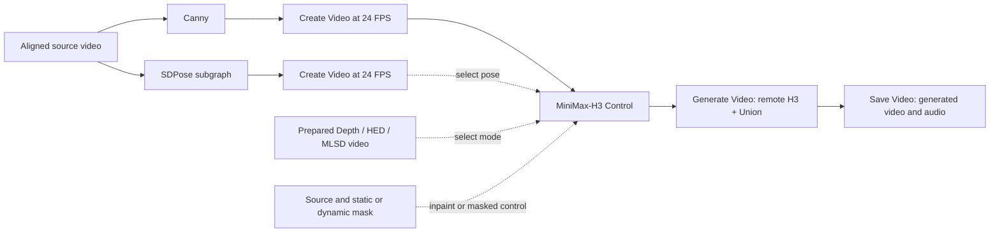

# MiniMax-H3 Fun ControlNet Union workflow

The [WF-06 workflow](../example_workflows/vLLM-Omni%20MiniMax-H3%20Fun%20ControlNet%20Union.json)
uses one remote generation chain for **Canny, Depth, HED, MLSD, Pose, and Inpaint**.
The default path extracts Canny edges from a video. The included SDPose subgraph
extracts whole-body pose from the source video. Prepared control videos provide
the Depth, HED and MLSD inputs without requiring community nodes in the template.



## Requirements

- ComfyUI with `Canny`, `LoadVideo`, `GetVideoComponents`, `CreateVideo`, and the
  SDPose/RT-DETR nodes. The initial implementation uses ComfyUI commit
  `02d39c8cd7828566f48ccf783c1c75b8336044f5` and frontend `1.52.7`.
- This extension, including `MiniMax-H3 Control` and the `Generate Video.control`
  input from CTRL-02.
- A reachable vLLM-Omni service with CTRL-01, MiniMax-H3 **FL2VA** base components,
  and the original
  [Union checkpoint](https://huggingface.co/alibaba-pai/MiniMax-H3-Fun-Controlnet-Union).
  Follow the [server recipe](../../../recipes/MiniMaxAI/MiniMax-H3.md#fun-controlnet-union-ctrl-01).
- FFmpeg with the `libx264` encoder for preparing video timing and dimensions.
- For Pose extraction, install the two weights below on the **ComfyUI host**.
  Canny and prepared-video modes do not load them.

| ComfyUI model directory | File |
| --- | --- |
| `models/checkpoints/` | [sdpose_wholebody_fp16.safetensors](https://huggingface.co/Comfy-Org/SDPose/resolve/main/checkpoints/sdpose_wholebody_fp16.safetensors) |
| `models/diffusion_models/` | [rt_detr_v4-x-hgnet_fp16.safetensors](https://huggingface.co/Comfy-Org/SDPose/resolve/main/diffusion_models/rt_detr_v4-x-hgnet_fp16.safetensors) |

H3 generation runs on the server. Preprocessing runs on the ComfyUI host;
SDPose benefits from a GPU. The initial server configuration uses resident BF16
weights and two-way tensor parallelism. Keep the Base configuration while
validating this workflow; Turbo and other acceleration settings need their own
validation.

## Prepare the default source

The starter uses the public dancer video from the
[official ComfyUI template](https://github.com/Comfy-Org/workflow_templates/blob/aaac56dd5cc5497533d92cbe50edc35ea660e587/templates/video_minimax_h3_fun_controlnet_union.json).
It is a starter for Canny and Pose; CTRL-01's forest/bridge examples use different
source material and prompts.

Run on the ComfyUI host, replacing the directory:

```bash
export COMFYUI_ROOT=/path/to/ComfyUI
curl --fail --location \
  https://raw.githubusercontent.com/Comfy-Org/workflow_templates/aaac56dd5cc5497533d92cbe50edc35ea660e587/input/dancer_field_pose.mp4 \
  --output "$COMFYUI_ROOT/input/wf06-dancer-original.mp4"

ffmpeg -y -i "$COMFYUI_ROOT/input/wf06-dancer-original.mp4" \
  -vf "fps=24,scale=1344:768:force_original_aspect_ratio=increase,crop=1344:768,tpad=stop_mode=clone:stop_duration=6" \
  -frames:v 124 -an -c:v libx264 -crf 18 -pix_fmt yuv420p \
  "$COMFYUI_ROOT/input/wf06-source.mp4"
```

This resamples by time, crops to the target canvas and takes 124 frames. A short
clip holds its last frame. For another segment, select its start time before
preprocessing. Use the same segment and crop for source, hint and dynamic mask.
Changing only the `Create Video` FPS would change the playback speed of a frame
batch; it does not resample it.

## Run Canny

1. Import the workflow JSON, or select **Templates → ComfyUI-vLLM-Omni →
   vLLM-Omni MiniMax-H3 Fun ControlNet Union**.
2. Select `wf06-source.mp4` in **Aligned source**. If files were added while
   ComfyUI was open, use **Edit → Refresh Node Definitions** before importing
   the workflow so its file selectors see the new inputs.
3. Set **Generate Video.url** to the server's `/v1` URL and **model** to its
   served name. The default is `http://127.0.0.1:8092/v1` with
   `MiniMaxAI/MiniMax-H3`. The URL must be reachable from the ComfyUI backend.
4. Keep **Control.control_type=canny**, **strength=1**, and queue the workflow.
5. Inspect the generated clip in **Save Video** and its output directory.

| Setting | Default |
| --- | --- |
| Width × height / derived H3 aspect ratio | 1344 × 768 / `16:9` |
| FPS / duration / requested frames | 24 / 5.167 seconds / 124 (`17 × 7 + 5`) |
| Inference steps / guidance | 40 / 1 |
| Video / audio flow shift | 12 / 3 |
| Seed / control after generate | 43 / fixed |
| Canny thresholds | 0.1 / 0.2 |

The input video's audio is left unconnected. **Save Video** receives the video
and generated audio returned by H3. Input hints are encoded by CTRL-02 as
H.264 at CRF 0; static masks use thresholded PNG.

Generate Video uses **duration** in seconds. Set it to **5.167** at 24 FPS
for a 124-frame request. H3 Params contains only the two flow shifts; the client
derives `16:9` from the generation width and height. Keep the optional FastH3
input disconnected for this ordinary H3 + Union deployment.

## Switch modes

Keep the shared **Control → Generate Video → Save Video** chain. Replace the
`control_video` connection and select the matching enum on **Control**. Update
the prompt to describe the desired scene.

| Mode | Connection to shared Control | Additional action |
| --- | --- | --- |
| `canny` | **Canny frames → control VIDEO** → `control_video` | Default path |
| `pose` | **Pose frames → control VIDEO** → `control_video` | Install both Pose weights; the source video feeds the included extractor |
| `depth` | **Prepared hint** → `control_video` | Select a depth video |
| `hed` | **Prepared hint** → `control_video` | Select a soft-edge video |
| `mlsd` | **Prepared hint** → `control_video` | Select a line-segment video |
| `inpaint` | **Aligned source** → `source_video`; **Static mask** → `mask` | Disconnect `control_video`; for a moving mask, use **Dynamic mask** → `mask_video` instead |

The alternative branches have no output/save nodes of their own and remain
idle until connected. The Pose subgraph exposes its weight selectors and
detector settings. It retains both MODEL and VAE inputs to the keypoint
extractor, followed by skeleton drawing and `Create Video` at 24 FPS.

Structural modes can also use `source_video` plus one mask. A connected source
requires a mask. Inpaint requires a mask and can optionally also accept a
prepared control video. Use one mask input at a time. Keep `frame` and
`references` disconnected when Control is connected.

## Prepared Depth, HED and MLSD examples

The [Union model card](https://huggingface.co/alibaba-pai/MiniMax-H3-Fun-Controlnet-Union)
provides real control videos and corresponding author outputs. Its `asset/`
files are **control hints**. Its `results/` files are generated outputs.
The following pinned examples can be used without installing a preprocessor:

| Mode | Control file | Example scene to describe in the prompt |
| --- | --- | --- |
| Depth | `depth_astronaut.mp4` | An astronaut exploring a landscape; preserve foreground/background layout |
| HED | `hed_trex_bmx.mp4` | A dinosaur riding a BMX bike; follow the moving silhouettes |
| MLSD | `mlsd_village.mp4` | A village street; preserve the directions and layout of building lines |

Choose one file, then prepare it for **Prepared hint**:

```bash
export WF06_HINT=depth_astronaut.mp4
curl --fail --location \
  "https://huggingface.co/alibaba-pai/MiniMax-H3-Fun-Controlnet-Union/resolve/6419c27ece80f330826ae4439fa9c5910c475ccf/asset/$WF06_HINT" \
  --output "$COMFYUI_ROOT/input/wf06-hint-original.mp4"
ffmpeg -y -i "$COMFYUI_ROOT/input/wf06-hint-original.mp4" \
  -vf "fps=24,scale=1344:768:force_original_aspect_ratio=increase,crop=1344:768,tpad=stop_mode=clone:stop_duration=6" \
  -frames:v 124 -an -c:v libx264 -crf 0 -pix_fmt yuv420p \
  "$COMFYUI_ROOT/input/wf06-control.mp4"
```

These resized/cropped hints provide reproducible workflow inputs. Comparing
against an author's output additionally requires matching their original
canvas, prompt and sampling configuration.

For your own footage, align the source first, then extract a hint with
[Depth Anything 3](https://docs.comfy.org/tutorials/utility/depth-anything-3) or
the HED/MLSD preprocessors in
[comfyui_controlnet_aux](https://github.com/Fannovel16/comfyui_controlnet_aux).
Export the hint as a 24 FPS video with the same canvas and frame count, and
load it through **Prepared hint**. Record the preprocessor version and weights
with your example. Community nodes are optional and are not embedded here.

## Inpaint masks

Create a black/white PNG matching the source canvas. In **Static mask**, use the
**red** channel so white means regenerate and black means source conditioning.
The alpha channel of `LoadImageMask` has different semantics.

A simple starter mask selects a rectangle on the right side of the frame:

```bash
ffmpeg -y -f lavfi -i "color=black:s=1344x768" \
  -vf "drawbox=x=950:y=450:w=240:h=180:color=white:t=fill" \
  -frames:v 1 -update 1 "$COMFYUI_ROOT/input/wf06-mask.png"
```

Connect source and mask, set `inpaint`, and describe an object to add in that
region, such as a wooden bench. Select the region to suit your actual source.
For a moving region, load an aligned 24 FPS black/white video through
**Dynamic mask** and disconnect the static mask. A static mask is broadcast to
all frames. Assess background preservation visually; source conditioning does
not guarantee pixel-identical copying.

## Validation

From a checkout with matching vLLM/vLLM-Omni test dependencies, run the L1 checks:

```bash
pytest -q tests/e2e/features/comfyui/test_minimax_h3_control_workflow.py -m "core_model and cpu"
pytest -q tests/e2e/features/comfyui/test_minimax_h3_control.py -m "core_model and cpu"
```

The workflow tests cover the default Canny route, H3 settings, portable input
paths, Pose MODEL/VAE and detection connections, and idle alternative inputs.
The existing client tests cover input validation and multipart encoding.

Also import, execute, save and re-import the actual graph in ComfyUI. Run all
six modes, including static and dynamic Inpaint masks, and inspect control
adherence, frame count, dimensions, timing and audio. Use the actual ComfyUI
API export for subgraphs. An editor workflow JSON is not an API prompt.

For audio checks, save the same job's original `/videos/{id}/content` response
before the client converts it and deletes the job, then compare it with the
ComfyUI output. An existing response-recording/debugging tool is sufficient;
record its steps and associate both files with the job ID. Check decodability
and listen to both tracks. Backend silence and audio lost during client
conversion require separate diagnosis.

### Recorded runtime results (2026-09-13 to 2026-09-14)

The WF-06 implementation at `60a2361e2` completed 12 real ComfyUI runs, covering
all six modes, static/dynamic Inpaint masks, combined control/source/mask,
an ordinary no-Control baseline, and default-template export/reimport/replay.
The 115 combined workflow/client/API/control-model regression tests and six
real ComfyUI encoding tests passed on this code.

The runtime used original Union BF16 weights, TP2 and TORCH_SDPA, with the
Base defaults above. A request for 40 steps executed 39 denoiser forwards.
Every server response and saved output fully decoded to 124 frames at 24 FPS,
1344x768, with 32 kHz stereo audio and equal decoded audio sample counts within
each job's before/after pair.

| Mode | Observed output and remaining validation |
| --- | --- |
| Canny | Forest and default dancer layouts followed the input; generated audio was very weak |
| Depth | Astronaut/landing-pod layout was recognizable; audio signal present |
| HED | Dinosaur/BMX outlines followed the hint; audio signal present |
| MLSD | Village generated; adherence to sparse lines needs further review; audio very weak |
| Pose | All 124 frames passed through SDPose; sampled poses corresponded to the source; full motion/hand review pending |
| Inpaint | Static, dynamic and wider masks completed, but the requested bridge was absent; audio very weak at strength 1 |

The forest Canny server response had audio RMS `1.88e-5`, compared with
`5.27e-3` for the same prompt/seed without Control. Lowering static Inpaint
strength from 1 to 0.5 increased the audio signal but introduced black areas
and visual artifacts. It did not resolve the requested edit. These signal
measurements precede ComfyUI conversion; subjective audio quality and
synchronization still need listening review.

This workflow remains under development. Track the downstream observations
in [CTRL-01 #7479](https://github.com/vllm-project/vllm-omni/pull/7479#discussion_r4000369021)
and the client dependency in [CTRL-02 #7492](https://github.com/vllm-project/vllm-omni/pull/7492).
The updated workflow targets the duration input introduced by main #7456 and
CTRL-02 `562cf1f74`. It uses the shared audio rewind fix from main and the
real audio regression tests now included in CTRL-02. The results above describe
the earlier implementation; real UI and GPU validation of the migrated graph
remain pending. Before delivery, compare
Canny/Inpaint with the reference runtime using matching inputs and effective
sampling schedules, and repeat the affected quality checks.

## References

- [WF-06 in issue #7380](https://github.com/vllm-project/vllm-omni/issues/7380)
- [Official H3 ControlNet tutorial](https://docs.comfy.org/tutorials/video/minimax/minimax-h3-fun-controlnet)
- [Official SDPose subgraph source](https://github.com/Comfy-Org/workflow_templates/blob/aaac56dd5cc5497533d92cbe50edc35ea660e587/templates/video_minimax_h3_fun_controlnet_union.json)
- [CTRL-01 server recipe](../../../recipes/MiniMaxAI/MiniMax-H3.md#fun-controlnet-union-ctrl-01)
