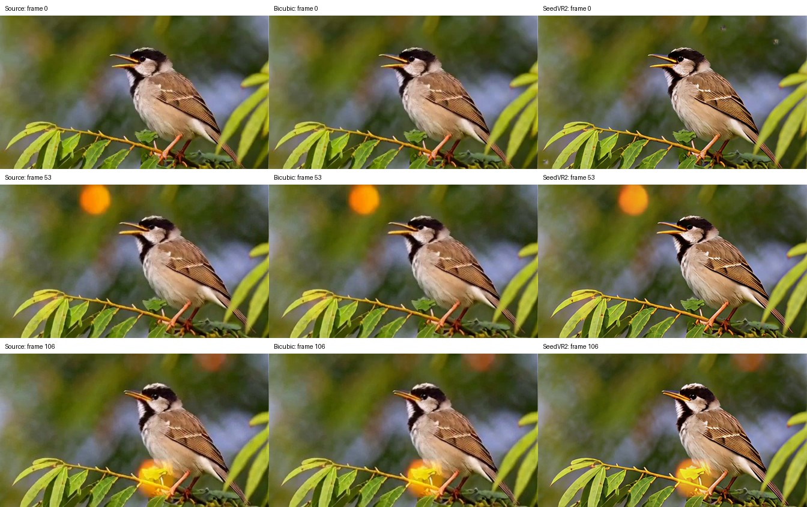

# Remote SeedVR2 video restoration

**Restore Video (SeedVR2)** sends a VIDEO to a vLLM-Omni SeedVR2 service and
returns VIDEO. Load an uploaded clip with ComfyUI's **Load Video**, or connect
**Generate Video** directly. **Save Video** exports the result with its audio.
ComfyUI does not load SeedVR2 weights or change either server's deployment.

## Start the service

Install ComfyUI-vLLM-Omni and prepare the released 3B FP16 checkpoint directory
following the [SeedVR2 model guide](../../../docs/models/seedvr2.md#model-directory).
The guide is also the authority for timing, audio and server admission limits.

```bash
CUDA_VISIBLE_DEVICES=0 vllm serve "$SEEDVR2_MODEL_DIR" --omni \
  --served-model-name seedvr2 --model-class-name SeedVR2Pipeline \
  --dtype float16 --enforce-eager --num-gpus 1 \
  --host 127.0.0.1 --port 8098
```

Set the node's URL to `http://localhost:8098/v1` and model to `seedvr2`.
Use the server's configured model name when choosing a different alias.

## Standalone template

Open **vLLM-Omni SeedVR2 Video Restoration.json** from the extension's templates.
Upload a short CFR clip in **Load Video**, set the service URL/model and output
width/height, and run. The default output is 224×128; dimensions are explicit
positive multiples of 16 and need not be larger than the input. Set both
dimensions proportionally when preserving the aspect ratio.
Both input and output geometry must fit the server's admission limits;
requesting a smaller output does not bypass the input limit.

The node submits one asynchronous whole-clip job through `/v1/videos`, polls its
status and downloads the completed MP4. `timeout_seconds` bounds an HTTP request
and the polling/download phase (default 1,800 seconds). ComfyUI **Stop** interrupts
the node while it waits for the remote request. The client attempts to delete a
known job after download, failure, timeout or cancellation. The node waits for
this best-effort cleanup, bounded to ten seconds or the configured HTTP timeout
when shorter; cancellation may still need the server's GPU work to drain. A
network failure during submission can leave the server with a job whose ID the
client never received.

The request deliberately omits FPS, duration and frame count. SeedVR2 reads the
source timing, pads internally to 4n+1 and crops back to the decoded input count.
The returned VIDEO uses the source's exact rational FPS, including rates such
as 30000/1001 that a response encoder may round. It corrects MP4 timestamps
without re-encoding; the templates' MP4/H.264 Save Video settings reuse those
streams. Other downstream nodes that re-encode VIDEO may change timing.
Its first mono/stereo audio track is aligned to the source video and re-encoded
as AAC. Audio is preserved as content, not as byte-identical compressed packets.
VFR and multichannel audio are rejected by the server. The upload is explicitly
saved as MP4, including file-backed VIDEO originally loaded from MOV/MKV.
Unusable codecs/containers, oversized clips, unavailable endpoints and failed
jobs are surfaced as errors; there is no local-model fallback or retry.

## Portable input and reference

Upload [seedvr2-input.mp4](assets/seedvr2-input.mp4) in the standalone template's
**Load Video** node. It contains six 112×64 H.264 frames at **30000/1001 FPS**, with
a 48 kHz mono AAC 440 Hz test tone. Keep the template's seed **7723** and output
**224×128**. The complete sample exercises padding to nine and cropping back to six.

The visual input is a downsampled excerpt of *Big Buck Bunny*:
(c) copyright 2008, Blender Foundation / [www.bigbuckbunny.org](https://www.bigbuckbunny.org), licensed under
[CC BY 3.0](https://peach.blender.org/about/). The excerpt has been resized,
shortened and given a synthetic test tone. Its original download is
[Big_Buck_Bunny_720_10s_10MB.mp4](https://huggingface.co/datasets/raushan-testing-hf/videos-test/resolve/4cba700bd771f44d72b549253da025c32e944d42/Big_Buck_Bunny_720_10s_10MB.mp4)
at the fixed dataset revision in that URL. SHA-256:

| Asset | SHA-256 |
| --- | --- |
| Original download | `881e507cecf827e5abb5da3b4ac86b105af4dea8fa8eb2934b6dded495577fdd` |
| Portable input | `dac80008ad47b6cbc05a120a399a2aef1eba1299f77fd3b5a47e5a39fa4a5889` |
| Saved reference | `023fe2af36640929adce31b50a414afdbeeb3b8161c089715082f06c9eab6b80` |

The [saved restoration reference](assets/seedvr2-restored.mp4) is an actual
SeedVR2 3B FP16 GPU output exported by ComfyUI's **Save Video**. It retains six
frames, exact 30000/1001 FPS and mono audio at 224×128. It is a fixed serving
reference for the client integration, not an independent implementation of the
model or a perceptual quality benchmark.

To obtain a direct serving reference, start the single-GPU service above, then
run from this directory:

```bash
curl --fail-with-body http://localhost:8098/v1/videos/sync \
  -F 'model=seedvr2' --form-string 'prompt= ' \
  -F 'input_references=@assets/seedvr2-input.mp4;type=video/mp4' \
  -F 'size=224x128' -F 'seed=7723' \
  -F 'num_inference_steps=1' -F 'guidance_scale=1' \
  --output direct.mp4
```

All six decoded RGB frames match the saved reference exactly on the recorded
deployment (maximum absolute pixel difference **0**). Container hashes can
differ because Save Video adds workflow metadata. Different model revisions,
hardware or attention backends can change pixels. The generic server encoder
may round fractional FPS; this node corrects timestamps while retaining the
encoded streams. Use `--form-string` for the required space prompt: curl's `-F`
trims that value.

## Remote H3 → SeedVR2 template

Open **vLLM-Omni MiniMax H3 Remote SeedVR2.json**. Start H3 separately using the
[H3 recipe](../../../recipes/MiniMaxAI/MiniMax-H3.md), and set **Generate Video**
to that service's URL/model. **Restore Video** keeps its own SeedVR2 URL/model.
On slow storage, allow enough H3 startup time with `--init-timeout` and
`--stage-init-timeout`; node timeouts apply only after the services are ready.
The template saves both videos under `video/H3-source` and
`video/H3-SeedVR2-restored` for comparison. The existing local
[WF-07](wf07-h3-upscale.md) remains available.

This template uses base H3, 50 steps, 24 FPS, 4.458 seconds and an explicit
448×256 canvas; H3 resolves duration onto its own frame lattice. SeedVR2 requests
896×512 output. A generated H3 clip exceeds the default single-GPU SeedVR2
whole-clip budget. Use a deployment qualified for the full source and output
geometry; raising a timeout does not increase its memory budget.

For four 48 GB GPUs, the following limits the maximum admitted frame to the
template's output geometry and uses the server's memory-scaled clip budget:

```bash
CUDA_VISIBLE_DEVICES=0,1,2,3 \
VLLM_OMNI_SEEDVR2_SHARDED_FRAME_PIXELS=458752 \
vllm serve "$SEEDVR2_MODEL_DIR" --omni \
  --served-model-name seedvr2 --model-class-name SeedVR2Pipeline \
  --dtype float16 --enforce-eager --vae-use-tiling \
  --num-gpus 4 --distributed-executor-backend mp \
  --stage-overrides '{"0":{"ulysses_degree":4,"vae_patch_parallel_size":4,"vae_parallel_mode":"spatial_shard_height"}}' \
  --host 127.0.0.1 --port 8098
```

Qualify the intended clip on your hardware before using changed caps. Check
available memory on every GPU, including other services. See the model guide for
admission behavior, supported profiles and the consequences of GPU OOM.

## Qualified versions and output example

The real-model runs used vLLM-Omni main `5ca23106` plus this integration,
vLLM **0.30.0**, Python **3.12.4**, PyTorch **2.13.0+cu130**, PyAV **18.0.0**,
aiohttp **3.14.3** and FFmpeg CLI **4.4.2**, on shared NVIDIA RTX A6000 GPUs
(48 GB each). ComfyUI was pinned to
`5c460d8172fe30761ff67c0df3d5643bb74e0d70`, with frontend **1.53.10**.

After rebasing, a standalone GPU smoke test also passed on **vLLM 0.31.0**
(FlashInfer 0.7.0.post1) at integration commit `4c64b69c`, using the portable input and native
Load Video → Restore → Save Video with caching disabled. On one RTX A6000,
it completed in **11.04 seconds**: six frames at exact **30000/1001 FPS**,
**224×128** output and **48 kHz mono AAC**. Full FFmpeg decode and Chromium
playback passed; the browser decoded all six frames and the audio track.
Source/restored zero-lag audio correlation was **0.99657**. The multi-container
and full H3 results below remain qualified against vLLM 0.30.0.

The native Stop fix at `a5a6ae12` was also tested on that vLLM 0.31 stack,
with one RTX A6000 and caching disabled. The audio sample restored successfully
before and after interrupting a 17-frame clip requesting 448×256 output. Native
Stop reported interruption in **0.14 seconds**, deleted the remote job (DELETE
200, subsequent GET 404), and skipped Save Video. Both successful outputs retained
six frames, exact **30000/1001 FPS** and **48 kHz mono AAC**, passed full FFmpeg
decode and Chromium playback, and had identical decoded RGB frames. The full
ComfyUI CPU suite at that commit passed all **108 tests**.

SeedVR2 uses `seedvr2_ema_3b_fp16.safetensors`, `ema_vae_fp16.safetensors` and
`pos_emb.pt`; hashes and layout are maintained in the
[model guide](../../../docs/models/seedvr2.md#model-directory). Downloads were
pinned to numz/SeedVR2_comfyUI revision
`09ced71023636e9bc8cdf9cdecfb2625d1e691e8` and ByteDance/SeedVR2-3B revision
`37255ff8cccfb01071b87f635a5948ca8d53117c`. H3 uses the base FL2VA checkpoint at
MiniMaxAI/MiniMax-H3 revision `42ed227ee7df40d41602854ae760620d6eb651fe`;
all 29 weight files passed their published SHA-256 checks.

Both templates were opened and serialized in native ComfyUI/Chromium, then
executed with ComfyUI's cache disabled against real served models. Standalone
H.264/AAC tests covered MP4 without audio, mono MP4/MOV and stereo MKV, with five
or six frames at 24, 25 or 30000/1001 FPS. Each retained its frame count, exact
FPS and expected audio, at the requested 224×128 output.

The H3 template's default 50-step run through separate H3 and SeedVR2 services
completed in **367.93 seconds**. Both saved videos have **107 frames** at
**24 FPS**, lasting **4.458333 seconds**, with **32 kHz stereo AAC**. The task
requester fully watched and listened to both clips and confirmed no new obvious
audiovisual problems on 2026-10-05. These are functional measurements on shared
GPUs, not performance benchmarks.

The model-generated example shows frames 0, 53 and 106: source, bicubic baseline,
then SeedVR2 restoration, displayed at the same size. The source has generated
visual artifacts; restoration does not guarantee their removal.



## Whole-clip boundary and verification

This first node does not use `/v1/seedvr2/restore-long`, split clips, loop frames
or blend boundaries. Explicit long-video job support is a follow-up; the
[long-video API](../../../docs/models/seedvr2.md#long-video-restoration) has
separate FPS, deployment and storage requirements.

Inspect both input and saved output:

```bash
ffprobe -v error -count_frames \
  -show_entries stream=codec_name,codec_type,width,height,avg_frame_rate,nb_read_frames,sample_rate,channels,duration \
  -of json input.mp4
# Repeat for the MP4 written by Save Video.
```

Check requested dimensions, equal decoded frame counts and source FPS, and an
audio stream when the input has one. Watch corresponding first/middle/last
frames and listen for alignment. Record server commit, checkpoint hashes,
ComfyUI commit, workflow JSON, seed, input, runtime and output. Repeat with a
six-frame input to verify that internal padding does not leak into the result.
