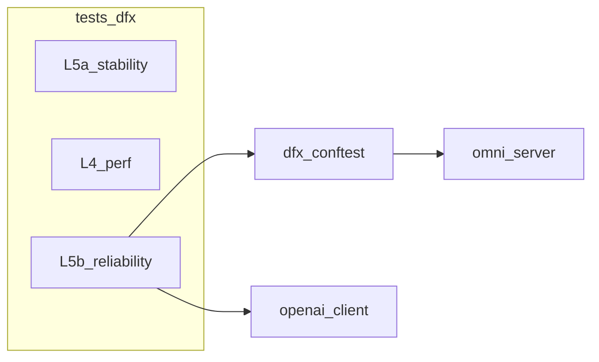

# RFC：tests/dfx 下 L5(b) 可靠性测试框架

> **状态**：草案（本地存档，可后续同步为 GitHub Issue 讨论）  
> **模板**：与 [.cursor/skills/RFC-generate/SKILL.md](../../../../.cursor/skills/RFC-generate/SKILL.md) 对齐；密度可参考 [Issue #1313](https://github.com/vllm-project/vllm-omni/issues/1313)。

### Motivation

L5 在 [CI_5levels.md](../ci/CI_5levels.md) 中分为长期 **Stability** 与 **Reliability（故障/恢复）**。当前 `tests/dfx/stability/` 与 `tests/dfx/perf/` 已采用 JSON 配置 + `omni_server` 参数化模式，但 **L5(b) 在文档中仍指向 `tests/e2e/reliability/`**，与现有 dfx 布局不一致。[PR #1384](https://github.com/vllm-project/vllm-omni/pull/1384) 曾搭建 e2e 可靠性脚手架，因 **fixture 未定义、配置未入库、静默失败** 等问题未达可合并质量。

本 RFC 目标：在 `**tests/dfx/reliability/`** 提供与 stability 对称的 **可配置场景 + 可观测 RecoveryResult + pytest collect 零错误**，服务 **周跑/发布前 GPU 独占环境** 的质量门禁与回归对比；与 [L5 长期稳定性 #1590](https://github.com/vllm-project/vllm-omni/issues/1590) 互补（#1590 偏长期曲线，本 RFC 偏故障后行为）。

### Proposed Change

- 新增目录 `tests/dfx/reliability/`，用 `tests/scenarios.json`（或 `test.json`，与 stability 命名二选一并写死）描述 **server_params + scenario_type + fault + expect**。
- 复用 `[tests/dfx/conftest.py](../../../tests/dfx/conftest.py)` 的 `load_configs`、`create_unique_server_params`、`omni_server`（indirect），测试侧显式使用 `**openai_client`**（与 `tests/conftest.py` 一致），禁止虚构 `client` fixture。
- 定义结构化 `**RecoveryResult**`（字段见 Detailed Design），文档与代码一致；缺可选依赖时 `**pytest.skip` 或 fail**，禁止返回 0 掩盖失败。
- **OOM 分档**：Tier1 为「超规格请求 → 预期错误 + 进程存活 + 后续成功」；Tier2 硬 OOM 仅 `requires` + 环境变量，默认周跑不启用。
- **Kill 进程**：作为独立 `scenario.type`（见下表），与 OOM Tier2 同属「进程级故障」，默认仅独占环境 + 显式开关。
- 更新 [CI_5levels.md](../ci/CI_5levels.md) 第 4 章：L5(b) 路径与运行示例改为 `tests/dfx/reliability/`。

#### 采纳的可靠性场景（三类）

与本 RFC 对齐的**产品范围**为以下三种；均在 `scenarios.json` 中通过 `scenario.type` 与可选字段区分。

| 场景 | `scenario.type`（建议枚举） | 验证要点 | 默认周跑 / 门禁 |
|------|------------------------------|----------|----------------|
| **异常输入** | `abnormal_input` | 非法/超大 payload、错误 modality 等；期望可预期错误，**服务进程不僵死**，故障后若干次正常请求成功 | 可作为 Tier0，优先纳入 collect + 轻量 GPU |
| **OOM** | `oom_boundary`（Tier1） / `oom_hard`（Tier2） | Tier1：超规格请求触发拒绝或分配失败，进程存活；Tier2：真硬 OOM 或进程退出后的恢复（与实现一致） | Tier1 可纳入；**Tier2 默认关闭** |
| **Kill 进程** | `process_kill` | 对**可安全终止的目标**（如 worker 子进程，而非乱杀主进程）发送 SIGTERM/SIGKILL 等，验证 **拉起或恢复后** 健康检查与业务请求成功 | **默认关闭**；`requires: [baremetal]` + 环境变量（如 `VLLM_DFX_RELIABILITY_PROCESS_KILL=1`） |

### Feedback Period

开放至 **相关 PR 合并前**；若需跨团队对齐调度与队列，延长至 **首次周跑 job 合入后 1 周**。

### Design

**总览**：dfx 三层 `perf` / `stability` / `reliability` 共用同一套 server 参数生成；reliability 在 server 就绪后按场景执行 **fault_inject → 探测健康/后续请求 → 填充 RecoveryResult**。

```text
tests/dfx/reliability/
  README.md
  conftest.py              # 可选：报告目录、与 stability 对齐的 hook
  stage_configs/           # 与 stability 同模型 yaml 或文档说明复用路径
  tests/
    scenarios.json
  scripts/
    fault_inject.py        # 纯函数，可单元测试
    test_reliability.py    # @pytest.mark.slow；parametrize + omni_server + openai_client
```

**模块职责**：

- `scenarios.json`：唯一场景源；Buildkite 周跑调度文件仍只放在 `.buildkite`，避免与「weekly」语义混淆。
- `fault_inject.py`：按 `scenario_type` 分发（**`abnormal_input`**、**`oom_boundary` / `oom_hard`**、**`process_kill`**）；客户端超时可作为 `abnormal_input` 子类或独立类型；**OOM Tier2 / process_kill** 单独分支并 gate。
- `test_reliability.py`：装配 fixture、断言 RecoveryResult、写日志/可选 JSON 产物。

#### Detailed Design

**配置条目（示意）**：每条包含 `test_name`、`server_params`（与 stability 相同字段：`model`、`stage_config_name`、`update`/`delete`）、`scenario`（`type`、`fault_params`、`expect`）、可选 `requires`（如 `baremetal`）、`oom_tier`（`none` | `boundary` | `hard`）。`process_kill` 场景可在 `fault_params` 中指定 **目标角色**（如 `worker`）与 **信号**（如 `SIGTERM`），具体以 `OmniServer` 进程模型调研结果为准（开放问题）。

**RecoveryResult（建议 TypedDict 或 dataclass）**：

- `recovered: bool`
- `recovery_time_sec: float | None`
- `health_check_ok: bool`（若暂无独立 health API，可用「最小合法请求成功」代替并文档说明）
- `post_fault_success_count: int` / `post_fault_error_count: int`
- `notes: str`

**并发与生命周期**：与 `[test_benchmark_stability.py](../../../tests/dfx/stability/scripts/test_benchmark_stability.py)` 一致采用 module-scope `omni_server` + 锁时注意 **同进程多场景串行**；故障步骤禁止与子 benchmark 并行混跑（首版单测文件内串行即可）。

**错误与超时**：客户端超时、连接错误须显式记录进 `notes`；禁止裸 `except: return False` 吞异常。

**PR #1384 教训对照表**（实现与评审 checklist）：


| 问题           | 对策                                                             |
| ------------ | -------------------------------------------------------------- |
| 未定义 `client` | 使用 `openai_client`                                             |
| 默认配置文件缺失     | 入库 `scenarios.json` 或 `CONFIGS=[]` + collect-only 仍通过且显式 skip  |
| 依赖缺失静默 0     | skip/fail                                                      |
| 指标名与语义不符     | 阈值字段命名与断言逻辑一致（如 `max_post_fault_error_rate_pct` 若表示绝对比例则按绝对值算） |


### Use Case

**扩展方式**：在 `scenarios.json` 增加一条 `test_name`，必要时在 `stage_configs/` 增加 yaml。

**运行命令**：

```bash
pytest --collect-only tests/dfx/reliability
pytest -s -v tests/dfx/reliability/scripts/test_reliability.py -m slow
```

**产物**：控制台日志；可选 `reliability_result_<test_name>.json`（与 perf/stability 结果文件习惯对齐，Open question：是否必须与 stability 同目录命名规范）。

**单条场景示例（片段）**：

```json
{
  "test_name": "qwen3_omni_abnormal_then_ok",
  "server_params": {
    "model": "Qwen/Qwen3-Omni-30B-A3B-Instruct",
    "stage_config_name": "qwen3_omni.yaml"
  },
  "scenario": {
    "type": "abnormal_input",
    "fault_params": { "max_tokens": 999999 },
    "expect": { "process_alive": true, "min_post_success": 1 }
  }
}
```

### CC List

- dfx / CI 维护者（Buildkite、`.buildkite` 周跑定义）
- 曾评审 [PR #1384](https://github.com/vllm-project/vllm-omni/pull/1384) 的 reviewer（避免路径再次分叉）

### Any Other Things

- **风险**：共享 GPU 上 Tier2 硬 OOM 可能误伤同机 job → 默认关闭 Tier2。
- **开放问题**：`OmniServer` 是否暴露独立 health 端点；若无，「health_check_ok」的等价判定标准需在首版 PR 写死。

## Non-goals

- 首版不实现全集群网络分区、随机杀节点级混沌（独立流水线后续 RFC）。
- 默认不实现 **Tier2 硬 OOM**（除非环境变量 + 独占机）。
- **默认不跑 `process_kill`**（与 Tier2 OOM 同级）；不在共享 GPU 上主动 kill 主推理进程以免误伤同机任务。

## Alternatives considered


| 方案                                | 优点                              | 缺点                         | 推荐                  |
| --------------------------------- | ------------------------------- | -------------------------- | ------------------- |
| A：仅 `tests/e2e/reliability/`      | 与部分文档表述一致                       | 与 dfx 两套配置，易重复 PR #1384 问题 | 否                   |
| B：`tests/dfx/reliability/`（本 RFC） | 与 stability/perf 一致、复用 conftest | 需改 CI_5levels              | **是**               |
| C：dfx 仅薄封装调用 e2e                  | 单一代码库                           | 目录仍分裂，维护成本高                | 可作为 PR #1384 合并后的折中 |


## Rollout / Migration

1. 合入 `tests/dfx/reliability/` + 最小场景；**CI 先跑 `pytest --collect-only`**。
2. 更新 CI_5levels.md；旧路径 `tests/e2e/reliability` 若不存在则删除文档引用或标 Deprecated。
3. 周跑 job 再接入全量 `-m slow`（资源允许时）。

## Testing & CI

- **单测**：`fault_inject` 纯函数可对「构造请求 / mock 响应」做单元测试（不启 GPU）。
- **集成**：GPU 上跑 1～2 条默认可用场景；Tier2 仅标注 `manual`/`baremetal`。
- **门禁**：`pytest --collect-only tests/dfx/reliability` 必须通过；与 [RFC-generate reference](../../../../.cursor/skills/RFC-generate/reference.md) 中 #1313 建议一致，在 PR 描述中附 collect-only 输出片段。

## 实施顺序（执行阶段）

1. 本 RFC 已本地存档于本文档；需要时再开 GitHub Issue 链接讨论。
2. 脚手架目录 + `scenarios.json` + collect-only。
3. 实现 Tier0：**异常输入** + **客户端故障**（可选）；绑定 `openai_client` / `omni_server`。
4. **Tier1 OOM 边界**（`oom_boundary`）；文档化参数随模型变化。
5. **Kill 进程**（`process_kill`）与 **Tier2 硬 OOM**（`oom_hard`）：独占环境 + 开关就绪后再合入。
6. CI_5levels + Buildkite；评估与 PR #1384 共享代码。




