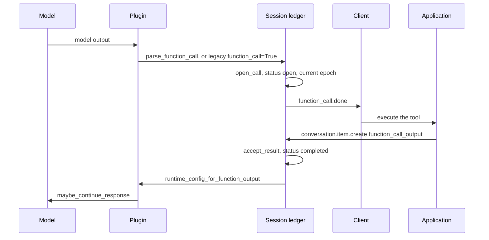
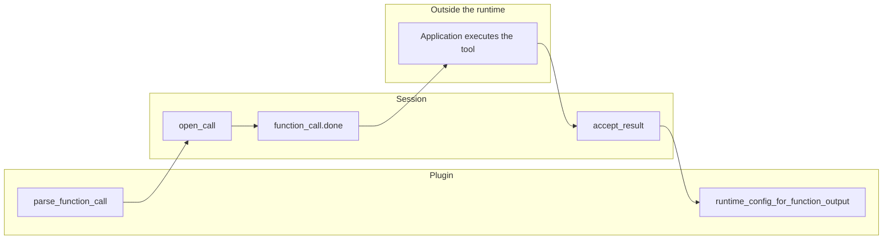
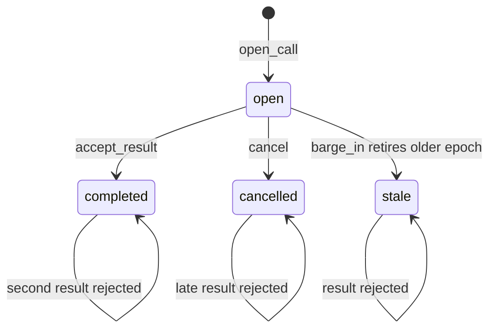
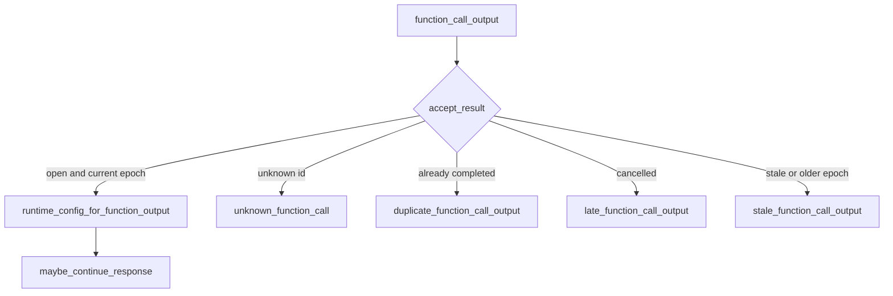

# Duplex session tool contract

A duplex function call has three owners:

| Owner | Job |
| --- | --- |
| Session (`DuplexToolLedger`) | `call_id`, epoch, duplicates, cancel, late and stale results |
| Model plugin | Recognize one call in model output, and turn an accepted result into model input |
| Application | Execute the tool. This stays outside the runtime |

The ledger does not run tools, does not start a timer, and does not block audio append while a result is outstanding. A timeout is recorded by `cancel(reason="timeout")`.

Model-specific grammars, prompts, and worker acknowledgement stay in that model's plugin. The Nemotron pending-batch acknowledgement added in #7884 still lives in the Nemotron plugin and runs only after the ledger accepts a result, through the existing `runtime_config_for_function_output` hook.

## Happy path

Audio append does not wait on this path. The ledger is not consulted when PCM is appended.

## Who does which step

`parse_function_call` defaults to `None`. A plugin that does not emit tool calls leaves both hooks as no-ops. When the hook returns `None`, the session still accepts the legacy `function_call is True` shape (`call_id`, `name`, `arguments`). A recognized call is `{"call_id", "name", "arguments"}`.

`runtime_config_for_function_output` is unchanged. It runs only after `accept_result` succeeds. The default returns `None`, so a plugin with no tool-result encoding does not patch runtime config.

## Call states

| Event | Ledger | What the client sees |
| --- | --- | --- |
| First `open_call` | `open` | `function_call.done` |
| Same `call_id` opened again | unchanged | `duplicate_function_call` |
| Plugin parse is not a call | no row | `invalid_function_call` |
| `accept_result` on an open call at the current epoch | `completed` | item created, then `maybe_continue_response` |
| Unknown `call_id` | no row | `unknown_function_call` |
| Second result for a completed call | stays `completed` | `duplicate_function_call_output` |
| Result after `cancel` | stays `cancelled` | `late_function_call_output` |
| Result after `barge_in`, or epoch mismatch | `stale` | `stale_function_call_output` |

`barge_in` increments the session epoch and calls `retire_before`. Open calls from the previous epoch become `stale`. Completed and cancelled rows are left as they are. There is no background timer: a caller that wants a timeout calls `cancel(call_id, reason="timeout")`. A second cancel of an already cancelled call returns the same row.

A legacy `function_call is True` output that has no `call_id` and `name` still emits a raw `function_call.done` and does not open a ledger row. A plugin `parse_function_call` result that is not a complete call is `invalid_function_call` and does not emit `function_call.done`.

## Result that must not reach the model

The realtime projector still checks conversation items on the wire. The session ledger is the additional check that a result belongs to a call this session opened and has not already finished, cancelled, or retired.
