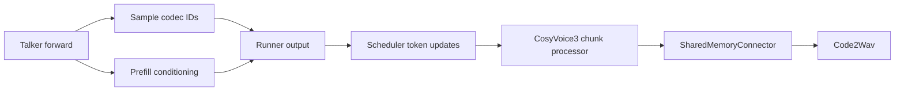

# CosyVoice3 Talker output payloads

This document defines the output contract used by CosyVoice3's async-chunk
pipeline and the payload cleanup in
[RFC #6870, B2](https://github.com/vllm-project/vllm-omni/issues/6870).
The Talker sends sampled codec tokens and prompt conditioning to Code2Wav.
Code2Wav does not consume the Talker's hidden states.

## Data flow

Talker hidden states remain available to logits computation and sampling.
The cleanup removes their downstream payload materialization and CPU copy.
It leaves the model forward computation, sampling parameters, codec chunk
policy, and Code2Wav computation unchanged.

## Payload by phase

| Phase | Sampled codec IDs | Prompt conditioning | Hidden payload |
| --- | --- | --- | --- |
| Async-chunk prefill | Delivered when sampled | Retained and routed per request | Omitted |
| Async-chunk decode | Delivered on token-only steps | Reused from the request's first payload | Omitted |
| Final async-chunk update | Remaining valid codec IDs | Existing request conditioning | Omitted |
| Legacy non-async-chunk execution | Existing token path | Existing full-payload path | Existing policy retained |

Conditioning includes prompt speech tokens, prompt speech features, speaker
embedding, and the prompt token lengths needed to remove batch padding.
The runner partitions these values by request. The chunk processor removes
padding, retains conditioning in its request state, and sends it with the
first codec chunk. Later chunks carry cumulative codec prefixes and the
offset of the already emitted portion.

Codec tokens are carried by `OmniModelRunnerOutput.sampled_token_ids`. They
do not require a tensor-valued `inter_stage_outputs` entry on every decode
step. Omitting hidden payloads can therefore leave that entry empty while
the decode step still produces a codec token.

## Producer and scheduler contract

The Talker sets `omni_pooler_payload_include_hidden = False` when its model
configuration enables async chunking. The GPU runner reads this policy when
loading the model and excludes hidden states from the downstream payload.
CosyVoice3 does not set `use_async_omni_output`: output materialization stays
inline, while the existing asynchronous sampled-token feedback remains
available when AR async scheduling is enabled.

`talker2code2wav_async_chunk.requires_token_updates = True` declares that the
processor needs sampled IDs even when the step has no tensor payload. The
AR scheduler enqueues an update when any existing emission condition holds
or the processor has explicitly opted in and `new_token_ids` is nonempty.
Processors without this declaration retain their previous trigger.

Requests marked `omni_final_stage_id=0` have no downstream chunk consumer.
The scheduler must evaluate that exclusion on token-only updates as well as
tensor-bearing and stopped updates. It reads the request metadata before
stop processing can release or replace it, then skips the connector send
for Stage-0-final requests.

## Chunk completion and ownership

The processor consumes each request's appended output-token history once,
using `seen_len` to find new IDs. It filters IDs outside the codec vocabulary,
including stop IDs, and forms cumulative prefixes according to the existing
hop, prompt-padding, and lookahead configuration.

Request-scoped state owns prompt conditioning, emitted-token offsets, and
the terminal marker. A final update flushes the remaining valid codec tokens.
If no tokens remain after the previous chunk, an empty terminal payload
signals completion without duplicating the audio prefix. Cleanup and
resumable-segment behavior continue to use the connector's existing lifecycle.

The hidden-payload policy is independent of AR async scheduling. Disabling
async scheduling does not make unused hidden states necessary for async
chunking. For non-async-chunk configurations, the prior hidden-payload policy
is preserved, including the pre-existing packed-inference opt-in.

The default CosyVoice3 deployment disables prefix caching. This cleanup
does not establish an additional prefix-cache compatibility claim.

## Correctness validation

Validation separates model output from transport and stochastic synthesis:

1. Assert that prefill conditioning and sampled IDs survive payload building.
2. Verify that async-chunk payload construction does not copy the hidden
   tensor to CPU, and that the legacy path retains its existing behavior.
3. Check token-only scheduler emission, empty-token steps, processors without
   an opt-in, and Stage-0-final exclusion.
4. Exercise actual streaming audio with fixed token counts and full-batch
   warmups on a single GPU.
5. For concurrent runs, compare the Talker's final codec stream with every
   sender and receiver prefix, then compare conditioning and flow inputs.

Flow synthesis draws random noise in the Code2Wav worker. Differences in
request/chunk execution order can assign different draws to requests despite
matching codec tokens. Waveform differences therefore need input and RNG
diagnostics before they can be attributed to payload corruption. Diagnostic
RNG controls belong in the validation harness and do not change production
sampling or synthesis.

## Measurement and submission evidence

Measure unprofiled AR inter-token latency separately from traces. Keep model,
hardware, token count, warmup batch size, chunk policy, AR scheduling, and flow
backend fixed. Record full paired rounds and end-to-end TTFA/throughput;
profile only in a separate process. Instrumented diagnostic runs establish
data-flow correctness and do not supply performance claims.

The implementation is small because the runner already supports omitting
hidden payloads. Completion requires the producer policy, token-only routing,
compatibility checks, real streaming validation, and reproducible evidence.
The measured benefit is local cleanup; the RFC's sampler and concurrency
bottlenecks remain separate workstreams.

The checked-in benchmark, reports, and reproduction artifacts live under
[`benchmarks/tts/cosyvoice3_async_output`](../../../benchmarks/tts/cosyvoice3_async_output/README.md).
