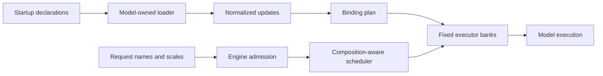

# Diffusion LoRA Runtime

## Status and scope

The Diffusion LoRA Runtime is a model-declared, startup-loaded backend for
request-level LoRA selection. It is introduced in parallel with the legacy
diffusion LoRA facilities. Existing models, examples, and request fields keep
their legacy behavior until they are migrated explicitly.

The first integration is MiniMax-H3 FL2VA, led by its Turbo deployment. This
initial scope supports:

- dynamic low-rank updates;
- immutable startup registration;
- request selection by registered name and scale;
- weighted compositions of multiple registered adapters;
- request and step batching;
- tensor-parallel linear layers; and
- eager and regional `torch.compile` execution.

It intentionally does not provide prefusion, request-time downloads, mutable
adapter caches, runtime add/remove/pin operations, image API integration, or
CPU and layerwise offload.

## Motivation

Diffusion LoRA publications are not uniform. Models may use different key
layouts, packed projections, tensor row orders, intrinsic scales, and update
semantics. Treating those differences as branches in one generic checkpoint
converter makes model correctness and feature compatibility difficult to
review.

The runtime therefore standardizes lifecycle and request behavior while each
model owns interpretation of its published checkpoint.

## Architecture



Each model declares a `DiffusionLoRASupport` with three extension points:

1. **Loader factory:** reads the model's publication format and emits
   `LowRankUpdate` objects.
2. **Binding plan:** allowlists pipeline components and logical target modules,
   including mappings from logical projections to packed physical modules.
3. **Executor factory:** installs and applies the normalized updates. The
   default executor supports common replicated, column-parallel,
   row-parallel, merged-column, and packed-QKV linear layers. A model can
   provide another executor when its update math is genuinely different.

The common runtime does not guess checkpoint semantics from model names or
tensor shapes. A pipeline that does not declare support fails startup when the
new runtime is enabled.

## Deployment and request contracts

`--enable-diffusion-lora` enables the new runtime. Each repeatable
`--diffusion-lora` value registers one immutable `{name, path}` deployment.
The path is resolved and loaded during worker startup.

Requests contain only `{name, scale}` selections. They cannot supply paths or
IDs and therefore cannot download or replace weights while the service is
running. The engine rejects disabled or unknown selections before scheduler
admission. An empty or omitted composition selects the base model.

The registry is not a default composition: registering an adapter makes it
available but does not activate it automatically.

Checkpoint format and adapter identity are independent. A model selects a
decoder from checkpoint metadata and validates the tensors; it never selects a
decoder from the user-provided deployment name. Multiple registered adapters
may therefore share one format decoder while retaining distinct names, weight
banks, and request scales.

For example, a service can register two model-compatible adapters and compose
them by name at request time:

```bash
--diffusion-lora '{"name":"fast","path":"/models/fast.safetensors"}' \
--diffusion-lora '{"name":"style","path":"/models/style.safetensors"}'
```

```json
{"loras":[{"name":"fast","scale":1.0},{"name":"style","scale":0.7}]}
```

## Composition and execution

For a base linear transform `W` and selected low-rank updates `(A_i, B_i)`, the
default executor computes

$$
y = Wx + \sum_i s_i B_i(A_i x).
$$

Intrinsic checkpoint scaling is folded into each adapter's runtime scale.
Duplicate request entries with the same name are combined, zero totals are
removed, and the result is sorted by name to form the canonical composition.

All startup adapters are concatenated into fixed-shape banks. Requests mutate
only device-resident scale buffers. This keeps the module graph and tensor
shapes stable for compilation while preserving request-level activation.

The canonical composition is part of both request-batch and step-batch
compatibility keys. One scheduled batch therefore cannot mix different LoRA
states.

## Lifecycle and feature boundaries

Initialization order is:

1. load the base pipeline;
2. load and bind immutable LoRA banks;
3. install compile and cache wrappers; and
4. serve name-only selections.

Pipeline replacement releases both legacy and new LoRA runtime references
before deleting the old pipeline, allowing its parameters and buffers to be
reclaimed before the replacement is loaded.

The first implementation has the following feature boundaries:

| Feature | Contract |
| --- | --- |
| `torch.compile` | Supported because bank capacity and graph shape are fixed at startup. |
| Tensor parallelism | Supported by the default executor for its declared linear layer types. |
| Request/step batching | Supported; composition participates in scheduler identity. |
| Runtime add/remove/list/pin | Rejected; the deployment registry is immutable. |
| CPU/layerwise/DLO offload | Rejected at startup. |
| Legacy LoRA flags and requests | Preserved for unmigrated models, but cannot be combined with the new runtime. |
| Image API | Not part of the MiniMax-H3-first integration. |
| Prefix-KV publication | A future cache identity must include the canonical composition before cross-request reuse is allowed. |

## MiniMax-H3 integration

MiniMax-H3 owns both the LightX2V Turbo v1.0 conversion and normalization of
the native H3 FL2VA fused-QKV layout. The Turbo path validates its rank-128,
alpha-128 contract and swaps the Diffusers FFN `lora_B` row order from
`[value; gate]` to native `[gate; up]`; the native path reads its declared rank
and splits fused QKV updates into logical Q/K/V bindings. This format support
does not endorse or register a specific third-party adapter.

Sampling steps, flow shifts, task selection, and other recipe behavior remain
pipeline/request concerns. Installing a Turbo adapter does not silently change
the execution plan.

## Validation

The runtime requires tests for:

- exact single- and multi-adapter low-rank math;
- startup parsing and immutable registration;
- disabled and unknown request rejection before scheduler admission;
- composition-aware request and step batching;
- model-specific checkpoint conversion and rejection paths;
- TP localization for every supported packed or parallel layer type;
- pipeline replacement cleanup; and
- eager and compiled end-to-end generation for each integrated model.

Migration of existing models and examples is deliberately separate work. Each
migration must preserve its legacy behavior until its model-owned loader,
binding plan, execution semantics, and compatibility tests are complete.
