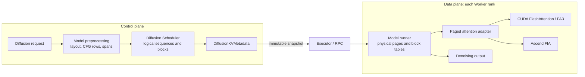
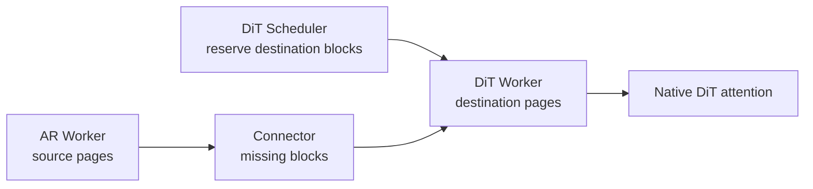

# Scheduler-Managed Paged KV Cache

This document describes the design and lifecycle of Scheduler-managed paged KV cache for diffusion DiT stages.

For operator-facing configuration and examples, see the
[Paged KV Cache user guide](../../user_guide/diffusion/paged_kv_cache.md).

## Table of Contents

1. [Overview](#overview)
2. [Motivation](#motivation)
3. [Architecture](#architecture)
4. [Execution Modes](#execution-modes)
5. [Design](#design)
6. [Model and Platform Integration](#model-and-platform-integration)
7. [Configuration and Compatibility](#configuration-and-compatibility)
8. [Limitations](#limitations)
9. [Related Files](#related-files)

## Overview

Scheduler-managed paged KV provides a page-based memory and data-movement
foundation for diffusion DiT stages. It makes KV capacity explicit, preserves
stable prefixes across denoising steps, and defines page-granular destinations
for future AR-to-DiT transfer. HunyuanImage-3.0 is the current request-mode
reference on CUDA and Ascend NPU; the supported boundaries and follow-up work
are described below.

## Motivation

Paged KV is introduced for three related goals:

1. **Memory management:** make diffusion KV capacity visible to the Scheduler
   so logical requests can reserve and release fixed-size blocks while the
   Worker owns one reusable physical pool. This improves capacity planning and
   memory utilization, and can increase request concurrency and throughput when
   the dense path would otherwise reserve separate full tensors.
2. **Transfer optimization:** give a DiT stage stable destination page slots so
   a future AR-to-DiT connector can transfer missing KV blocks directly,
   instead of gathering a complete tensor into a temporary receiver buffer.
3. **Prefix reuse:** keep the stable prompt/reference prefix resident while
   only the timestep/image target is rewritten at each denoising step. The same
   page-level contract also provides the foundation for canonical prefix-cache
   reuse when a model supplies cacheable block identities.

Request-local memory management and prefix reuse are implemented by the local
request path. Cross-stage transfer and cross-request canonical prefix caching
use the same page interfaces but require model/connector integration that is
outside the current Hunyuan implementation.

The legacy dense path keeps complete model-owned tensors for each request. The
paged path instead maps requests to Scheduler blocks and reuses a Worker page
pool, making capacity and fragmentation explicit. This can improve HBM
utilization and concurrency, although it does not guarantee lower latency for
every shape.

## Architecture

The control plane describes and reserves logical sequences. The data plane
installs the resulting snapshot on each Worker and runs the native attention
backend.



### Ownership boundary

| Component | Owns | Does not own |
| --- | --- | --- |
| Model preprocessing | Lengths, positions, CFG count, and attention spans | Physical blocks or Worker state |
| Diffusion Scheduler | Request lifecycle, logical sequences, admission, and release | Device tensors or native kernel metadata |
| Executor/RPC | Transport of the immutable allocation snapshot | Allocation decisions or page contents |
| Worker/model runner | Rank-local KV tensors, rows, block tables, slots, and active metadata | Scheduler block lifetime |
| Paged attention adapter | Layout translation, slot metadata, and backend dispatch | Capacity management or request admission |
| Platform backend | Native page geometry, metadata construction, and kernel selection | Model-specific token semantics |

`DiffusionKVCacheManager` is the request-facing Scheduler facade: it groups and
atomically allocates the internal sequences for one request, then publishes
`DiffusionKVMetadata` over the Worker-owned physical pool.

### Request lifecycle

1. **Admission:** preprocessing creates one logical sequence per CFG branch;
   the Scheduler reserves all required blocks atomically.
2. **Activation:** the Worker validates the metadata generation, binds rows,
   stages block tables, and installs native attention metadata.
3. **Execution:** the first denoising step writes the complete sequence once;
   later steps write only the changing target span and read retained pages.
4. **Release:** completion, cancellation, errors, and reinitialization release
   Scheduler blocks and clear Worker rows.

Dense requests do not install paged metadata. Paged requests reject legacy
dense KV payloads or stale/incomplete native metadata instead of silently
falling back to dense execution.

### AR-to-DiT transfer contract

When an AR stage and a DiT stage are deployed separately, the previous
model-owned transfer commonly gathers and flattens a complete KV tensor into a
temporary receiver buffer before the DiT model can use it.

The Scheduler-managed contract gives the DiT Worker a destination page layout
before transfer. The current feature implements this DiT-side destination
contract (reservation, layout, and generation/readiness metadata); it does not
execute connector transfers or import AR KV. A future connector can target the
reserved slots directly:



The diagram is a target connector boundary, not an enabled runtime path in this
feature. The expected benefits of a future connector using this contract are:

| Concern | Previous model-owned transfer | Page-native destination contract |
| --- | --- | --- |
| Transfer unit | Packed or complete KV tensor | Individual missing page blocks |
| Receiver storage | Temporary contiguous tensor, then model cache | Scheduler-reserved Worker pages |
| Data movement | Gather/flatten plus another copy or concatenation | Direct write to destination slots when a connector is enabled |
| Readiness | Implicit runner-side synchronization | Explicit generation and ready metadata |
| Denoising reuse | Reassemble the stable prefix in the model | Native attention reads resident pages |
| Cleanup | Transfer and model-cache lifetimes are coupled | Source lease, destination reservation, and request release are explicit |

Reserving destination pages up front supplies stable physical targets and an
explicit generation/ready state, so a future connector can move only missing
blocks and pass the same metadata to native attention. Imported AR KV is not
enabled for `paged_scheduler` in this PR; DreamZero and LingBot-World use the
separate `ar_diffusion_kv` contract.

## Execution Modes

Paged KV is a cache feature; request batching and step execution are separate
engine modes. The terminology follows the
[diffusion continuous batching design](diffusion_continuous_batching.md):

| Execution path | Configuration | Scheduler batch unit | Hunyuan `paged_scheduler` status |
| --- | --- | --- | --- |
| Request execution | `step_execution=false`, `max_num_seqs=1` | One complete denoising request | Current supported path |
| Request-level batching | `step_execution=false`, `max_num_seqs>1` | Multiple compatible public requests in one forward | Not supported by the current `paged_scheduler` integration |
| Step execution | `step_execution=true`, `max_num_seqs=1` | One request advances one denoising step per scheduler tick | Paged path rejects it |
| Step continuous batching | `step_execution=true`, `max_num_seqs>1` | Compatible active step states advance together | Separate feature; paged Hunyuan is not implemented |

`max_num_seqs` limits public requests. CFG branches are internal rows of one
request and are controlled by `diffusion_kv_max_rows_per_request`: a request
without CFG uses one row, while the standard positive/negative CFG request uses
two. Atomic CFG admission does not mean that CFG is required.

## Design

### Startup and cache sizing

Before real requests are admitted, the engine and Workers:

1. Resolve `diffusion_kv_mode` and prepare a maximum-shape profile request.
2. Register paged attention layers and collect a native `KVCacheSpec` per KV
   group.
3. Run the marked memory profile to determine non-KV memory. This probe is not
   a latency sample. On NPU, it may use SDPA only when MindIE-SD is
   unavailable; this is the sole intentional fallback and applies only to this
   startup profile.
4. Build the native cache configuration and resolve block geometry.
5. Allocate rank-local physical pages and create the Scheduler facade over the
   same geometry.

`kv_cache_memory_bytes` is a physical KV-pool budget per Worker rank, not a
request token count. When omitted, the normal utilization path sizes the pool
after subtracting profiled non-KV memory. Reserved pool memory can exceed the
live payload because it also reflects capacity and fragmentation.

### Logical layout

Each sequence has a stable prefix and a changing target:

```text
|-------------------------- allocated seq_len --------------------------|
|---------------- prefix_len ----------------|---- target_len ----|unused|
             retained across steps                 rewritten each step
```

The runner exposes these boundaries to the adapter:

| Phase | `query_len` | `seq_len` | `kv_start_pos` |
| --- | ---: | ---: | ---: |
| First denoising/prefill | `seq_len` | `seq_len` | `0` |
| Later denoising steps | `target_len` | `prefix_len + target_len` | `prefix_len` |

For `block_size`, token position `p` maps to the native slot
`block_id(p // block_size) * block_size + p % block_size`. The Scheduler owns
the block IDs; the Worker turns them into rank-local tables and slots.

### Dense and paged representation

Both modes implement Hunyuan's mixed causal/full attention. They differ in KV
representation and backend input, not in the attention result they describe:

| Aspect | `dense_legacy` | `paged_scheduler` |
| --- | --- | --- |
| KV owner | Model-owned contiguous cache | Worker-owned physical pages |
| Attention input | Contiguous K/V with a dense mask and/or span metadata | Block tables, slots, lengths, and `full_attn_spans` |
| Prefix reuse | Model-owned prefix tensor; cache scope depends on the dense path | Stable prefix pages are retained across denoising steps; canonical cross-request reuse requires cache identities |
| Scheduler state | No diffusion page reservation | Logical sequences, admission, generation, and release |

The current implementation guarantees prefix reuse between the first and later
denoising steps. Native vLLM cross-request prefix caching is not enabled by
this Hunyuan integration: the diffusion KV manager uses
`enable_caching=False`, and Hunyuan does not publish canonical block hashes.

### Attention execution

The two paths preserve the same mixed causal/full spans. In the paged path,
the adapter converts each row into aligned native segments:

| Segment | Query input | KV visibility | Causal flag |
| --- | --- | --- | --- |
| Causal `[s, e)` | `Q[s:e]` | `K[:e]`, `V[:e]` | `true` |
| Full `[a, b)` | Query overlap | `K[:b]`, `V[:b]` | `false` |

The K/V update is deliberately outside the segment loop:

```text
Q/K/V projection
    -> write the current K/V span once per layer
    -> run all causal/full native segments
    -> restore output order
```

CUDA keeps cache-update ownership in its native paged-attention contract.
Ascend prewrites the normal-layout K/V span once, then FIA segment calls read
the persistent pages without receiving K/V again. Output is restored to the
original token order before projection, residual, and MLP layers consume it.

Dense does not imply one universal kernel call. Hunyuan's CUDA dense path can
also use the shared piecewise FlashAttention helper for aligned regions. In
the paged path, the same regions are described as native segments that read
persistent pages. The two modes can therefore have different kernel names and
call counts while preserving the same mask semantics.

### Piecewise planning

The common planner supports both row layouts:

| Row layout | Preparation and output handling |
| --- | --- |
| Homogeneous ranges, such as CFG rows from one request | Keep the batched layout, use contiguous views/direct output-buffer writes, and avoid the large indexed output scatter |
| Heterogeneous lengths or offsets | Gather valid tokens with `index_select`, run native segments, and scatter them back with `index_copy_` |

The homogeneous fast path applies to rows in one attention invocation; it does
not enable arbitrary public-request batching or change Scheduler allocation.

## Model and Platform Integration

### HunyuanImage-3.0

Hunyuan is the reference integration because its self-attention mixes causal
and full regions and its generated-image region changes across denoising
steps. It creates one logical row per conditional or unconditional CFG branch
and supports strict Ulysses SP in request mode. Its runner owns row creation,
phase activation, and page metadata; the model boundary supplies token layout
and attention spans without allocating Scheduler blocks.

### Platform matrix

| Model/integration | Platform | Execution | Backend | Status |
| --- | --- | --- | --- | --- |
| HunyuanImage-3.0 | NVIDIA CUDA | Request-level | `FLASH_ATTN` -> native FlashAttention/FA3 | Implemented and validated |
| HunyuanImage-3.0 | Ascend NPU | Request-level | `FLASH_ATTN` -> Ascend FIA | Implemented and validated |
| DreamZero / LingBot-World | Platform-specific | Separate `ar_diffusion_kv` contract | Imported AR-KV path | Not `paged_scheduler` |
| Other diffusion models | Any | N/A | N/A | No paged integration yet |

The logical `FLASH_ATTN` selector is the only current paged-KV capability
advertised by `FlashAttentionBackend`. Other diffusion backends do not
transparently fall back to dense attention for a paged request.

## Configuration and Compatibility

`paged_scheduler` requires a native cache configuration, a positive row limit,
and a prepared memory-profile request. The main fields are:

| Field | Meaning |
| --- | --- |
| `diffusion_kv_mode` | `dense_legacy` (default) or `paged_scheduler` |
| `diffusion_kv_max_rows_per_request` | Worker row capacity for one public request, including CFG branches |
| `kv_cache_memory_bytes` | Optional explicit physical KV-pool budget per Worker rank |
| `gpu_memory_utilization` | Automatic pool sizing when no byte budget is supplied |
| `diffusion_attention_backend` | Must resolve to `FLASH_ATTN` for the current paged implementation |

The user guide contains the stage YAML and `vllm serve --omni` example.
Use request execution for the current Hunyuan integration; the unsupported
batching and step modes are summarized in [Execution Modes](#execution-modes).

The current paged KV format is unquantized BF16 with identity Q/K/V scales.
Model weight quantization, CPU offload, layerwise offload, and distributed
layerwise offload (DLO) have not been validated with this path. Leave those
options disabled for a validated paged setup; use `dense_legacy` when they are
required.

## Limitations

- Hunyuan `paged_scheduler` is request-level only; request batching and step
  execution are not implemented (see [Execution Modes](#execution-modes)).
- Only strict Ulysses SP and the current two-branch CFG layout are supported;
  Ring, AllGather-KV, and independent Hunyuan KV contexts are not implemented.
- Imported AR-to-DiT page transfer and cross-request canonical prefix caching
  are follow-up integrations; `ar_diffusion_kv` is a separate contract.
- Quantized KV and CPU/DLO offload combinations are untested.
- For a formal `paged_scheduler` request, missing native metadata or backend
  support is an explicit error, not a dense or SDPA fallback. The marked
  startup memory profile is the only intentional exception.

## Related Files

- Scheduler and allocation: [`diffusion_kv/manager.py`](gh-file:vllm_omni/diffusion/diffusion_kv/manager.py), [`diffusion_kv/request.py`](gh-file:vllm_omni/diffusion/diffusion_kv/request.py), [`diffusion_kv/metadata.py`](gh-file:vllm_omni/diffusion/diffusion_kv/metadata.py)
- Scheduler and runtime: [`sched/base_scheduler.py`](gh-file:vllm_omni/diffusion/sched/base_scheduler.py), [`diffusion_kv/config.py`](gh-file:vllm_omni/diffusion/diffusion_kv/config.py), [`forward_context.py`](gh-file:vllm_omni/diffusion/forward_context.py), [`vllm_config.py`](gh-file:vllm_omni/diffusion/vllm_config.py)
- Executor boundary: [`executor/abstract.py`](gh-file:vllm_omni/diffusion/executor/abstract.py), [`executor/uniproc_executor.py`](gh-file:vllm_omni/diffusion/executor/uniproc_executor.py)
- Worker data plane: [`diffusion_kv/initialization.py`](gh-file:vllm_omni/diffusion/diffusion_kv/initialization.py), [`diffusion_kv/model_runner_backend.py`](gh-file:vllm_omni/diffusion/diffusion_kv/model_runner_backend.py), [`worker/diffusion_model_runner.py`](gh-file:vllm_omni/diffusion/worker/diffusion_model_runner.py)
- Attention adapter and planner: [`diffusion_kv/paged_attention_adapter.py`](gh-file:vllm_omni/diffusion/diffusion_kv/paged_attention_adapter.py), [`attention/layer.py`](gh-file:vllm_omni/diffusion/attention/layer.py), [`attention/backends/flash_attn.py`](gh-file:vllm_omni/diffusion/attention/backends/flash_attn.py), [`attention/backends/utils/piecewise_attn.py`](gh-file:vllm_omni/diffusion/attention/backends/utils/piecewise_attn.py)
- Model boundary: [`models/hunyuan_image3/request_layout.py`](gh-file:vllm_omni/diffusion/models/hunyuan_image3/request_layout.py), [`models/hunyuan_image3/pipeline_hunyuan_image3.py`](gh-file:vllm_omni/diffusion/models/hunyuan_image3/pipeline_hunyuan_image3.py), [`models/hunyuan_image3/hunyuan_image3_transformer.py`](gh-file:vllm_omni/diffusion/models/hunyuan_image3/hunyuan_image3_transformer.py)
- Platform hooks: [`platforms/interface.py`](gh-file:vllm_omni/platforms/interface.py), [`platforms/cuda/platform.py`](gh-file:vllm_omni/platforms/cuda/platform.py), [`platforms/npu/platform.py`](gh-file:vllm_omni/platforms/npu/platform.py)
