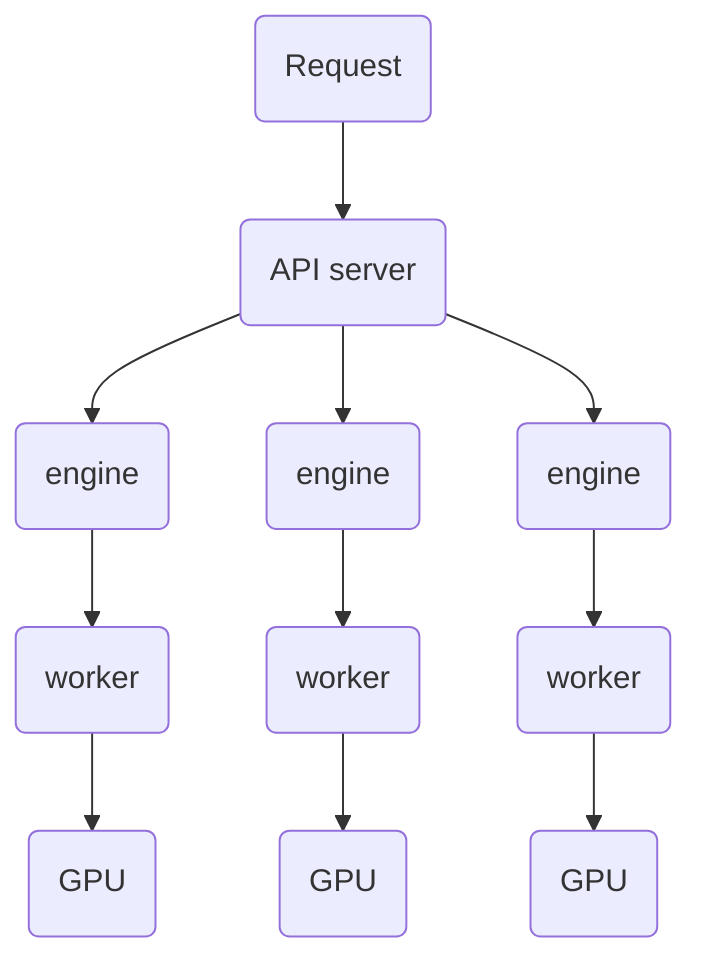

# vLLM-Omni 故障注入场景与预期行为矩阵

## 背景与目标

vLLM-Omni 的在线服务链路可以抽象为：`serve`（服务入口进程） -> `engine`（模型执行编排单元） -> `worker`（具体执行进程） -> `GPU`（计算资源）。

- `serve` 负责对外提供接口、接收请求和生命周期管理。
- `engine` 负责请求调度与模型推理编排；不同模型类型的 engine 数量和组织方式可能不同。
- `worker` 承担具体模型计算执行，通常与底层 GPU 资源绑定。
- `GPU` 是最终承载推理算力与显存占用的资源层。

在真实客户使用过程中，系统不可避免会遇到异常操作和外部扰动，例如误触发进程终止、容器/节点抖动、资源瞬时争抢、显存被其他任务挤占等。这些情况即使不常见，也会直接影响在线服务的稳定性。

因此需要通过故障注入，把这些高风险场景前置到测试阶段，提前验证系统在异常下是否具备可靠性保障能力：

- 请求是否能够**快速失败**，避免长时间悬挂；
- 健康状态和错误是否**可观测、可定位**；
- 异常退出后是否存在**残留进程**；
- GPU 显存等资源是否能够**及时释放并恢复**。

> 说明：当前版本暂未覆盖 `engine` 组件的独立故障注入，后续版本会逐步补齐。

## 组件关系图（serve -> engine -> worker -> GPU）

上图是抽象关系图，Omni 模型与 Diffusion 模型在这个层级关系上是一致的，差异主要体现在具体的 engine 拆分方式、worker 数量与调度策略。

## 故障注入场景矩阵

| 场景 | 异常类型 | 系统现象 | 当前状态 |
|------|----------------------------|----------|----------|
| 无负载 | 给 Worker 发送 SIGKILL 信号 | Worker 进程被立即杀死；主服务感知子进程丢失并转为不可用状态；接口进入稳定 5xx |  |
| 无负载 | 给 Worker 发送 SIGTERM 信号 | Worker 收到终止信号后退出；主服务标记不可用；接口进入稳定 5xx |  |
| 无负载 | 给 serve 主进程发送 SIGKILL 信号 | serve 主进程瞬时退出；请求连接被中断；相关子进程被清理，无残留，GPU 显存快速释放 |  |
| 无负载 | 给 serve 主进程发送 SIGTERM 信号 | serve 进入优雅关闭并停止提供服务；随后进程退出完成清理，GPU 显存释放 |  |
| 无负载 | 给 serve 主进程发送 SIGINT 信号（等价 Ctrl+C） | 触发 serve 停机链路；服务停止响应并转为不可用；相关子进程完成退出，资源释放 |  |
| 无负载 | 给所有相关进程发送 SIGKILL 信号 | 全部相关进程立即终止；服务立刻不可用；无残留进程，GPU 显存快速释放 |  |
| 无负载 | 给所有相关进程发送 SIGTERM 信号 | 全部进程进入退出流程并完成关闭；服务不可用；资源释放完成 |  |
| 有负载 | 给 Worker 发送 SIGKILL 信号 | 正在处理的请求被硬中断（5xx/连接断开）；主服务转为不可用 |  |
| 有负载 | 给 Worker 发送 SIGTERM 信号 | 正在处理请求被取消或快速失败；主服务转为不可用 |  |
| 有负载 | 给 serve 主进程发送 SIGKILL 信号 | serve 被硬杀导致当前连接中断；在途请求失败；进程清理后无残留并释放显存 |  |
| 有负载 | 给 serve 主进程发送 SIGTERM 信号 | serve 停止接收并执行关闭流程；在途请求失败；无残留并释放显存 |  |
| 有负载 | 给 serve 主进程发送 SIGINT 信号（等价 Ctrl+C） | Ctrl+C 式 serve 停机；在途请求失败（5xx/连接中断）；服务不可用；退出后无残留并释放显存 |  |
| 有负载 | 给所有相关进程发送 SIGKILL 信号 | 全部进程瞬时终止；在途请求全部失败；服务立即不可用；显存快速释放 |  |
| 有负载 | 给所有相关进程发送 SIGTERM 信号 | 全部进程优雅退出；在途请求失败；服务不可用；显存释放 |  |
| OOM | OOM 注入（显存打满） | OOM 注入进程启动后，GPU 显存被持续占满；服务进入不可用/亚健康状态，健康检查降为 503；chat/speech 等不同类型请求在固定时间内快速失败并返回 500（不悬挂）；停止注入并释放显存后，服务进程无需重启即可逐步恢复，健康检查回到 200，请求成功率恢复 |  |

## 结论来源

以上现象与结论基于当前对 `Qwen3-Omni` 与 `Wan2.2` 模型的故障注入验证结果整理。
