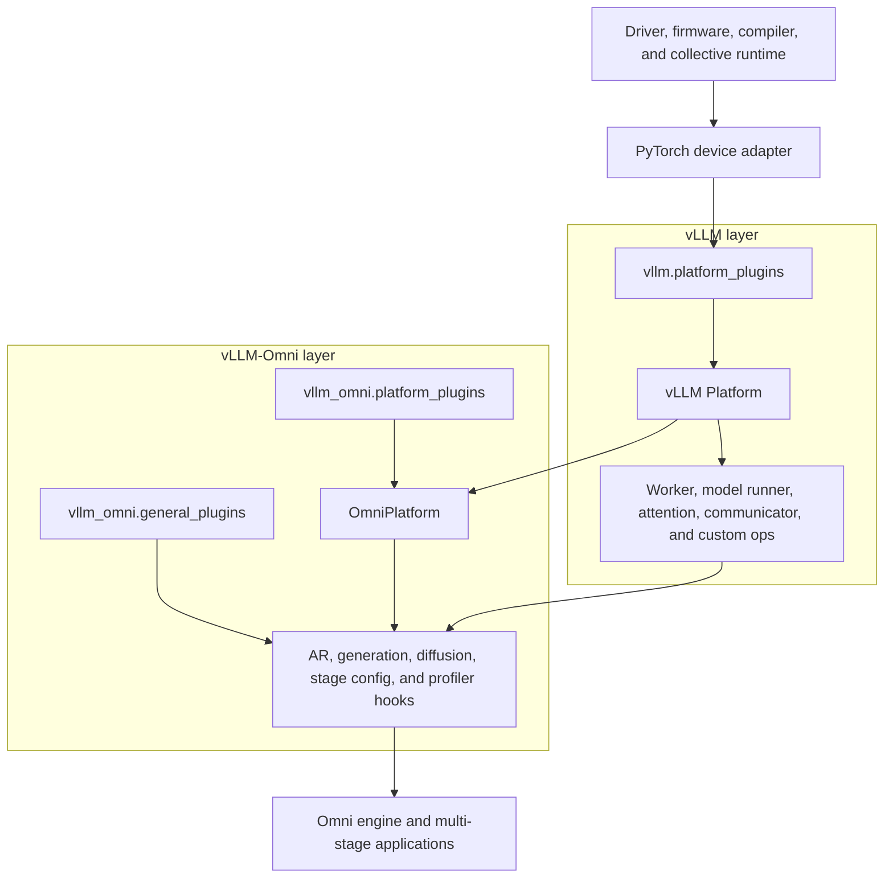

# Hardware Plugin System

This document describes how vLLM-Omni supports multiple accelerator platforms and how a new hardware backend should be
integrated. The design follows the
[vLLM plugin system](https://docs.vllm.ai/en/latest/design/plugin_system/) while adding Omni-specific contracts for
autoregressive (AR), generation, and diffusion stages.

Hardware support in vLLM-Omni is a layered integration. A backend must first provide a working PyTorch device and a
working vLLM platform. vLLM-Omni then extends that platform with the APIs needed by its multi-stage and diffusion
runtimes. Installing an Omni plugin alone cannot compensate for a missing or incompatible vLLM hardware backend.

## Terminology and Classification

Hardware backends are commonly classified along two independent axes. These axes must not be conflated.

### Execution ecosystem

- **GPGPU and CUDA-like ecosystems:** CUDA, ROCm, XPU, and MUSA expose GPU-style execution. The degree of CUDA
  compatibility differs: ROCm commonly uses `torch.cuda` APIs backed by HIP, XPU uses `torch.xpu`, and MUSA combines a
  vendor runtime with compatibility adapters.
- **Non-CUDA accelerator ecosystems:** Ascend NPU uses `torch_npu`, HCCL, ACL Graph, and Ascend-specific operators. It
  requires deeper substitutions than a CUDA-like backend and is therefore the reference integration for validating
  whether an abstraction is genuinely hardware-neutral.

This classification helps estimate implementation effort, but it does not decide whether code is built in or
out-of-tree (OOT).

### Integration ownership

"Built-in" and "OOT" are relative to a repository. The same hardware can be OOT in vLLM and built in to vLLM-Omni.

| Hardware | PyTorch device | vLLM integration | vLLM-Omni integration | Main reuse pattern |
|----------|----------------|------------------|-----------------------|--------------------|
| NVIDIA CUDA | `cuda` | Built-in | Built-in | `CudaPlatformBase` plus shared Omni GPU workers |
| AMD ROCm | `cuda` over HIP | Built-in | Built-in | `RocmPlatform` plus small Omni patches |
| Intel XPU | `xpu` | Built-in | Built-in | `XPUPlatform` plus XPU Omni workers and profiler |
| Ascend NPU | `npu` | OOT (`vllm-ascend`) | Built-in | `NPUPlatform` plus NPU-specific Omni workers and diffusion hooks |
| Moore Threads MUSA | `musa` | OOT (`vllm-musa`) | Built-in | `MUSAPlatformBase` plus shared Omni GPU workers |

NPU is the important boundary case: users must install the vLLM-Ascend plugin, but the Omni adapter lives under
`vllm_omni/platforms/npu`. MUSA has the same ownership shape even though its execution model is closer to CUDA. A new
backend may instead remain OOT in both projects.

## Design Goals

The hardware plugin system has the following goals:

1. Reuse the vLLM platform, worker, attention, communication, and custom-operator contracts wherever possible.
2. Keep device selection and hardware-specific behavior out of model and orchestration code.
3. Allow both built-in and OOT Omni backends without changing the runtime call sites.
4. Load registration code consistently in the API process, engine processes, and worker processes.
5. Expose capability hooks for AR, generation, and diffusion rather than relying on hardware-name conditionals.
6. Treat the complete software stack as one tested compatibility unit.

The system does not promise that arbitrary versions of vLLM, an OOT vLLM hardware plugin, and vLLM-Omni can be mixed.
The vLLM plugin entry point is stable, but plugins often inherit or extend internal worker and model-runner APIs that
change between releases.

## Layered Architecture



`OmniPlatform` inherits from vLLM's `Platform`. A concrete adapter normally uses multiple inheritance to combine the
Omni contract with the platform implementation from vLLM or its vendor plugin:

```python
class NPUOmniPlatform(OmniPlatform, NPUPlatform):
    _omni_enum = OmniPlatformEnum.NPU
    ...


class MUSAOmniPlatform(OmniPlatform, MUSAPlatformBase):
    _omni_enum = OmniPlatformEnum.MUSA
    ...
```

The vLLM platform remains responsible for general inference behavior such as the device type, distributed backend,
attention backend, and base worker. The Omni platform adds the behavior required by Omni stages and diffusion models.
Both selected classes must describe the same physical backend.

## Plugin Discovery and Lifecycle

vLLM-Omni uses Python package entry points, as vLLM does. Four groups can participate in a complete hardware package.

| Entry-point group | Owner | Purpose | Load behavior |
|-------------------|-------|---------|---------------|
| `vllm.platform_plugins` | vLLM | Select the base vLLM hardware platform | Loaded by vLLM platform discovery |
| `vllm.general_plugins` | vLLM | Register vLLM models, operators, loaders, or connectors | Loaded in vLLM processes |
| `vllm_omni.platform_plugins` | vLLM-Omni | Select an OOT `OmniPlatform` | Loaded when `current_omni_platform` is first resolved |
| `vllm_omni.general_plugins` | vLLM-Omni | Register Omni models or other Omni extensions | Loaded once in each process |

`load_omni_general_plugins()` first invokes vLLM's general-plugin loader, then invokes Omni general plugins. Omni worker
entry points call this loader again in subprocesses. The per-process guard prevents duplicate execution within one
process, but every registration function must still be re-entrant because the same package is imported in multiple
processes.

vLLM-Omni itself advertises `vllm_omni_register_models` under `vllm.general_plugins`. This ensures that subprocesses
created by vLLM register Omni model architectures even when they import vLLM before importing `vllm_omni` directly.

Plugins are executable Python code and must be treated as trusted packages. `VLLM_PLUGINS` filters plugin names for both
vLLM and vLLM-Omni. Hardware packages should use one stable entry-point name across groups so an allowlist does not
select only half of an integration.

### Platform resolution

`current_omni_platform` is initialized lazily. Resolution performs the following steps:

1. Load callables advertised under `vllm_omni.platform_plugins`.
2. Run all built-in and OOT detector callables. A detector returns `None` when its device is unavailable, or the fully
   qualified `OmniPlatform` class name when it is available.
3. Reject two or more active OOT Omni platforms.
4. If exactly one OOT platform is active, select it. An OOT platform intentionally takes precedence over built-in
   detection.
5. Otherwise, select the single active built-in platform, reject ambiguous detection, or fall back to
   `UnspecifiedOmniPlatform`.
6. Resolve and instantiate the selected class.

Detector functions may be called more than once during resolution and must be cheap, idempotent, and safe when an
optional vendor package is absent. Avoid irreversible side effects. Heavy initialization belongs in the selected
platform or worker, not in detection.

## `OmniPlatform` Contract

The concrete class inherits the general vLLM `Platform` interface and implements only the Omni-specific differences.
The contract is grouped by responsibility below.

### Identity and device runtime

| API | Responsibility |
|-----|----------------|
| `_enum` | vLLM platform identity, normally inherited from the vLLM backend |
| `_omni_enum` | Omni identity: a built-in value or `OmniPlatformEnum.OOT` |
| `device_type` and `device_name` | PyTorch device string and display name, normally inherited |
| `device_control_env_var` | Environment variable used to isolate stage devices |
| `dist_backend` | Default collective backend such as NCCL (backed by NCCL or RCCL), XCCL/CCL, HCCL, or MCCL |
| `get_torch_device()` | Construct the device for an optional local rank |
| `get_device_count()` | Return visible accelerator count |
| `get_device_version()` | Return a runtime version when available |
| `synchronize()` | Synchronize the active device |
| `get_free_memory()` / `get_device_memory()` | Report free and total device memory |

The base vLLM platform also supplies common operations such as `set_device`, stream and event types, seed handling,
dtype checks, and device capability queries. A backend must verify every inherited method against its PyTorch adapter;
matching method names do not guarantee matching semantics.

### Stage workers and configuration

| API | Responsibility |
|-----|----------------|
| `get_omni_ar_worker_cls()` | Return the AR worker used by thinker/talker-style stages |
| `get_omni_generation_worker_cls()` | Return the non-AR generation worker used by decoder/code2wav-style stages |
| `get_default_stage_config_path()` | Return the platform-specific stage-config directory |

CUDA, ROCm, and MUSA can share the generic Omni GPU workers when their vLLM platform supplies compatible GPU behavior.
XPU and NPU use dedicated workers where initialization, memory accounting, or model-runner behavior differs.

### Diffusion and operator hooks

| API | Responsibility | Default behavior |
|-----|----------------|------------------|
| `get_diffusion_worker_cls()` | Select a diffusion worker | Generic `DiffusionWorker` |
| `get_diffusion_model_runner_cls()` | Select a diffusion model runner | Generic `DiffusionModelRunner` |
| `init_diffusion_worker_vllm_config()` | Initialize vendor state in the worker config | No-op |
| `get_diffusion_attn_backend_cls()` | Select a supported diffusion attention implementation | Platform-defined |
| `get_diffusion_model_impl_qualname()` | Select a platform implementation of a named model op | Default implementation for known ops |
| `prepare_diffusion_op_runtime()` | Initialize runtime state required by an op | No-op |
| `get_diffusion_packed_modules_mapping()` | Describe vendor-specific packed weights | `None` |
| `get_default_ir_op_priority()` | Order native, compiled, and vendor IR operators | Inherited or platform-defined |

An OOT general plugin can also call `register_diffusion_model()` to add a pipeline or replace a built-in pipeline with a
platform-optimized implementation. Optional pre-process, post-process, action post-process, and IR-op-priority hooks can
be registered with the same call.

### Compilation, graphs, and observability

| API | Responsibility | Default behavior |
|-----|----------------|------------------|
| `supports_torch_inductor()` | Declare whether the backend supports the selected compile path | Platform-defined |
| `has_flash_attn_package()` | Report a usable local Flash Attention package | `False` |
| `get_graph_wrapper_cls()` | Select CUDA Graph, ACL Graph, or another graph wrapper | vLLM CUDA graph wrapper |
| `set_forward_context()` | Enter the platform-specific attention/graph context | vLLM forward context |
| `get_profiler_cls()` | Select the device-aware profiler | Generic Omni torch profiler |
| `supports_cpu_offload()` | Declare CPU offload support | `True` |
| `supports_float64()` | Declare float64 support | `True` |

New shared code should consume capabilities such as these rather than adding `is_<vendor>()` branches. In particular,
an OOT platform has `_omni_enum = OmniPlatformEnum.OOT`, so it will not match built-in identity checks even if its
execution behavior is CUDA-like.

## Adding a New Hardware Backend

### 1. Choose built-in or OOT ownership

Make this decision independently for vLLM and vLLM-Omni.

Use a built-in Omni backend when the vLLM-Omni maintainers accept long-term ownership, CI hardware and reviewers are
available, and the backend affects enough shared code to justify in-tree maintenance. Prefer OOT when the vendor needs
an independent release cadence, carries proprietary or fast-moving dependencies, or cannot provide continuous upstream
CI. OOT is also the normal incubation path before an integration is considered for built-in status.

The hardware family does not determine this choice. Both a CUDA-like device and a non-CUDA accelerator can use either
model.

### 2. Establish the vLLM platform layer

First determine whether the hardware already has a built-in or OOT vLLM platform. When it claims vLLM inference
support, verify that platform independently for every advertised execution path:

- platform discovery and device detection;
- worker and model runner initialization;
- attention backend and custom operators;
- communicator and distributed collectives;
- graph/compile mode, memory profiling, and supported dtypes;
- at least one representative AR model when the backend claims vLLM model support.

If vLLM support is OOT, publish it as a separate plugin package using `vllm.platform_plugins`. vLLM-Omni should inherit
that platform rather than duplicate it. A diffusion-only device without an existing vLLM backend does not need to add
AR inference to vLLM first; it can provide the minimal vLLM platform contract described in the next step.

### 3. Integrate a diffusion-only backend

A hardware backend may initially support only diffusion models in vLLM-Omni. It does not need to implement Omni AR or
non-AR generation workers, but it still needs a vLLM-compatible `Platform` because vLLM-Omni reuses `VllmConfig`,
distributed configuration, compilation interfaces, and other vLLM runtime components.

There are two common integration shapes.

#### Reuse an existing vLLM hardware plugin

Some accelerators already provide a built-in or OOT vLLM platform even when the intended vLLM-Omni workload is purely
diffusion. In this case, add only a thin Omni adapter:

```python
from vllm_omni.platforms.interface import OmniPlatform, OmniPlatformEnum
from vllm_my_accel.platform import MyAccelPlatform


class MyAccelDiffusionPlatform(OmniPlatform, MyAccelPlatform):
    _omni_enum = OmniPlatformEnum.OOT

    @classmethod
    def get_omni_ar_worker_cls(cls) -> str:
        raise NotImplementedError("MyAccel currently supports diffusion only")

    @classmethod
    def get_omni_generation_worker_cls(cls) -> str:
        raise NotImplementedError("MyAccel currently supports diffusion only")

    @classmethod
    def get_default_stage_config_path(cls) -> str:
        # Shared model-config resolution may query this path before it has
        # classified the model as an Omni stage or a diffusion pipeline.
        return "vllm_omni/model_executor/stage_configs"

    @classmethod
    def get_diffusion_attn_backend_cls(
        cls,
        selected_backend: str | None,
        head_size: int,
    ) -> str:
        return "vllm_omni_my_accel.attention.MyAccelAttentionBackend"

    @classmethod
    def supports_torch_inductor(cls) -> bool:
        return False
```

The vLLM plugin owns device initialization, distributed communication, base platform identity, and common runtime
behavior. The Omni adapter owns only the diffusion-specific differences. Unsupported AR and generation methods should
fail explicitly instead of returning a worker that has not been validated. `get_default_stage_config_path()` should
still return a valid path because shared model-config resolution can call it for diffusion models.

The adapter does not have to live in the vLLM-Omni repository. An OOT vLLM hardware-plugin distribution may also ship
the `vllm_omni.platform_plugins` entry point, its `OmniPlatform` subclass, and vendor diffusion components. This keeps
the entire hardware integration under one vendor release cadence while vLLM-Omni consumes it through the documented
plugin contracts.

#### Provide a minimal vLLM platform for an Omni-only device

If no vLLM backend exists, the hardware package should normally expose both entry points:

- `vllm.platform_plugins` selects a minimal vendor `Platform` implementation;
- `vllm_omni.platform_plugins` selects the diffusion-capable `OmniPlatform` adapter.

The minimal vLLM platform does not have to claim support for vLLM AR inference. It must implement the device and runtime
contract used by vLLM-Omni: device identity, device selection, visible-device control, dtype validation,
`check_and_update_config()` behavior, memory queries, streams/events, distributed backend, and any compilation
interfaces reached by the diffusion engine. Keeping this layer as a vLLM platform plugin avoids a second, incompatible
definition of the same hardware primitives inside vLLM-Omni.

For a diffusion-only backend, review and implement the following Omni hooks:

| Hook | When it is needed |
|------|-------------------|
| `get_diffusion_attn_backend_cls()` | Always; select a supported attention implementation or SDPA-style fallback |
| `get_diffusion_worker_cls()` | Override only when generic `DiffusionWorker` initialization is incompatible |
| `get_diffusion_model_runner_cls()` | Override only when the generic runner cannot drive the device |
| `init_diffusion_worker_vllm_config()` | Initialize vendor configuration before worker/model construction |
| `supports_torch_inductor()` | Declare the compile path accurately; returning `False` is valid |
| `get_graph_wrapper_cls()` / `set_forward_context()` | Required when using a non-CUDA graph or attention context |
| `get_profiler_cls()` | Required when the generic torch profiler cannot record device activity |
| `get_diffusion_model_impl_qualname()` | Select vendor implementations of named diffusion operators |
| `prepare_diffusion_op_runtime()` | Initialize communication groups or vendor libraries for those operators |
| `get_diffusion_packed_modules_mapping()` | Describe vendor-specific fused or packed checkpoint layouts |

The generic `DiffusionWorker` and `DiffusionModelRunner` are the preferred starting point. Override them only for actual
device initialization, memory, graph, or execution differences. A pure diffusion integration should not copy the AR
worker or GPU model runner merely to satisfy a class hierarchy.

Platform support and model support are separate. If existing diffusion pipelines run through the platform hooks, no
model registration is needed. Use `register_diffusion_model()` only to add a new architecture or replace a built-in
pipeline with a vendor-optimized implementation. Register custom attention backends, quantization methods, fused ops,
and IR-op priorities through their registries or the corresponding platform hooks.

The minimum validation target is one representative diffusion pipeline in eager mode. Add attention, graph/compile,
multi-device parallelism, CPU offload, quantization, and optimized model tests only for the capabilities the backend
advertises. Also add a negative test confirming that AR or generation startup fails with a clear unsupported-platform
message.

### 4. Create the Omni platform package

An OOT package can use the following structure:

```text
vllm_omni_my_accel/
├── pyproject.toml
└── vllm_omni_my_accel/
    ├── __init__.py
    ├── platform.py
    ├── worker.py                 # only when shared workers are insufficient
    ├── diffusion_worker.py       # optional
    ├── attention.py              # optional
    ├── ops.py                    # optional
    └── stage_configs/            # optional platform overrides
```

Register the vLLM and Omni layers in package metadata. They may live in one distribution or in coordinated
distributions, but they must be versioned and tested together. If the vLLM backend is a separate distribution, that
distribution owns the first entry point below and the Omni distribution owns the remaining entries.

```toml
[project.entry-points."vllm.platform_plugins"]
my_accel = "vllm_my_accel:register_platform"

[project.entry-points."vllm_omni.platform_plugins"]
my_accel = "vllm_omni_my_accel:register_platform"

[project.entry-points."vllm_omni.general_plugins"]
my_accel = "vllm_omni_my_accel:register_extensions"
```

The Omni detector must not import heavy modules at package import time:

```python
def register_platform() -> str | None:
    try:
        import torch

        if hasattr(torch, "my_accel") and torch.my_accel.is_available():
            return "vllm_omni_my_accel.platform.MyAccelOmniPlatform"
    except Exception:
        pass
    return None
```

Implement the platform by inheriting the Omni interface first and the working vLLM platform second. The following
skeleton assumes that the backend supports AR, generation, and diffusion; a diffusion-only backend should use the
explicitly unsupported stage methods shown in the previous step.

```python
from vllm_omni.platforms.interface import OmniPlatform, OmniPlatformEnum
from vllm_my_accel.platform import MyAccelPlatform


class MyAccelOmniPlatform(OmniPlatform, MyAccelPlatform):
    _omni_enum = OmniPlatformEnum.OOT

    @classmethod
    def get_omni_ar_worker_cls(cls) -> str:
        return "vllm_omni.worker.gpu_ar_worker.GPUARWorker"

    @classmethod
    def get_omni_generation_worker_cls(cls) -> str:
        return "vllm_omni.worker.gpu_generation_worker.GPUGenerationWorker"

    @classmethod
    def get_default_stage_config_path(cls) -> str:
        return "vllm_omni_my_accel/stage_configs"

    @classmethod
    def get_diffusion_attn_backend_cls(
        cls,
        selected_backend: str | None,
        head_size: int,
    ) -> str:
        ...

    @classmethod
    def supports_torch_inductor(cls) -> bool:
        ...
```

Only reuse the generic GPU workers after verifying their initialization, memory, distributed, graph, and model-runner
paths on the new device. Otherwise, return vendor worker classes and keep the differences localized there.

### 5. Register models and optimized components

The general-plugin callable is the correct place for repeatable registration:

```python
def register_extensions() -> None:
    from vllm_omni.diffusion.registry import register_diffusion_model
    from vllm_omni.platforms import current_omni_platform

    if current_omni_platform.device_type != "my_accel":
        return

    register_diffusion_model(
        model_arch="WanPipeline",
        module_name="vllm_omni_my_accel.models.wan",
        class_name="MyAccelWanPipeline",
    )
```

The callable must be idempotent. Prefer registries, inheritance, and platform hooks over monkey patches. When a patch is
unavoidable, keep it narrow, make repeated application safe, add a regression test, and document the upstream API it
depends on.

Use platform dispatch for attention, fused operators, graph wrappers, forward context, quantization, profiler, and
connectors. Do not place vendor imports in shared module scope, because those modules are imported on every platform.

### 6. Add installation routing

An OOT distribution owns its vendor dependencies and should declare compatible ranges or exact pins in its own package.
It must not depend on vLLM-Omni's build-time auto-detection.

For a built-in backend, update all of the following:

1. `OmniPlatformEnum`, the detector, and `builtin_omni_platform_plugins`.
2. `VLLM_OMNI_TARGET_DEVICE` validation and detection in `setup.py`.
3. `requirements/<device>.txt` and the platform wheel suffix.
4. Installation documentation and reproducible development/release images.
5. pytest markers, resource names, distributed markers, and hardware CI routing.

Build isolation may hide the final PyTorch runtime during package installation. Built-in backends must support an
explicit `VLLM_OMNI_TARGET_DEVICE=<device>` override; release pipelines should set it instead of relying on accidental
auto-detection.

### 7. Remove shared-code hardware assumptions

Search for device-specific behavior before enabling the backend. Common problems include:

- literal `"cuda"` devices and direct `torch.cuda` calls;
- NCCL-only environment variables or collectives;
- CUDA Graph types in `isinstance` checks;
- hard-coded visible-device environment variables;
- CUDA-only autocast, random generators, streams, events, and profilers;
- attention or quantization registries that enumerate only existing backends;
- models that branch on `is_npu()` when they actually need a capability.

Use `current_omni_platform`, `torch.accelerator` where it has the required semantics, and narrow capability methods. Add
a new capability to `OmniPlatform` when multiple callers need the same decision.

## Version Compatibility and Release Coordination

Version alignment is part of the hardware plugin design, not an installation footnote. A hardware backend spans several
independently released components:

| Layer | Examples |
|-------|----------|
| System runtime | Driver, firmware, CUDA/ROCm/CANN/MUSA toolkit, collective library |
| PyTorch runtime | `torch`, `torch_npu`, `torch_musa`, Intel extension |
| vLLM hardware layer | vLLM built-in platform, `vllm-ascend`, or `vllm-musa` |
| vLLM core | Platform, worker, model-runner, attention, and compilation APIs |
| vLLM-Omni | Omni platform, stage workers, diffusion runtime, models, and connectors |
| Optional operator libraries | MindIE-SD, MATE, AITER, Flash Attention, or vendor kernels |

For NPU, the AR path depends jointly on vLLM and vLLM-Ascend, while diffusion may additionally depend on MindIE-SD.
Therefore, matching only the vLLM and vLLM-Omni version numbers is insufficient.

### Compatibility is a tested tuple

Every supported release must publish a compatibility row containing:

- exact vLLM-Omni version;
- exact vLLM version or commit;
- exact OOT vLLM hardware-plugin version or commit, if any;
- PyTorch and vendor PyTorch-adapter versions;
- driver/toolkit and collective-runtime versions;
- optional operator-library versions;
- supported accelerator generations;
- a tested container tag and, for final releases, an immutable image digest;
- validation status and known limitations.

The row, rather than equal-looking version strings, is the support contract. The NPU matrix maintained in
[issue #886](https://github.com/vllm-project/vllm-omni/issues/886) is an example of why this is necessary.

### Release channels

Maintain three explicit channels and never silently mix them:

| Channel | Inputs | Purpose | Pinning rule |
|---------|--------|---------|--------------|
| Stable | Released vLLM, hardware plugin, and vLLM-Omni | Production | Exact versions and image digest |
| RC | Release candidates aligned to one upcoming vLLM version | Pre-release qualification | Exact RC versions or commits |
| Main/nightly | Coordinated commits from each repository | Early breakage detection | Immutable commit SHAs; never floating `main` |

Installing vLLM-Omni `main` with a hardware plugin's floating `main` is not reproducible: either repository can move
between image build and test. Nightly images may be convenient transport artifacts, but their component commit SHAs
must still be recorded.

### Release handshake

For OOT vLLM hardware plugins, the expected release sequence is:

1. **Upstream cut:** vLLM publishes or freezes the target release.
2. **Hardware-plugin adaptation:** the vendor plugin passes its vLLM contract tests and publishes an early RC image.
3. **Omni adaptation:** vLLM-Omni rebases against the exact vLLM and vendor-plugin tuple and runs ready/merge coverage.
4. **Omni RC:** publish only after an installable, pinned hardware base exists.
5. **Final qualification:** run functionality, accuracy, performance, distributed, graph, and long-running tests.
6. **Publication:** update the compatibility matrix and release images together.

[RFC #3565](https://github.com/vllm-project/vllm-omni/issues/3565) documents the failure mode when this handshake is
missing: vLLM-Omni can adapt on day 0 or day 1 while the vLLM-Ascend main branch is still catching up; later, the lack
of a matching RC image forces downstream CI to build from source or pull a moving nightly image. The RFC records an
approximately 30-minute source-build path compared with approximately 10 minutes from a fixed compatible image. This
creates both a temporary break period and a large CI startup penalty.

To close that gap, a vendor plugin should publish an `rc0` or equivalent pinned base image as soon as it adopts the new
vLLM version. Until that artifact exists, vLLM-Omni's affected hardware lane should report the tuple as pending rather
than implying that arbitrary `main` branches are supported.

### Compatibility enforcement

Use defense in depth:

1. Package metadata should reject known-incompatible major/minor ranges where practical.
2. Container builds should pin all components and print their versions and commit SHAs.
3. Startup diagnostics should report vLLM, vLLM-Omni, the hardware plugin, PyTorch adapter, toolkit, and selected
   `OmniPlatform`.
4. Known-incompatible tuples should fail early with an actionable error instead of failing later in a worker import or
   model-runner call.
5. Deprecations in inherited vLLM APIs should be treated as release blockers for the next aligned tuple.

Some vendor packages must support more than one vLLM release. In that case, keep compatibility branches narrow and
covered by CI; do not infer compatibility from version comparison alone.

## Validation Requirements

A new platform is complete only when the paths it claims to support run on real hardware.

### Discovery and contract tests

- Detector returns `None` without the vendor runtime and a class name when mocked as available.
- Exactly one platform is selected; ambiguous OOT plugins fail clearly.
- `VLLM_PLUGINS` filtering selects both required layers.
- General registration is safe across repeated calls and subprocesses.
- Every class-path hook resolves and its class satisfies the expected constructor and runtime protocol.

### Hardware tests

At minimum, cover:

1. installation, import, device detection, and environment collection;
2. one AR stage and one non-AR generation stage when claimed;
3. one representative diffusion pipeline;
4. default and explicitly selected attention backends;
5. single-device eager execution;
6. supported graph/compile mode;
7. tensor parallel or another multi-device collective path;
8. memory profiling, offload, and sleep mode when advertised;
9. a multi-stage connector path;
10. accuracy and performance baselines plus a long-running stability test.

Use hardware-neutral tests where behavior should be shared, and vendor-specific tests only for genuine device behavior.
Different hardware kernels are not expected to be bitwise identical. Compare task-appropriate accuracy or quality
thresholds and investigate obvious degradation rather than forcing exact tensor equality across devices.

### CI levels

- **Ready/PR:** fast imports, discovery, contract tests, and representative single-device smoke tests.
- **Merge:** broader model and feature coverage, plus at least one distributed test.
- **Nightly:** core-model functionality, accuracy, performance, graph modes, distributed configurations, and soak tests.
- **Upstream canary:** a pinned vLLM candidate paired with the vendor plugin and vLLM-Omni to detect contract changes
  before a release cut.

CI results must identify the full compatibility tuple. A green result without the image tag and component revisions is
not reproducible evidence.

## Common Failure Modes

| Symptom | Likely cause | Resolution |
|---------|--------------|------------|
| Two Omni platforms are reported active | Detector is too permissive or multiple OOT plugins are installed | Make detection hardware-specific or set `VLLM_PLUGINS` |
| vLLM selects one platform and Omni selects another | Only one plugin layer was installed or allowlisted | Install and enable both entry points; log both selected platforms |
| Parent process works but workers miss registrations | Plugin was imported manually instead of registered as an entry point | Use the general-plugin group and make registration re-entrant |
| Import fails on unrelated hardware | Vendor modules are imported at shared module scope | Move imports into detectors, hooks, or selected platform code |
| Installation chooses CUDA or CPU dependencies | Build isolation cannot observe the target PyTorch adapter | Set `VLLM_OMNI_TARGET_DEVICE` for built-in backends or use an OOT-owned installer |
| Worker fails after a vLLM upgrade | Hardware plugin depends on a changed internal API | Use the published compatibility tuple and adapt the vendor plugin first |
| Backend works in eager mode but fails in graph mode | CUDA Graph or forward-context assumptions leaked into shared code | Implement `get_graph_wrapper_cls()` and `set_forward_context()` |
| New CUDA-like backend misses optimized paths | Shared code branches on a built-in Omni enum | Replace identity checks with capabilities or a backend registry |

## References

- [vLLM Plugin System](https://docs.vllm.ai/en/latest/design/plugin_system/)
- [vLLM-Omni platform and plugin foundation, PR #774](https://github.com/vllm-project/vllm-omni/pull/774)
- [MUSA platform integration, PR #2337](https://github.com/vllm-project/vllm-omni/pull/2337)
- [OOT diffusion extensibility, PR #3239](https://github.com/vllm-project/vllm-omni/pull/3239)
- [vLLM-Omni NPU roadmap and version matrix, issue #886](https://github.com/vllm-project/vllm-omni/issues/886)
- [NPU CI and release-gap RFC, issue #3565](https://github.com/vllm-project/vllm-omni/issues/3565)
- [vLLM-Ascend versioning policy](https://docs.vllm.ai/projects/ascend/en/latest/community/versioning_policy.html)
