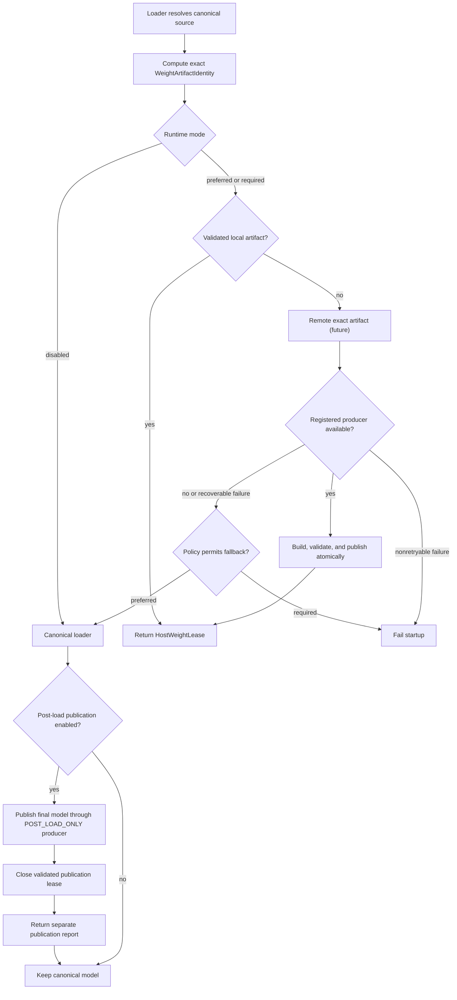
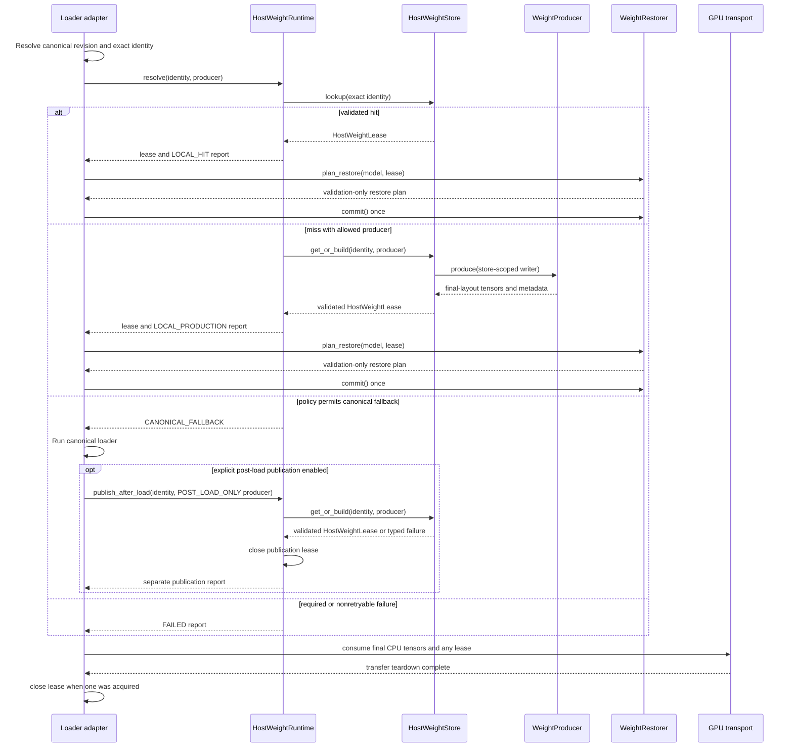

# Host Weight Runtime

The Host Weight Runtime is a loader-facing feature for reusing immutable,
runtime-ready model weights across workers on one host. It lets a model
integration replace repeated checkpoint loading and transformation with an
exact lookup of a previously published host representation, while keeping the
canonical model source authoritative.

This feature is shared infrastructure. Diffusion, autoregressive, speech, and
future model integrations may depend on the top-level
`vllm_omni.host_weight_runtime` package without depending on one another's
loader or execution stack. The internal component and filesystem contracts are
specified in the [Host Weight Runtime module design](../module/host_weight_runtime.md).

## Status

The first implementation provides contracts and a CPU local-filesystem store.
It does not enable cached loading for a model by itself. A consumer must still
provide an exact identity, a representation producer, and a model restorer.

V1 includes:

- exact runtime-weight identity and immutable manifests;
- coordinated local lookup and one-producer publication;
- descriptor-backed safetensors mmap leases;
- preferred and required resolution policy;
- explicit, separately reported post-load publication;
- validation, deny, quarantine, cleanup, and capacity controls; and
- typed reports for every terminal resolution outcome.

V1 does not include:

- a public CLI or default-on model integration;
- a generic BF16, FP8, quantized, or model-specific producer;
- CUDA registration, pinned staging, H2D scheduling, or GPU kernels;
- a remote artifact provider or cross-node coordination;
- automatic eviction; or
- a change to DLO AllGather or no-AllGather behavior.

## Motivation and use cases

Model loading can create the same final host representation repeatedly. This
is especially expensive when loading performs checkpoint decoding, tensor
renaming, TP slicing, quantization, packing, or scale construction before GPU
transfer. Independent workers may then retain private CPU copies of identical
runtime weights.

The Host Weight Runtime is useful when:

- multiple same-node workers request semantically identical final weights;
- constructing those weights is materially more expensive than validating and
  mapping a local artifact;
- the runtime layout can be identified exactly and reproduced deterministically;
- the workers can share immutable file-backed pages through the OS page cache;
  and
- canonical loading remains available when policy permits fallback.

Typical consumers include same-node diffusion replicas, DLO host-weight
sources, and future transformed or quantized model loaders. Request routing and
replica orchestration remain outside this feature.

This feature is not zero-copy GPU execution. A lease exposes stable CPU tensor
views and mapped ranges. A separate transport still decides whether to use
registered mmap, private pinned staging, synchronous copies, or asynchronous
H2D transfer.

## Resolution behavior

The loader resolves the immutable canonical source and computes the exact
requested identity before asking the runtime for a representation.

The modes are:

| Mode | Observable behavior |
| --- | --- |
| `disabled` | Use canonical loading directly without probing storage, identity, credentials, or topology. |
| `preferred` | Return an exact lease when available; otherwise use canonical fallback only for a miss, invalid cache entry, or typed retryable failure. |
| `required` | Fail when an exact lease cannot be acquired. |

During pre-load resolution, an unsupported capability, semantic identity
collision, producer failure, or publication failure is nonretryable and remains
visible even in preferred mode. A post-load publication failure is likewise
visible in its own report, but cannot revise the canonical-fallback outcome.
Storage policy must never disguise a semantic or configuration error as a cache
miss.

## Loader and restoration sequence

The model integration owns the end-to-end loading transaction. The runtime
does not construct a model or invoke the canonical loader.

`plan_restore()` must not mutate the model or lease. `commit() -> None` is the
sole one-shot model mutation. If planning fails, canonical fallback may reuse
the untouched model. If commit begins and fails, the partially hydrated model
must be discarded and canonical fallback must construct a fresh model.

`publish_after_load()` is synchronous in V1 and accepts only a
`POST_LOAD_ONLY` producer. Its report is separate from the terminal resolution,
so a publication failure cannot rewrite a successful canonical fallback. A
successful publication closes the store-returned lease inside the runtime and
warms only future startups. It does not restore, rebind, or otherwise mutate the
canonically loaded model serving the current startup.
`allow_local_build` gates producers during pre-load resolution, while
`allow_post_load_publish` independently gates this explicit post-load path.

## Exact representation identity

The store performs exact lookup. It never silently converts one representation
into another or substitutes the first backing that responds.

Identity includes:

- immutable model revision and source fingerprint;
- model component and ownership boundary;
- representation name, dtype, and format metadata;
- final tensor layout and semantic parallel coordinates;
- static adaptation identity; and
- producer implementation, manifest, and restorer schema versions.

The requested representation is selected by the loader. The store chooses
where to obtain that exact representation: validated local artifact, future
remote materialization, or a registered producer.

### Parallelism

Parallel coordinates are included only when they change bytes, shape, layout,
or component ownership.

| Dimension | Identity and sharing rule |
| --- | --- |
| DP | Exclude DP rank for replicated weights so same-node replicas can acquire the same artifact. Include a coordinate only if DP changes weight ownership. |
| TP | Include TP size and rank when each rank owns different tensor slices or packed layouts. Each distinct TP shard is a separate exact artifact. |
| SP | Include SP size and backend when they change the weight layout. Exclude SP rank when all SP ranks consume identical bytes. |
| PP | Encode component ownership or stage-local layout when PP changes which weights belong to the consumer. |
| EP | Encode expert ownership and layout whenever ranks own different expert weights. |

The runtime does not infer these rules from process-group topology. The model
adapter is responsible for constructing a correct identity.

### Quantization and adaptations

Runtime BF16, FP8, packed quantized weights, and future formats are distinct
representations. Conversion is performed by an explicitly versioned producer,
never by cache coercion. A producer must publish the final layout consumed by
its matching restorer.

Dynamic LoRA overlays are not part of a reusable base-weight artifact. A
statically merged adapter is cacheable only as a separate identity containing
the adapter fingerprint and merge semantics.

## Host sharing and GPU transport

Every process receives its own virtual mappings and `HostWeightLease`, but
workers mapping the same local artifact can share physical file-backed pages
through the OS page cache. This avoids independent private tensor allocations;
it does not guarantee that process PSS reports exactly one model copy.

The ownership boundary is:

- the store owns immutable artifact files, publication, and lifecycle;
- the kernel owns page-cache residency and placement;
- the lease owns process-local mappings and the shared artifact lock; and
- transport owns page registration, page locking, private staging, H2D copies,
  streams, device buffers, and lease release ordering.

DLO AllGather and no-AllGather remain transport and execution choices. A DLO
integration may consume a lease, but the Host Weight Runtime does not choose a
parallel collective or orchestrate DP requests. See the
[DLO feature design](offloader/distributed_layerwise_offload.md).

## Locality and NUMA policy

The V1 backend is node-local. It accepts an allowlist of known local disk
filesystems plus tmpfs/ramfs, records the detected kernel filesystem type, and
rejects known remote or unknown filesystems. NFS, CIFS, Lustre, Ceph, and other
cross-node mounts cannot silently satisfy the local backend because their
page-cache and advisory-lock behavior does not provide the required node-local
contract.

A NUMA-specific root creates a separate storage domain but does not by itself
place page-cache pages on that NUMA node. A topology-aware integration must
also pin workers, establish local first touch or prefault, perform transport
registration in the same domain, and collect residency evidence.

Tmpfs artifacts consume host memory and may consume swap. They must be
accounted as memory-backed storage rather than ordinary disk capacity.

## Concurrency and timeouts

One process per exact identity owns a build; other workers wait and then acquire
leases for the published artifact. Publication is invisible until all payloads
and metadata are validated, hashed, fsynced, and atomically renamed.

`coordination_timeout_seconds` bounds filesystem lock acquisition. It does not
cancel synchronous validation, a producer that has already started, or atomic
publication. A hung in-process producer therefore blocks its owning process and
must be handled by external process supervision. Enforceable producer
cancellation requires a future process-isolated producer contract.

Leases keep a shared artifact lock for their lifetime. A forked child may close
its inherited descriptors but cannot unlock the parent process's lease. Cleanup
uses a nonblocking exclusive lock and reports an active lease instead of
removing live mappings.

## Failure and fallback contract

| Condition | Preferred mode | Required mode |
| --- | --- | --- |
| Exact local hit | Return lease | Return lease |
| Local miss | Try later backing or canonical fallback | Try later backing or fail |
| Invalid or denied artifact | Quarantine/rebuild when possible; otherwise canonical fallback | Quarantine/rebuild or fail |
| Retryable lock, domain, or capacity failure | Canonical fallback | Fail |
| Unsupported producer or backend | Fail | Fail |
| Identity collision | Fail | Fail |
| Pre-load producer or atomic publication failure | Fail | Fail |
| Post-load publication failure after canonical fallback | Keep canonical model; report publication failure | Not reached through required resolution |
| Restore planning failure | Canonical fallback may reuse untouched model | Fail |
| Restore commit failure | Discard model; fallback requires a fresh instance | Fail |

Cache failures should normally reduce performance rather than availability,
but only when the typed failure explicitly permits fallback. Canonical source,
authentication, configuration, and semantic errors remain visible.

## Consumer integration requirements

A consumer PR must:

1. Resolve an immutable canonical model source before cache lookup.
2. Construct the exact final representation identity, including relevant
   parallel, quantization, and adaptation semantics.
3. Register a deterministic producer for that identity or support lookup-only
   operation.
4. Provide a validation-only restorer with a one-shot commit.
5. Keep GPU transport outside the producer, store, and restorer contracts.
6. Handle preferred fallback and required failure without reusing a model after
   a failed restore commit.
7. Retain the lease until every transport operation that may access mapped
   memory has completed.
8. Emit and test the terminal resolution report and any separate post-load
   publication report.

Consumer validation must prove:

- output parity with canonical loading;
- exact warm-hit work avoidance;
- correct TP/SP/PP/EP ownership and layout identity;
- correct BF16, FP8, quantized, or adaptation semantics;
- shared-backing evidence when host-memory savings are claimed;
- clean unmapping, unregistration, and artifact-lock release; and
- startup, host-memory, and transport effects for the claimed deployment.

## Rollout

The rollout is intentionally staged:

1. Land the neutral contracts and local filesystem store.
2. Add one model-specific producer/restorer integration with parity evidence.
3. Connect eligible DLO or other transport paths without moving transport
   ownership into the runtime.
4. Add additional final-layout and quantized producers independently.
5. Introduce remote materialization only through the same local lease contract.

The architectural decisions and deferred work are tracked in
[RFC #6414](https://github.com/vllm-project/vllm-omni/issues/6414).
