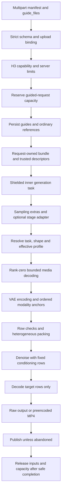
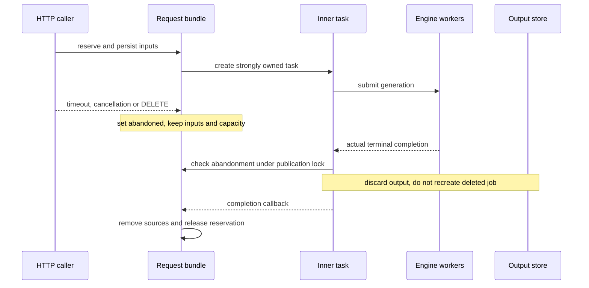

# MiniMax H3 Timeline Guides: Implementation

This document describes the implemented GUIDE-01 contract, its integration
boundaries, and the invariants required to change it safely. It is not a claim
that every execution topology has been validated on real models.

For multipart usage, see [H3 timeline guides in the Videos API](../../serving/videos_api.md#h3-timeline-guides).
Deployment commands, checkpoint/output hashes, hardware measurements, and the
chronological validation record are in the repository's
`recipes/MiniMaxAI/MiniMax-H3.md`. Runnable request scripts are in
`examples/online_serving/minimax_h3/`.

## Scope and design decisions

Timeline guides condition particular output times without becoming ordinary
references. GUIDE-01 supports ordered image, video, audio-only, and explicit
visual-plus-audio entries. Guides can overlap, arrive in nonchronological order,
and reuse the same uploaded source. Each occurrence remains a separate condition.

The feature is additive to both `/v1/videos` and `/v1/videos/sync`. There is no
new endpoint, migration, remote guide URL fetch, public server-path input,
guide-strength parameter, editing mask, ControlNet integration, or workflow JSON.
GUIDE-02 and WF-04 are outside this implementation.

The initial supported execution profile is base H3 with dense attention and no
effective cache acceleration. Existing offload/execution restrictions still
apply. No-guide requests keep their existing routing, packing, optimization,
first/last-frame behavior, and cancellation path.

The native placement and temporal-cadence reference is ComfyUI commit
`1d48d9cf7bcecb6022a87b3cb13e0fb435bf9b8a`, specifically
`MiniMaxH3AddGuide` and `PackedLayout`. Guides condition the denoiser; they do
not promise exact pixel or sample reconstruction.

## Component map

All paths below are repository-relative.

| Component | File and primary symbols | Responsibility |
| --- | --- | --- |
| Public schema | `vllm_omni/entrypoints/openai/protocol/videos.py`: `TimelineGuideUpload`, `TimelineGuide`, `VideoGenerationRequest` | Strict manifest records and private request ownership attachment |
| Multipart transport | `vllm_omni/entrypoints/openai/video/generation/helpers.py`: `_bind_guide_uploads`, `_persist_guide_uploads`, `_parse_video_form` | Association checks, persistence, trusted descriptors, sync/async request contexts |
| Admission and lifetime | `vllm_omni/entrypoints/openai/video/generation/guided_lifetime.py`: `GuidedRequestLifetime`, `GuidedRequestBundle`, `GUIDED_JOBS` | Capacity, strongly owned tasks, abandonment, storage serialization and cleanup |
| Serving boundary | `vllm_omni/entrypoints/openai/serving_video.py`, `vllm_omni/entrypoints/openai/api_server.py` | H3 capability, sampling transport, engine completion evidence, routes and shutdown |
| CPU policy and decoding | `vllm_omni/model_executor/models/minimax_h3/timeline_guides.py` | Shared configuration parser, descriptors, placement, subprocess limits and media normalization |
| Model integration | `vllm_omni/diffusion/models/minimax_h3/pipeline_minimax_h3.py`, `vllm_omni/diffusion/models/minimax_h3/timeline_guide_encoding.py`, `vllm_omni/diffusion/models/minimax_h3/distributed_errors.py` | Effective-profile checks, encoding, row budgets, anchors, request/step preparation, cross-rank error agreement |
| Layout | `vllm_omni/diffusion/models/minimax_h3/packed_sequence.py`: `minimax_h3_packed_sequence_ref2va_blocks` | Physical row order, coordinates, masks, tags and spans |
| Split-stage adapter | `vllm_omni/model_executor/stage_input_processors/minimax_h3.py` | Preserve guide sampling extras without adding Qwen inputs |
| RPC error transport | `vllm_omni/diffusion/data.py`, `vllm_omni/diffusion/worker/diffusion_worker.py`, `vllm_omni/diffusion/executor/multiproc_executor.py` | Preserve typed errors and collect terminal rank replies |
| Terminal provenance | `vllm_omni/errors.py`, `vllm_omni/engine/messages.py`, `vllm_omni/engine/orchestrator.py`, `vllm_omni/entrypoints/omni_base.py` | Preserve qualified final-worker completion evidence |

## Request data flow



The API schema does not import the GPU pipeline. Limits and media semantics
live in the CPU-only H3 module and are shared by serving, offline input
validation, and model preparation.

### Public manifest

The manifest is a JSON-encoded form field. Sources address a separate repeated
`guide_files` upload list using zero-based indices:

```json
[
  {"frame_index": 36, "image": {"upload_index": 0}},
  {"frame_index": -22, "video": {"upload_index": 1}, "audio": {"upload_index": 2}},
  {"frame_index": 0, "audio": {"upload_index": 2}}
]
```

The last entry deliberately reuses the second entry's audio upload. Its bytes
and source ownership count once; its decode/conditioning work counts again.

The schema enforces these rules:

- `frame_index` and `upload_index` are strict integers, not booleans, floats or strings.
- Upload indices are nonnegative; output-relative frame indices may be negative.
- An entry contains at least one source and cannot contain both image and video.
- Source objects contain only `upload_index`; unknown entry/source fields fail.
- Missing, out-of-range, unreferenced and mismatched-modality uploads fail.
- An upload cannot be reused as two different media kinds.
- An empty/omitted manifest without files selects the legacy path.
- Client-supplied internal descriptors or attempts to override the reserved sampling key fail.

The public manifest is never placed directly in `extra_params`. Ordinary
`input_reference`, `input_references`, typed references and `frame_indices`
retain their existing meanings.

### Trusted descriptors and ownership

After upload binding, the server replaces upload references with trusted local
paths. The internal representation is an ordered list of dictionaries such as:

```python
[
    {"frame_index": 36, "image": "/server-owned-temp/guide.png"},
    {"frame_index": -22, "video": "/server-owned-temp/guide.mp4", "audio": "/server-owned-temp/guide.flac"},
]
```

These descriptors travel under `GUIDES_EXTRA_KEY`, whose value is
`_minimax_h3_timeline_guides`. Client extras cannot provide or overwrite that
key. The generic extras merge must not replace trusted descriptors afterward.
User filenames are not used as destination paths. Each owned source path is
stored in a set on the request bundle, so reuse cannot cause duplicate deletion.

The same bundle owns **all file-backed inputs of the guided request**, including
ordinary references and any request context's control-reference path. Keeping
only guide uploads would be unsafe when a cancelled Ref2VA request still needs
ordinary reference files.

The offline CLI is a separate trust boundary: the operator supplies local paths
directly. It resolves and validates those paths and produces the same descriptor
shape; it does not reserve HTTP capacity or delete the operator's source files.

### Task and text-encoder routing

| Ordinary inputs | Route with guides | Consequence |
| --- | --- | --- |
| Text only | `t2va` using FL2VA weights | Guides do not become reference images |
| Ordinary first/last images | `fl2va` | Existing keyframe labels and stretching remain |
| Ordinary visual references | `ref2va` | References and guides are packed together |
| No ordinary visual reference on Ref2VA-only startup | Error | No implicit conversion of guides into references |

Guides never enter Qwen's reference presentation and never change `<Picture N>`
numbering. Split-stage transport carries descriptors in sampling extras, not
as text-encoder multimodal inputs. File paths must be accessible to the diffusion
worker; the implementation adds no cross-host file transfer.

The existing shape contract remains authoritative. In particular, `t2va`
requires an explicit ratio through the multipart `aspect_ratio` field or
`extra_params.aspect_ratio`, even when width/height are given. Output duration
remains 4-15 seconds. A short guide does not relax those output restrictions.

## Timeline normalization

### Output-relative placement

H3 output is 24 FPS. Resolve guides against actual output length `N`, after the
existing upward alignment to `17k+5`, not against the unaligned request value.
For a requested guide index `i`:

```text
start = i       if i >= 0
start = N + i   otherwise
```

Starts remain pixel-frame indices. They are never rounded to a VAE boundary.

For `M` decoded visual frames:

```text
M == 0: reject
1 <= M <= 4: keep the first frame, G = 1
M >= 5: G = 5 + 17 * floor((M - 5) / 17)
```

| Source frames M | 0 | 1 | 2 | 4 | 5 | 6 | 21 | 22 | 23 | 38 | 39 |
| --- | --- | --- | --- | --- | --- | --- | --- | --- | --- | --- | --- |
| Normalized G | reject | 1 | 1 | 1 | 5 | 5 | 5 | 22 | 22 | 22 | 39 |

The condition must satisfy `0 <= start` and `start+G <= N`. Normalization is not
repeated to fit the remaining output. At `N=124`, a 22-frame guide starts at 102
when its index is `-22`; index `-1` instead resolves to 123 and must fail.

### Visual decoding and resize

Images are decoded as still RGB images. Animated images are rejected. Guide
visuals are center-cropped to the target aspect ratio and resized to the target
canvas. This is intentionally different from legacy FL2VA first/last-image
stretching, which is unchanged.

Video decoding resets to elapsed timestamps, resamples at 24 FPS, and then
applies the normalization above. It does not use an assumed source frame rate
or simply select every nth frame. Oversized clips are rejected with a trim
instruction rather than silently truncated to the available target tail.

Resource accounting observes source frames **before** the FPS filter. Otherwise
a high-FPS clip could decode hundreds of source frames while being charged for
only a few output frames. Normalization-discarded frames are still charged.
For each decoded clip occurrence, visual work is:

```text
max(source_frames, resampled_24_fps_frames) * max(source_pixels, canvas_pixels)
```

Image occurrences are charged using the maximum of source and canvas pixels.
The source-pixel limit is also checked against the target canvas.

There are deliberately separate visible-dimension and codec-allocation checks.
Codecs may need padded scratch buffers for an otherwise valid frame, such as
130x130 H.264. Scratch allowance must not be clamped back to visible pixels, but
must remain bounded and respect ffmpeg's signed 32-bit `max_pixels` AVOption.
The derived bound is capped at `2**31-1`.

### Audio normalization and crop

Explicit guide audio starts at the same pixel frame as its visual, if present.
A video's soundtrack is never extracted automatically. Audio-only entries use
a one-frame start bound and must leave at least one audio latent position.

The CPU decoder returns stereo 32-kHz PCM, converting mono to stereo and
resampling as needed. Empty audio is rejected. Ref2VA's two-second ordinary
audio minimum is not applied to guides. An audio guide can outlast its visual.

The target has 40 audio latent positions per second. The implementation uses
integer arithmetic equivalent to the native rounding/floor rules:

```text
A = round(N * 40 / 24) = (5*N + 1) // 3
L = floor(A - (5/3)*start) = (3*A - 5*start) // 3
```

Encode audio before cropping its latent time axis. The channel-major result is
reshaped to `[2,T,32]`, cropped as `[:, :L]`, and flattened again. Slicing the
first `2*L` rows of the original flattened tensor would incorrectly retain one
channel's time range at the expense of the other.

Audio duration metadata is not an exact PCM budget. In particular, MP3 duration
can include encoder delay/padding. Admission therefore relies on bounded PCM
decoding and a sentinel sample rather than rejecting on padded duration alone.
Small ffmpeg duration arguments use fixed-point notation, not scientific notation.

### Format boundaries

For online guides, use JPEG/PNG/WebP images, MP4/MOV video and WAV/MP3/FLAC audio.
The CPU still decoder also understands BMP/TIFF/nonanimated GIF for trusted
offline inputs; that is not an extension of the HTTP suffix contract.

The shared HTTP media classifier recognizes HEIC/HEIF suffixes for ordinary
references, but the guide CPU decoder's allowlist does not support those image
formats. Do not advertise the recipe's ordinary-reference HEIC/HEIF support as
guide support; convert guide images to PNG/JPEG/WebP instead. Passing the
multipart suffix check does not guarantee later guide decoding will accept a file.

## Model capability

Guide support is declared by shared serving metadata, not by a hardcoded
pipeline name: `DiffusionModelMetadata.supports_timeline_guides` in
`vllm_omni/diffusion/model_metadata.py` is set for `MiniMaxH3Pipeline` and its
`MiniMaxH3ModularPipeline` alias, and `OmniOpenAIServingVideo.supports_timeline_guides`
resolves it from the active `od_config` plus every stage config, the same way
mixed references and control uploads are resolved. `OmniDiffusionConfig`
propagates the flag through `update_multimodal_support()`, so a split-stage
deployment that names the pipeline only in a stage config still admits guides.
Pipelines that do not declare the capability reject guides with a 400 before any
upload is persisted.

## Admission limits

`TimelineGuideLimits.from_config()` reads one server-owned block:

```yaml
model_config:
  minimax_h3_timeline_guides:
    max_entries: 8
    max_unique_files: 16
    max_outstanding_requests: 4
```

It belongs to the H3 diffusion stage's `od_config.model_config`. Existing deploy
YAML/stage overrides configure it; no global CLI or request-level override was
added. Unknown keys fail. Budget fields must be strict positive integers;
`subprocess_timeout_seconds` accepts a finite positive integer or float.
Booleans, zero, negative and unlimited values fail.

Out-of-process diffusion stages keep the real `OmniDiffusionConfig` in the
worker, so `StageDiffusionClient` carries a sanitized, deep-copied
`model_config` snapshot (`diffusion_model_config`) that the head process reads
through `AsyncOmniEngine.get_diffusion_od_config()`. Without it a split
deployment would silently fall back to the defaults in this table. The snapshot
is deliberately not exposed as `od_config`: `AsyncOmni.get_diffusion_od_config()`
returns the first client-level `od_config` it finds, and a partial object there
would regress `model`, `revision` and capability lookups. A malformed snapshot
now fails guided requests loudly instead of reverting to defaults.

| Field | Default | Unit or meaning |
| --- | ---: | --- |
| `max_entries` | 8 | Manifest occurrences |
| `max_unique_files` | 16 | Unique source paths/uploads |
| `max_image_bytes` | 31,457,280 | Per-image bytes |
| `max_video_bytes` | 52,428,800 | Per-video bytes |
| `max_audio_bytes` | 15,728,640 | Per-audio bytes |
| `max_total_upload_bytes` | 134,217,728 | Unique guide-upload bytes |
| `max_guide_rows` | 65,536 | Explicit guides plus adapted FL2VA anchor rows |
| `max_packed_rows` | 262,144 | Entire request, including actual padding |
| `max_source_pixels` | 16,777,216 | Source image/frame and canvas pixels |
| `max_decoded_visual_pixels` | 268,435,456 | Aggregate visual work per occurrence |
| `max_decoded_audio_samples` | 8,388,608 | Stereo scalar samples at 32 kHz, not per-channel frames |
| `subprocess_timeout_seconds` | 60 | Per probe/decode operation |
| `max_outstanding_requests` | 4 | Per handler, including abandoned and retained requests |

Reuse counts once for file bytes but repeatedly for decode and conditioning.
Offline execution applies model/decode limits without an HTTP reservation.
These defaults are admission policy, not measured safe GPU capacity.

### Layered resource checks

1. Validate schema, associations, capability and configured limits before persistence where possible.
2. Reserve handler capacity before writing uploaded guide files.
3. Bound bytes and visible dimensions, including partially persisted failure cleanup.
4. Use bounded ffprobe/ffmpeg operations, finite pipe output and wall-clock deadlines.
5. Check a minimum row estimate before large model-side preparation allocations.
6. Check decoded guide rows and conservative audio remainder before VAE encoding.
7. Check actual encoded row counts and anchor dimensions before noise/layout allocation.
8. Verify the exact padded layout remains inside the packed-row budget.

The audio preflight can reserve the whole remaining target audio interval before
the encoded guide length is known. It is intentionally conservative; a short
source does not imply the preflight can use its final row count yet.

Probe/decode uses restricted local-file/pipe protocols and bounded demuxer
configuration, without an unbounded full-stream probe fallback. On failure,
subprocesses are killed and reaped before their input ownership can be released.
Multipart parsing itself may already spool the HTTP body before admission, so
these checks do not replace reverse-proxy/body-size ingress limits.

## Packed layout and coordinates

The heterogeneous builder accepts optional ordered `guide_blocks`. An absent
or empty list preserves the legacy no-guide output, including metadata.

```text
[ text | explicit guides | adapted FL2VA anchors | ordinary refs |
  target audio | target video | padding ]
```

Adapted FL2VA anchors occur only when explicit guides are present. They are
trailing guide blocks, preserving the existing first/last text and resize
behavior. Ordinary Ref2VA reference blocks remain a separate section.

### Physical order versus temporal origin

For an AV guide, visual rows precede audio rows. For an ordinary AV reference,
the existing audio-before-visual order is retained. Neither modality order may
be inferred merely from the other, or anchors will bind to the wrong rows.

Let `reference_spans` denote the existing logical temporal spans of ordinary
references, not their physical row counts. Then:

```text
T0 = text_len + sum(reference_spans)
guide_origin = T0 + (5/3)*start
```

Guide blocks do not advance `T0`. Physical insertion before references must not
shift the target timeline. Starts such as frame 1 retain a fractional origin
offset of `5/3`; integer rounding would violate native placement semantics.

Visual local temporal cadence uses the existing repeating `(1,4,4,4,4)`
pattern. Audio advances with unit cadence. Guide positions, modality masks,
text tags, padding metadata and video spans are emitted together. Guide video
spans reuse the supported `reference` role rather than inventing a new role
unknown to downstream attention/offload consumers.

### Modality anchors and target masks

Visual and audio tensors are each concatenated in the modality-row order that
packing emits: explicit guides first, adapted keyframes where applicable, then
ordinary reference anchors. The sequence of visual conditions can differ from
the physical interleaving of visual/audio blocks, but must match `img_pos`.
The same applies to audio conditions and `audio_pos`.

Guide and ordinary reference rows form fixed prefixes within each modality.
Only target rows have update masks enabled. Existing condition-noise
augmentation and fixed-anchor restoration apply to the combined prefixes.
Output decoding selects target rows only: adding a 22-frame guide must not
increase the output's 124-frame count or concatenate guide audio into output.

For H3's packed visual patches and stereo audio:

```text
visual_rows = latent_t * (latent_h // 2) * (latent_w // 2)
audio_rows = 2 * audio_t
packed_rows = 64 * ceil((guide_rows + other_rows) / 64)
```

`other_rows` includes text, ordinary references and targets. Adapted keyframes
count in `guide_rows` as well as the packed total. At 1344x768, 124 frames and
256 text rows, synthetic checks produce 42,048 padded rows for four image
guides and 45,056 for a 22-frame guide. These are layout checks, not GPU-memory
benchmarks.

## Model preparation and execution

### Shared preparation boundaries

`_prepare_encoder_conditioning_inputs()` resolves ordinary routing, effective
profile, limits and guide conditioning on top of the encoder-stage
`MiniMaxH3EncoderConditioning` (canvas, frame count, ordinary reference anchors),
whether that conditioning was produced locally or by a separate encoder stage.
`_build_denoise_inputs()` performs final row/shape checks and constructs the
packed denoising tensors. `guide_blocks` is carried through the context and
`_MINIMAX_H3_DENOISE_INPUT_KEYS` so both request and step execution use the same
logic rather than separate guide implementations.

Guide codecs run in the diffusion stage, so a guided request requires a local
VAE encoder there. A deployment that moves the VAE encoders into the encoder
stage (`vae_encoder=false` on the diffusion stage) rejects guides with a 400
instead of failing inside a decode-only VAE.

Guide normalization/encoding belongs in `_encode_timeline_guides()`. Stills use
`encode_image`; clips use `encode_video`. The latter requires a contiguous uint8
array `[T,H,W,3]`, so the pipeline explicitly stacks decoded PIL frames at the
native VAE call boundary. Actual latent dimensions are checked, not assumed
from the input count alone. Audio uses the existing VAE normalization and
channel-major representation before temporal cropping.

Heterogeneous requests keep separate guide metadata and anchor tensors. Fanout
reuses descriptors but does not mutate their starts/order or share a target
layout across outputs. These paths remain subject to the pre-existing batching
and execution-mode constraints; guide support is not an expansion of every
combination the runtime can schedule.

### Effective profile validation

`_validate_timeline_guide_profile()` runs before expensive guide encoding. It
checks active/fused adapters, FastH3, distilled schedules, effective quality
cache policy, and the actual attention modules, including role-specific/token
refiner attention. Looking only at the default backend name is insufficient.
It lives with `_check_timeline_rows()` and `_encode_timeline_guides()` in
`MiniMaxH3TimelineGuideMixin` (`timeline_guide_encoding.py`), which the pipeline
composes; method names and call sites are unchanged.

`quality=high` can activate Cache-DiT even when startup caching was disabled.
Conversely, a startup Cache-DiT configuration is not itself proof that a
lossless request uses caching; validation follows the resolved request plan.

The current dense-name allowlist contains `FLASH_ATTN`, `SDPA`, `SAGE_ATTN`,
`SAGE_ATTN_3`, `CUDNN_ATTN`, `FLASHINFER_ATTN`, `FLASH_ATTN_HUB`,
`FLASH_ATTN_3_HUB` and `TRTLLM_ATTN`. Platform availability still applies.
TRTLLM additionally rejects quantization and skip-softmax settings found in
either the runtime implementation or resolved attention specification. This is
not a blanket statement that all allowed attention backends are unquantized.

HTTP guided requests reject a supplied LoRA request. Pipeline-level checks also
cover active/fused state not apparent from that HTTP field. Unsupported profiles
fail explicitly rather than ignoring guides or silently changing the profile.

### Distributed preparation and errors

CPU guide decoding is rank-zero work. Its errors are broadcast before ranks
enter subsequent broadcasts or native distributed VAE operations. Encodes
follow manifest order, ensuring ranks execute the same sequence of collectives.

Distributed VAE encoding runs on every participating rank. At those boundaries,
`_synchronize_any_rank_exception()` agrees whether **any** rank failed, after the
residency/offload context exits. A rank-zero-only error broadcast is insufficient:
it would discard a rank-1 cleanup error and strand healthy ranks in the next
tensor transfer. Rank-zero-only preparation retains its separate helper.

The helper evaluates every failed rank before raising. An unknown/fatal failure
on any rank outranks a 4xx on a lower rank, matching the rule
`MultiprocDiffusionExecutor._unwrap_rpc_result_envelope()` already enforces;
only when every failed rank reports a 4xx may a client error be raised. This
matters beyond error text: the serving boundary treats an origin-qualified 4xx
as proof of a clean worker rejection and releases guided uploads, so a masked
fatal failure would delete inputs while another rank is in an unknown state.
The client message names the selected rank only; other failed ranks are logged.

This coordinates errors after native collectives return. It does not claim
recovery from a lost process or a hang inside a native collective.

### Output materialization

The normal route returns target video/audio for existing serving conversion.
With `preencode_mp4=true`, audio is already muxed into the worker-produced MP4;
the serving layer must not require a second standalone audio tensor or remux
the soundtrack as if it were missing. Both output forms use the same guide
preparation and target-only decode rules.

## Guided request lifetime

### Ownership state

`GuidedRequestLifetime.bundles` strongly owns admitted requests. `GUIDED_JOBS`
is only an async job lookup; it is not the capacity counter. A synchronous
request or a deleted-but-running async request must still consume capacity.

| Field | Meaning |
| --- | --- |
| `paths` | Set of all owned temporary source paths |
| `descriptors` | Ordered trusted guide metadata |
| `task` | Strongly owned inner generation task |
| `started` | Inner coroutine entered; not proof of engine dispatch |
| `engine_started` | EngineCore accepted the request (set from `generate()`'s `on_engine_admitted` callback, not on coroutine entry) |
| `engine_completed` | Serving observed qualified completion evidence |
| `abandoned` | Result must not be published, independently of GPU progress |
| `closed` | Bundle cleanup/admission release has run |
| `lock` | Serializes job publication and deletion with storage completion |

Guided HTTP ownership requires Python 3.11+ to inspect `Task.cancelling()`,
including cancellation swallowed by lower layers. Older runtimes receive an
actionable 503 before bundle creation or file persistence. Empty/omitted guides
continue to use the legacy lifecycle.

### Cancellation and publication



`submit()` closes unstarted coroutines and files on submission failure, handles
cancellation before the coroutine starts, and retrieves task exceptions in its
completion callback. Outer timeout/DELETE paths shield the inner task; they do
not send cancellation into AsyncOmni as an attempted GPU abort.

`finish_storage()` is necessary because cancelling an `asyncio.to_thread`
waiter does not stop its underlying write. The storage task is shielded and its
result retrieved while the publication lock remains held. DELETE cannot race
a surviving writer into recreating a file or publishing a deleted job.

### Completion evidence and RPC transport

Normal engine iterator exhaustion establishes completion even if it produces
no usable output. A local pre-dispatch failure can also release sources.
A post-completion serialization/storage error does not make workers resume
reading those sources.

A worker-side client rejection requires more care. Exception class, HTTP 400,
an abort acknowledgment, and engine shutdown return are **not** sufficient proof
that all readers stopped. Error transport adds `worker_finished`, default false,
with a narrow origin-qualified meaning:

- There is live request state and a finished client-error output.
- The output came from that request's final stage.
- The stage is non-streaming and the request has no CFG companion branch.
- The error is not a fatal transport error.
- The serving task is not cancelling when it consumes the marker.

The orchestrator sets that marker; frontend reconstruction preserves it on
`OmniClientError`. AsyncOmni may subsequently perform abort cleanup, but the
abort's return does not create or upgrade the marker.

Typed status and error type must survive worker RPC to make this work. The
worker/executor changes preserve metadata through synchronous and asynchronous
results, batch splitting, and `DiffusionOutput.from_exception()`. RPC rejection
collects terminal statuses from all executing ranks and drains DP replies before
surfacing an error. If any participating failure is unknown, it must not be
misclassified as a safe client rejection merely because another rank returned
a 4xx. No exception-name string matching is used to establish safety.

Worker tracebacks stay server-side. `api_server` echoes `str(exc)` for 5xx as
well as 4xx, so `_unwrap_rpc_result_envelope()` logs the per-rank tracebacks
with the RPC method and failing ranks and raises only the sanitized
rank/type/message summary.

### Unknown failures and shutdown

After dispatch, an unknown/fatal error without completion evidence retains both
files and admission slots. Unexpected inner-task cancellation also retains
them, even when a lower layer swallowed cancellation and returned normally.
The async wrapper returning successfully after storing a failed job does not
override the serving boundary's completion flags.

"After dispatch" means after EngineCore accepted the request.
`AsyncOmni.generate()` invokes the optional `on_engine_admitted` callback
exactly once, immediately after `add_request_async()` (or after the first
streaming chunk is submitted), and the serving boundary sets `engine_started`
from it. Failures that happen after the generator is entered but before
submission — an asleep engine, the diffusion list-prompt rejection, sampling
resolution — leave `engine_started` false, so those bundles close and their
uploads and admission slots are released. Nothing is queued in any worker at
that point, so retention would leak both.

`drain()` stops new admission, abandons output, closes unsubmitted work and
shields a gather of submitted tasks. Repeated shutdown cancellation cannot exit
the engine context while those tasks may still read files. However, an engine
shutdown method can return while worker teardown is deferred. Consequently,
unknown retained bundles are not automatically reclaimed after drain.

Operator cleanup requires independent confirmation that all readers terminated.
This can require restarting admission after worker termination. It is a
deliberate safety tradeoff, not immediate GPU-abort support. Normal confirmed
validation failures must release capacity; four invalid requests must not
permanently exhaust the default four slots.

## Validation and regression coverage

| Suite | Principal coverage |
| --- | --- |
| `test_minimax_h3_timeline_guides.py` | Strict limits, frame normalization/bounds, media decoding, source-work accounting, MP3 padding, stereo PCM budgets |
| `test_minimax_h3_packing.py` | Ordering, fractional origins, ordinary-reference offsets, masks, spans, padding, no-guide equivalence, native-size row budgets |
| `test_minimax_h3_contract.py` | VAE input contract, channel-major audio crop, effective profiles, anchors, row rejection, distributed error agreement |
| `test_minimax_h3_step_execution.py` | Shared request/step preparation, mixed guided/unguided batching and isolation |
| `tests/model_executor/stage_input_processors/test_minimax_h3.py` | Descriptor transport and unchanged text/reference presentation |
| `test_video_server.py`, `test_video_api_utils.py` | Both endpoints, binding/reuse, injection protection, budgets, failures and output paths |
| `test_video_guided_lifetime.py` | Cancellation, submission/storage races, terminal provenance, runtime gate and capacity release |
| `test_diffusion_ipc.py`, `test_multiproc_engine_concurrency.py`, `test_result_pump.py` | Typed RPC round trips, all-rank/DP completion and mixed unknown errors |

The latest combined H3, API, orchestrator and RPC regression run passed
**1,151 tests with no skips** using vLLM 0.29.0, without the earlier paged-KV
import guard. Warnings remain documented; the version warning was not hidden.
The recipe contains the exact complete test command and earlier blocked/guarded
runs so historical evidence is not confused with the latest result.

### Real-model evidence

Real requests used four H20 GPUs, the base FL2VA checkpoint, 1344x768, 124 frames,
24 FPS, seed 1101 and `quality=lossless`. A requested 50-point uniform sigma
schedule, shifted by video/audio scales 12/3, produced 49 denoising intervals.

| Case | Observation |
| --- | --- |
| Offline 22-frame tail clip at `-22` | Generated 124 frames with stereo audio; target-only decode verified |
| Sync image plus FLAC at frame 36 | HTTP 200; image and audio appeared at the requested time |
| Async audio-only with preencoded MP4 | Job completed; downloaded MP4 contained the already-muxed soundtrack |
| Same-seed no-guide T2VA control | HTTP 200 and complete audio/video decode |
| Six consecutive invalid guided requests, then async failure | All returned/preserved 400; no upload leak or capacity exhaustion |
| Valid last-image request after those errors | HTTP 200 using a deliberately low three-point schedule; functional recovery evidence only |

The image-guide frame-36 pixel MAE was 4.65 versus 62.80 for the same-seed
control. Tail-clip MAE was 2.02 versus 85.68 for the control; that comparison
uses different offload profiles and is not a bitwise equivalence experiment.
The supplied 440 Hz audio dominated its intended windows. All measured full
outputs had 5.166667-second video and 5.175-second audio, consistent with the
40-Hz audio lattice; AAC decoding includes additional packet padding.

The resident offline run recovered from allocator OOM/retry warnings. HTTP
model-level CPU offload reported 66,174 MiB peak for the audio-only request.
Do not turn either observation into a general capacity guarantee. The tested
environment also required a process-local library search override to prefer
installed cuDNN 9.20 over system cuDNN 9.15; no global environment was changed.

These are functional conditioning checks, not a completed artistic-quality
evaluation. Real Ref2VA, legacy first/last plus guides, heterogeneous/fanout/step
execution, disaggregated serving, and timeout/DELETE during active generation
remain separate matrix work. Automated coverage does not imply those real-model
combinations passed. Tests and validation scripts used during development are local
validation artifacts, not shipped application dependencies.

## Maintenance checklist

- Preserve the distinction between public upload indices and trusted local paths.
- Do not add guide images/audio to Qwen inputs or renumber ordinary references.
- Keep packing order, modality anchor order and target-only masks consistent.
- Resolve negative starts after actual output alignment; never round pixel starts.
- Count reused media per occurrence for work and once for file ownership/bytes.
- Enforce limits before expensive allocations and again against actual padded rows.
- Test real probe/decoder calls as well as mocks; mocks previously hid the VAE input-type error.
- Inspect effective role-specific attention/cache/adapter state, not only startup names.
- Agree all-rank errors before later collectives, including residency cleanup failures.
- Preserve typed error provenance across RPC and never infer quiescence from abort acknowledgment.
- Keep publication, deletion and thread-backed storage completion serialized.
- Preserve no-guide behavior, and document any newly supported execution profile with evidence.
- Treat unknown-failure cleanup and the remaining real-model matrix as explicit limitations, not implied guarantees.
