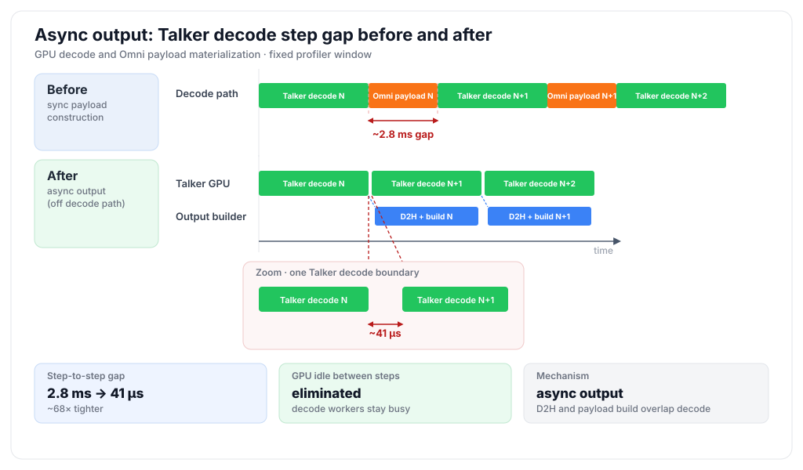

# Async Omni Output Materialization

## Table of Contents

1. [Overview](#overview)
2. [Performance](#performance)
3. [Architecture](#architecture)
4. [Enabling the Feature](#enabling-the-feature)
5. [Compatibility and Fallbacks](#compatibility-and-fallbacks)
6. [Related Files](#related-files)

## Overview

Async Omni output materialization moves CPU-side construction of
`OmniModelRunnerOutput` out of the autoregressive (AR) decode critical path.
It complements [Async Chunk](async_chunk.md): async chunk pipelines partial
outputs between stages, while async output materialization prevents the
construction of those partial outputs from blocking the next decode step.

An AR stage must return sampled token IDs quickly because the scheduler needs
them for the next decode step. However, an Omni stage can also produce hidden
states, multimodal tensors, full-payload accumulations, and connector metadata.
Building these payloads can require device-to-host (D2H) copies, tensor slicing,
flattening, and Python object construction.

Without this feature, all of that work runs inline in `sample_tokens()`:

```text
sample tokens
  -> update decode state
  -> copy hidden and multimodal outputs to CPU
  -> build per-request payloads
  -> accumulate connector outputs
  -> return sampled tokens
  -> launch the next decode step
```

With async output materialization, only work required by the next decode step
stays on the critical path:

```text
sample tokens
  -> update decode state
  -> snapshot output state and start asynchronous D2H copies
  -> register sampled tokens
  -> launch the next decode step

background output path
  -> wait for the payload snapshot
  -> build per-request payloads
  -> accumulate connector outputs
  -> construct OmniModelRunnerOutput
```

This allows payload construction for step `N` to overlap with GPU decode work
for step `N + 1`. It does not change model computation or generated output.

!!! note "Platform scope"
    This design currently applies to the CUDA and ROCm AR runners, which use
    `GPUARModelRunner`. Ascend NPU uses a separate `NPUARModelRunner` path that
    still constructs `OmniModelRunnerOutput` and drains connector output
    synchronously before wrapping the result as an asynchronous runner output.
    XPU and MUSA are not currently covered or validated by this design.

<p align="center">
  
</p>

<p align="center">
  <em>
    Figure 1: Moving payload construction off the decode path reduces the
    observed gap between consecutive Talker steps from about 2.8 ms to 41 µs.
    Adapted from the
    <a href="https://vllm.ai/blog/2026-07-01-qwen3-omni-optimization">
      Qwen3-Omni optimization blog
    </a>.
  </em>
</p>

For Qwen3-Omni, the feature is enabled for both AR stages:

- **Thinker**: Defers hidden-state and multimodal payload materialization.
- **Talker**: Runs its decode-state postprocess eagerly, then defers codec
  payload materialization. Because Code2Wav consumes codec codes rather than
  Talker hidden states, the Talker also skips unnecessary hidden-state D2H.
- **Code2Wav**: Does not use this path because it is a generation stage rather
  than an AR stage.

Qwen3-TTS uses the same mechanism in its AR Talker stage. The Talker updates
the decode state it needs for the next step before returning, then constructs
the codec payload for Code2Wav in the background.

## Performance

In the controlled Qwen3-Omni optimization sweep, enabling async output
materialization on top of CUDA Graph and async chunk produced the following
results at concurrency 64:

| Configuration | Request throughput | Mean audio TTFP | Mean audio RTF |
|---|---:|---:|---:|
| CUDA Graph + async chunk | 9.3 req/s | 655 ms | 0.63 |
| + async output materialization | 11.3 req/s | 631 ms | 0.47 |
| Change | **+22%** | **-4%** | **-25%** |

The sweep used `Qwen/Qwen3-Omni-30B-A3B-Instruct`, 640 Seed-TTS English
prompts, and one replica each for Thinker, Talker, and Code2Wav. Async output
materialization recovers throughput by removing CPU payload construction from
the decode critical path without regressing time to first audio packet (TTFP).
See the
[Qwen3-Omni optimization blog](https://vllm.ai/blog/2026-07-01-qwen3-omni-optimization)
for the complete benchmark methodology and results.

The implementation was also validated against the synchronous safe-copy path.
The text and audio output hashes matched, confirming that overlap does not
change the generated result. See
[PR #4476](https://github.com/vllm-project/vllm-omni/pull/4476) for the
correctness and profiling details.

## Architecture

### Output Lifecycle

`OmniAsyncGPUModelRunnerOutput` extends vLLM's
`AsyncGPUModelRunnerOutput`. It preserves the existing asynchronous
sampled-token feedback while adding a background builder for the complete Omni
output.

The output lifecycle is:

1. `GPUARModelRunner.sample_tokens()` samples tokens and performs the
   bookkeeping required by the next decode step.
2. The runner snapshots step-local metadata such as request IDs, token spans,
   scheduler output, and query start locations.
3. CUDA payload tensors are cloned before reusable model or CUDA Graph buffers
   can be overwritten.
4. The cloned payload is copied to pinned CPU memory on a dedicated CUDA
   stream. A CUDA event records when the copy is ready.
5. `OmniAsyncGPUModelRunnerOutput` starts a background thread that waits for
   the payload event and builds `OmniModelRunnerOutput`.
6. The AR runner immediately registers the sampled-token CPU copy with the
   input batch and returns, allowing async scheduling to advance.
7. When the engine calls `get_output()`, it joins the background builder,
   propagates any builder exception, and finalizes sampled tokens and logprobs
   through the upstream output implementation.

```text
GPU / decode path                         Background output path

forward + sample
      |
      +-- clone output tensors
      +-- enqueue D2H copy --------------> wait for D2H event
      +-- register sampled tokens               |
      +-- return async output                    +-- slice per request
      |                                         +-- build multimodal payloads
next decode step                                +-- accumulate full payloads
                                                +-- read connector output
                                                +-- build OmniModelRunnerOutput
```

### Safe State Snapshots

The next scheduler step can mutate runner state while the background builder is
still active. Most step-local builder inputs are therefore detached snapshots.
The snapshotted state includes:

- scheduler token counts and speculative-token metadata
- request IDs and request-to-batch-index mappings
- sampled token IDs, logprobs, and prompt logprobs
- query start locations and scheduled-token spans
- hidden states and multimodal output tensors
- KV-connector and encoder-cache outputs captured for the step

CUDA tensor cloning is required because CUDA Graph and model output buffers can
be reused by the next forward pass. The dedicated copy stream and pinned host
buffers make the D2H transfer asynchronous; the snapshot retains its cloned
CUDA sources until the transfer event completes.

### Live Runner State and Ownership

The complete builder input is not a detached snapshot. Two parts deliberately
remain runner-owned:

- Full-payload accumulation looks up each request in `self.requests` and
  updates the runner's pending full-payload accumulator.
- `get_omni_connector_output()` drains live, per-cycle connector signals after
  payload accumulation. Connector output state itself is not snapshotted.

Correctness therefore depends on the output lifecycle: request entries and the
full-payload accumulator must remain valid until the background builder
finishes, and that builder must be the only consumer that drains connector
signals for its output cycle. Receive-side connector state written by the
background receiver is coordinated by the connector mixin's `_lock`.
`OmniAsyncGPUModelRunnerOutput.get_output()` joins the builder and is the
completion and exception boundary before the materialized output is consumed.

### Output Builder

The background builder performs the work that previously ran inline:

- resolves which requests need downstream payloads
- converts hidden and multimodal tensors into per-request CPU payloads
- applies model-specific payload processing
- accumulates full payloads when required
- creates the tensor-only `multimodal_outputs` wire payload
- drains live connector readiness signals after payload accumulation
- constructs the final `OmniModelRunnerOutput`

Input-side connector operations remain synchronous with model execution. In
particular, receiving inputs and flushing previously completed connector
outputs are not deferred because they affect scheduler-visible request state.

### Qwen3-Omni Stage Behavior

| Stage | Async output behavior | Reason |
|---|---|---|
| Thinker | Snapshots hidden states and multimodal outputs; builds the downstream payload in the background | The Talker needs the payload, but the next Thinker decode step only needs sampled-token feedback |
| Talker | Runs lightweight postprocess eagerly; snapshots codec outputs; omits hidden states from the downstream payload | `hidden_states.last` is needed by the next Talker step, while Code2Wav only needs codec codes |
| Code2Wav | Uses the normal generation-stage output path | Code2Wav is not executed by `GPUARModelRunner` |

The Qwen3-TTS Talker follows the same pattern as the Qwen3-Omni Talker:
postprocess runs eagerly because the next decode step needs its updated state,
while codec payload construction runs asynchronously. Its Code2Wav stage also
uses the normal generation-stage path.

## Enabling the Feature

There is no separate `async_omni_output` command-line or YAML option. The
feature is selected automatically for model stages that opt in when the runtime
conditions are safe. On CUDA and ROCm, using the bundled deployment profile is
enough to turn it on for the supported Qwen3-Omni and Qwen3-TTS pipelines. The
same profile does not enable background Omni materialization on Ascend NPU.

### Example 1: Qwen3-Omni

Start the full Qwen3-Omni pipeline:

```bash
vllm serve Qwen/Qwen3-Omni-30B-A3B-Instruct \
  --omni \
  --port 8091
```

The model registry automatically loads
`vllm_omni/deploy/qwen3_omni_moe.yaml`. Its relevant settings are:

```yaml
async_chunk: true

stages:
  - stage_id: 0  # Thinker
    enable_prefix_caching: false
    # async_scheduling defaults to true for AR stages

  - stage_id: 1  # Talker
    enable_prefix_caching: false
    # async_scheduling defaults to true for AR stages

  - stage_id: 2  # Code2Wav
    enable_prefix_caching: false
    async_scheduling: false
```

With this profile, async output materialization activates automatically for:

- **Stage 0, Thinker**: Defers hidden-state and multimodal payload
  construction.
- **Stage 1, Talker**: Defers codec payload construction after eagerly
  updating its decode state.

Stage 2 does not use this feature because Code2Wav is not an AR stage.

### Example 2: Qwen3-TTS

Start Qwen3-TTS with any checkpoint that uses the Qwen3-TTS Talker pipeline.
For example:

```bash
vllm serve Qwen/Qwen3-TTS-12Hz-1.7B-CustomVoice \
  --omni \
  --port 8091
```

The model registry automatically loads `vllm_omni/deploy/qwen3_tts.yaml`. Its
relevant settings are:

```yaml
async_chunk: true

stages:
  - stage_id: 0  # Talker
    async_scheduling: true
    enable_prefix_caching: false

  - stage_id: 1  # Code2Wav
    enable_prefix_caching: false
```

Async output materialization activates only for Stage 0, the AR Talker. The
Talker keeps the state required by its next decode step on the GPU, skips an
unnecessary hidden-state D2H copy, and builds the codec payload for Code2Wav in
the background. Stage 1 uses the generation-stage output path.

The same behavior applies to the Base and VoiceDesign Qwen3-TTS checkpoints
because they use the same Talker implementation.

!!! warning
    Do not pass `--no-async-chunk` or enable prefix caching when you want this
    optimization. Either change causes the runner to fall back to synchronous
    output construction. Enabling async chunk alone cannot activate the feature
    for a model that has not opted into async Omni output.

## Compatibility and Fallbacks

The async output path is used only when all of the following conditions hold:

| Requirement | Reason |
|---|---|
| The platform uses the CUDA or ROCm `GPUARModelRunner` path | Ascend NPU materializes the Omni output synchronously; XPU and MUSA are not covered or validated by this design |
| AR async scheduling is enabled | The optimization relies on the scheduler advancing while the prior output is materialized |
| `async_chunk` is enabled | The feature targets incremental downstream Omni payloads |
| The model stage opts in with `use_async_omni_output` | Models must declare that their output lifecycle is safe to defer |
| Omni prefix cache is disabled | Prefix-cache merge and update ordering currently requires synchronous materialization |
| Speculative decoding is disabled | Speculative output state is not included in this deferred path |
| Routed-expert output is disabled | Routed-expert extraction currently requires the synchronous path |
| Postprocess is absent or explicitly runs eagerly | State needed by the next decode step must be updated before the runner returns |

On CUDA and ROCm, these checks are evaluated per stage. An unsupported
combination does not prevent serving; it only falls back to synchronous output
construction for that stage. On Ascend NPU, `NPUARModelRunner.sample_tokens()`
fully constructs `OmniModelRunnerOutput`, calls
`get_omni_connector_output()`, and only then creates the asynchronous wrapper,
so Omni payload materialization remains synchronous.

!!! note
    `use_async_omni_output`,
    `eager_omni_postprocess_before_async_output`, and
    `omni_pooler_payload_include_hidden` are model implementation contracts,
    not user-facing configuration fields.

## Related Files

- `vllm_omni/worker/gpu_ar_model_runner.py`: Async output object, safe tensor
  snapshots, compatibility guards, and deferred Omni output builder.
- `vllm_omni/platforms/npu/worker/npu_ar_model_runner.py`: Separate Ascend NPU
  runner, where Omni output materialization remains synchronous.
- `vllm_omni/model_executor/models/qwen3_omni/qwen3_omni.py`: Thinker and
  Talker opt-in behavior.
- `vllm_omni/deploy/qwen3_omni_moe.yaml`: Default Qwen3-Omni deployment
  settings.
- `vllm_omni/model_executor/models/qwen3_tts/qwen3_tts_talker.py`: Qwen3-TTS
  Talker opt-in and eager postprocess behavior.
- `vllm_omni/deploy/qwen3_tts.yaml`: Default Qwen3-TTS deployment settings.
- `tests/worker/test_gpu_ar_model_runner.py`: Snapshot, guard, connector
  ordering, and background error-propagation tests.
- [Async Chunk](async_chunk.md): Inter-stage chunking and scheduling design.
- [Qwen3-Omni optimization blog](https://vllm.ai/blog/2026-07-01-qwen3-omni-optimization):
  Optimization context and controlled performance results.
- [PR #4476](https://github.com/vllm-project/vllm-omni/pull/4476): Feature
  implementation, validation, and review history.
