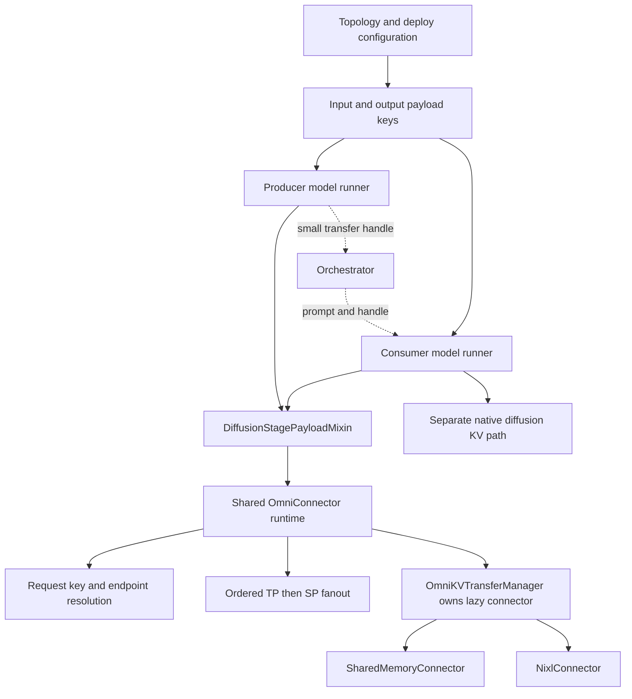
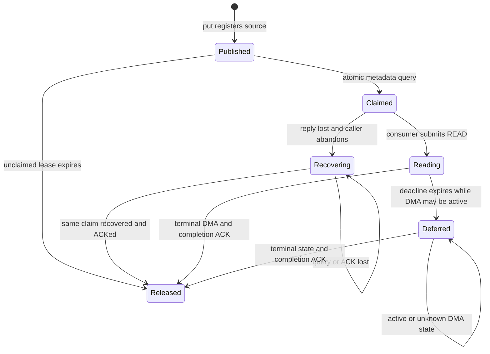

# Cross-Stage Payload Transport

Stage payload transport moves model outputs such as encoder conditioning between
workers without routing their tensor contents through the orchestrator. It is
separate from native diffusion KV transfer: a deployment can use both, either, or
neither. MiniMax-H3 is one consumer of this interface, not its implementation.

## Architecture



The diffusion adapter owns model-facing selection and validation. The shared
runtime owns request-key construction, endpoint metadata, retry policy, and
distributed fanout. Backends own storage, transfer progress, and allocation
lifetime. No pipeline should instantiate a NIXL agent or implement its own
metadata-query loop.

The synchronous runtime borrows the manager's connector. It does not create
background AR receive/save loops or replace the manager's KV key callbacks.
The asynchronous AR path continues using `get()` through its existing poller.
Both paths share the descriptor and fanout helpers; their scheduling policies
are deliberately different.

## Configuration and Identity

`stage_output_payload_keys` selects non-`None` entries in a producer's
`DiffusionOutput.custom_output`. `stage_input_payload_keys` declares the required
entries in the consumer's `prompt.additional_information`. Both normalize to
tuples in `OmniDiffusionConfig`, including lists loaded from YAML.

The model topology declares these keys; deploy configuration selects the
connector for the edge. MiniMax-H3's standard and Turbo disaggregated profiles
default to SharedMemory. Their `_nixl.yaml` overlays opt into NIXL with
`--deploy-config`; choosing NIXL does not imply fallback to SharedMemory.

Without an explicit handle, the key is:

```text
{external_req_id or request_id}_{from_stage}_{chunk_id}
```

The synchronous complete-payload path uses chunk zero. Source and destination
IDs come from the configured edge, not from an assumption that stages are
adjacent or that the producer is stage zero. An explicit handle can override
the key, source, destination, and backend metadata:

```python
{
    "key": "request-42_2_0",
    "from_stage": "2",
    "to_stage": "5",
    "size_bytes": 4096,
    "metadata": {...},
    "payload_keys": ["text_encoder_output"],
}
```

This descriptor is attached under `_stage_payload_transfer`. Backend metadata
is opaque to the pipeline. If it is absent, request-scoped sender information
can supply `source_host` and `source_port`. `payload_sender_info` takes
precedence over legacy `kv_sender_info`. A flat endpoint is accepted directly;
a stage-keyed map is resolved using the actual source stage, accepting string
and integer keys. A single unambiguous candidate remains supported. Multiple
unmatched candidates are not arbitrarily resolved to stage zero.

## API Contracts

| API | Owner | Contract |
| --- | --- | --- |
| `init_omni_connectors(..., synchronous=True)` | Shared runtime | Borrow an existing manager; no AR polling threads or KV callback mutation. |
| `_stage_payload_recv_spec(...)` | Shared transport | Resolve explicit handle or conventional key plus request-scoped endpoint. |
| `recv_stage_payload(..., retry_seconds=2.0)` | Shared transport | Leader retries with one monotonic deadline, retires discovery, then fans out success or absence. |
| `get_with_deadline(..., deadline=...)` | Connector | Bound backend-controlled waits by the supplied absolute monotonic deadline. Return `(payload, bytes)` or `None`. |
| `abandon_get(key)` | Connector | Retire unresolved discovery on the calling thread after the retry loop. Never free an active READ. Default is a no-op for stateless discovery. |
| `_maybe_recv_stage_payload(request)` | Diffusion adapter | Skip warmup, receive, merge declared keys on the target device, and reject missing required values. |
| `_maybe_send_stage_payload(requests, outputs)` | Diffusion adapter | Leader publishes selected complete outputs; all ranks attach the same handle and remove only transferred fields. |
| `OmniKVTransferManager.close()` | Manager | Drain prefetch, close only the connector already created, and disable later lazy initialization. |

`get_with_deadline()` is intentionally not a wrapper around an arbitrary
blocking `get()`. The base implementation raises `NotImplementedError`.
An unsupported backend must implement this capability before being used for
synchronous remote-only payloads. Existing asynchronous `get()` users are
unchanged.

The deadline covers retry sleeps, metadata socket waits, and NIXL completion
polling. It is **not a hard real-time bound** on Python execution, allocation,
serialization, individual native driver calls, device copies, or TP/SP
collectives. A stuck native call cannot safely be preempted with a Python
future timeout. The implementation does not start a detached READ and discard
its ownership when the model-thread budget expires.

## Successful Transfer

```mermaid
sequenceDiagram
    participant P as Producer leader
    participant B as Connector
    participant O as Orchestrator
    participant C as Consumer leader
    participant R as Consumer peer ranks
    P->>B: put(key, selected custom_output)
    B-->>P: success, bytes, backend metadata
    P->>P: Broadcast handle; remove transferred inline keys
    P->>O: Output carrying small handle
    O->>C: Prompt carrying handle and endpoint
    C->>B: get_with_deadline(key, deadline)
    B-->>C: Complete payload or absence
    C->>B: abandon_get(key)
    C->>R: Delivery status, then tensors if present
    C->>C: Merge and validate required keys
    R->>R: Merge and validate required keys
```

Exactly one rank, the leader in every participating group, accesses the
connector. The shared broadcaster traverses TP and then SP groups in the same
order on every rank. In a TP-by-SP grid, TP first populates the source SP row;
SP then propagates each TP column. Followers do not initialize or query a
connector. Absence is broadcast too, so peers do not wait for tensor broadcasts
that the leader will never issue.

Pipelines must gather sharded producer outputs before publication. Selecting
payload keys does not gather tensor shards automatically.

## Execution and Failure Policy

Full forward receives before pipeline execution and sends after output
preparation. Stepwise execution receives once when a new cached state is
created. That state retains the external request ID; final decoded output is
published exactly once. Intermediate denoising steps and non-final streaming
chunks are not published under the complete-payload key. Chunk-addressed
streaming transfer remains the asynchronous path's separate contract.

Dummy request IDs (`dummy_req_id` and its slash-prefixed variants) bypass both
directions. A pure warmup batch does not lazily initialize the connector,
publish buffers, wait for remote data, or enter payload fanout.

If `put()` fails, the producer keeps its inline fields. If a receive fails,
inline continuation is valid only when **all required keys have non-`None`
values**. Missing required values raise an explicit stage-payload error on
each rank after fanout. In particular, a successful H3 producer removes its
large inline encoder output: loss of that remote payload is an error, not a
claim that the original prompt is equivalent conditioning. With no declared
input keys, an explicit handle's `payload_keys` defines the required set.

## NIXL Ownership and Recovery



Claims are scoped by payload generation and UUID. A transient metadata miss
reuses the same UUID. At the end of the synchronous retry loop, `abandon_get()`
moves unresolved queries to background recovery. Recovery asks for the same
claim, obtains the generation, and acknowledges it **without submitting a
READ**. A lost completion reply is retried against that exact generation,
not by acquiring a fresh payload with the same key. Existing claims may be
recovered while a producer is closing; new claims may not.

If a READ was submitted and its state is active or unknown, timeout does not
release source or destination allocations. The deferred-transfer reaper keeps
tensors, registrations, descriptor lists, and transfer handles until NIXL
reports a terminal state. Completion ACK failure also stays in background
retry. Producer close can therefore remain deferred until ownership drains.

Recovery is eventual, not guaranteed under permanent network partition or
consumer process death. A producer cannot safely infer that an unreachable
consumer has stopped DMA. Conservatively retained ownership in that case is
an explicit safety limit, distinct from a live consumer silently abandoning
a recoverable discovery claim.

## Reusing the Interface

| Backend | Synchronous support | Backend responsibility |
| --- | --- | --- |
| SharedMemory | Implemented | Nonblocking read-lock acquisition; return absence on contention; shared runtime retries. Copy and deserialize after acquiring the lock. |
| NIXL | Implemented | Deadline-aware socket and completion waits, generation-scoped claims, deferred active-DMA cleanup, discovery recovery. |
| Other existing connectors | Opt-in required | Implement `get_with_deadline`; implement `abandon_get` only when discovery creates ownership. Do not inherit an unbounded blocking call. |

To add a model, declare input/output keys and use ordinary prompt and output
structures. To add a backend, implement the connector capability and ownership
tests, register it through the existing factory, and select it in deploy
configuration. Neither requires a backend-specific diffusion model runner.

Worker teardown disables offloading, closes the manager after draining
prefetch, then tears down native KV and distributed resources in `finally`
blocks. The synchronous mixin does not close the borrowed connector itself.
Repeated manager close is safe, including for an unused manager.

## Validation Map

| Test module | Main invariants |
| --- | --- |
| `tests/diffusion/test_diffusion_stage_payload.py` | Warmup bypass, strict missing-payload errors, valid inline fallback, source-stage endpoints, TP/SP fanout, handle publication. |
| `tests/diffusion/test_diffusion_model_runner.py` | New-request receive and final-only stepwise publication with cached external identity. |
| `tests/distributed/omni_connectors/test_nixl_connector.py` | Lost replies, same-claim recovery, deadlines, generation isolation, active DMA retention, deferred close and ACKs. |
| `tests/distributed/omni_connectors/test_shm_connector.py` | Key and metadata reads, lock contention, expired deadline, cleanup. |
| `tests/worker/test_omni_connector_mixin.py` | Borrowed connector ownership and shared synchronous/asynchronous helpers. |
| `tests/distributed/omni_connectors/test_kv_async_prefetch.py` | Prefetch ordering and idempotent manager close. |
| `tests/config/test_omni_config.py` | Tuple normalization across topology, deploy, stage CLI, and serialization. |

Mocked ownership tests do not establish native transport performance or
accelerator correctness. Native NIXL and model E2E runs are separate checks;
their results must name the tested revision and runtime.
