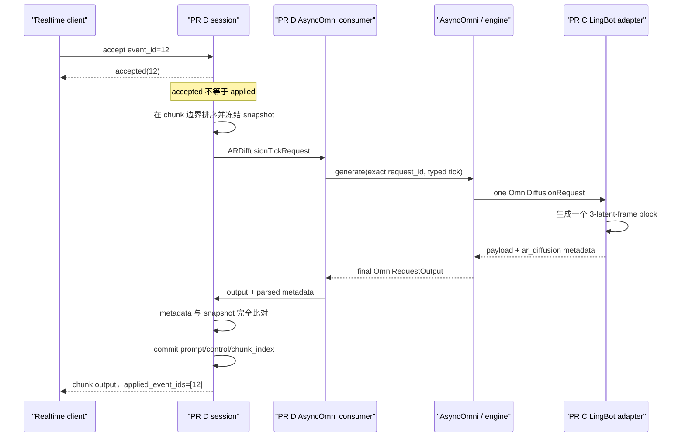

# LingBot World 2.0 Realtime PR D 完全掌握指南

本文用问答方式解释 PR D 的目标、状态机、代码边界、与 PR C 的配合方式、
测试覆盖和剩余集成点。读完后，应能独立 review、联调和扩展这个 PR。

## 一句话结论

PR D 建立了一个与模型无关的 realtime world control plane：

- session 管理世界生命周期；
- event queue 接收 prompt/control 更新；
- 每个 chunk 边界生成一个不可变 typed tick；
- AsyncOmni 用完全一致的 `request_id` 执行一次 AR block；
- 只有 PR C 返回的标准 chunk metadata 与 tick 完全一致，事件才从
  `accepted` 变成 `applied`；
- reset、close、disconnect 和失败清理通过已有 collective RPC 到达
  diffusion worker/runner。

它没有实现 LingBot camera 数学、transformer、KV、VAE，也没有把 realtime
字段塞进普通 `/v1/videos` 的 `extra_params`。

## Q1：这个 PR 真正解决了什么问题？

离线视频请求通常是“一次请求，生成完整视频”。Realtime world 不同：
同一个世界要跨多个 engine request 持续演化，而且用户输入可能在任意时刻到达。

PR D 解决的是模型调用之前和之后的控制面问题：

1. 哪些输入属于同一个世界；
2. 输入按什么顺序生效；
3. 队列满了怎么办；
4. 一个 prompt 和多个 control 如何原子生效；
5. 当前 AR block 应看到哪一份状态；
6. 什么时候可以告诉客户端某个 event 已经 applied；
7. reset、close、断线和失败时如何释放 worker session。

PR D 不决定“camera payload 代表什么”。它只传递
`track/schema/data`。具体坐标系、WASD、target、velocity、轨迹插值都属于 PR C。

## Q2：PR C 和 PR D 的边界是什么？

| 责任 | PR D：control plane | PR C：LingBot adapter |
|---|---|---|
| session/event 身份 | 负责 | 消费 `session_id` |
| event 排序、去重、背压 | 负责 | 不负责 |
| chunk-boundary snapshot | 负责 | 消费 snapshot |
| control `track/schema/data` 路由 | 原样保存和转发 | 解释 LingBot 语义 |
| prompt 当前值 | 决定哪个版本生效 | 编码 prompt、管理 text cross-KV |
| camera/pose/WASD 数学 | 不解析 | 负责 |
| paged/self/cross KV | 不接触 | 负责 |
| 一个 request 生成一个 block | 发起 request | 执行模型计算 |
| chunk identity metadata | 校验后提交 | 从实际 tick 生成并返回 |
| reset/close/disconnect | 发起 lifecycle RPC | 释放 runner/model state |
| CUDA tensor | 不持久保存、不解释 | 模型侧拥有 |

最重要的规则是：两边只共享 contract commit `721a03a4` 中的三个类型，
不再创建 LingBot 私有重复类型。

## Q3：一次成功的 chunk 完整经过哪些步骤？



任意一步失败，都不会把该 snapshot 标记为 applied。

## Q4：共享 contract 到底是哪三个类型？

固定使用：

```python
from vllm_omni.experimental.ar_diffusion.tick_protocol import (
    ARDiffusionChunkMetadata,
    ARDiffusionControlInput,
    ARDiffusionTickRequest,
)
```

- `ARDiffusionControlInput`：一个 opaque control track；
- `ARDiffusionTickRequest`：一次 AR block 的完整不可变输入；
- `ARDiffusionChunkMetadata`：模型实际完成的 chunk 身份。

序列化后，tick 只放在：

```python
sampling_params.extra_args["ar_diffusion_tick"]
```

PR D 没有修改这些类型或字段语义。

## Q5：四种 ID 为什么不能混用？

| ID | 标识对象 | 规则 |
|---|---|---|
| `session_id` | 持续世界 | create 到 close；reset 后可复用同一 transport session |
| `event_id` | 一次交互输入 | session 内唯一、单调边界、用于去重 |
| `request_id` | 一次 engine 计算 | 每个 tick 一个，必须原样到达 PR C |
| `chunk_index` | 当前世界 epoch 内的 AR block | 从 0 连续递增；reset 后回到 0 |

`request_id` 不能用 `chunk_index` 代替，因为失败、取消和重建都需要独立追踪
一次具体 engine request。默认 request ID 同时包含 session、chunk 和随机后缀。

## Q6：为什么修改了 `AsyncOmni.generate()` 的 request ID 行为？

原来的 `AsyncOmni.generate()` 会给外部 ID 自动追加随机后缀。这对普通请求是好事，
但固定 contract 要求：

```text
ar_diffusion_tick.request_id
==
OmniDiffusionRequest.request_id
```

因此新增了内部专用参数 `_internal_request_id`。普通调用完全保持旧行为；
只有内部 typed protocol 可以请求一个已经由 session control plane 保证唯一的
engine-facing ID。

当 `request_id` 和 `_internal_request_id` 同时提供时，两者必须相等。这样不会在
model runner 里放宽 contract，也不会让 PR C 猜测重写后的 ID。

## Q7：event 的 accepted 和 applied 有什么区别？

`accept_event()` 成功只表示：

- event 合法；
- 没有违反单调边界；
- queue 还有容量；
- 已经原子进入 pending queue。

它立即返回 `ARDiffusionEventAcceptance`，状态可能是：

- `accepted`：第一次入队；
- `duplicate`：同一 event 已在 pending 或近期已见。

只有以下条件全部成立后，event 才是 applied：

1. 它被包含在某个 chunk-boundary tick；
2. engine 成功返回最终目标 diffusion stage output；
3. output 包含标准 `ar_diffusion` metadata；
4. metadata 与发送的 tick 完全一致；
5. session 本地 commit 完成。

客户端应使用 chunk 的 `applied_event_ids` 关联此前收到的 accepted 回执。

## Q8：event queue 如何排序、去重和背压？

队列行为是 deterministic 的：

- 入队顺序可以乱，snapshot 按 `event_id` 升序处理；
- pending duplicate 返回幂等 `duplicate`；
- 已经应用或近期见过的 duplicate 也返回 `duplicate`；
- 小于等于当前 event floor 的未知旧 ID 返回 stale error；
- 达到 `max_pending_events` 后，新 event 整体拒绝；
- queue 容量统计包含正在执行 snapshot 中尚未 commit 的 event。

最后一条很重要：模型还没确认成功时，control plane 不能提前释放 queue slot，
否则会制造“看似 applied、实际失败”的窗口。

## Q9：composite event 的“原子”具体指什么？

一个 `ARDiffusionSessionEvent` 可以同时带：

- 一个 prompt 更新；
- 多个不同 track 的 control 更新。

整个 event 只占一个 queue slot。它要么完整入队，要么完整拒绝，不会出现 prompt
成功但 camera 被 queue-full 丢弃的半状态。同一个 composite event 内不允许重复
更新同一 track。

## Q10：多个 event 更新同一字段时谁生效？

在一个 snapshot 内按 `event_id` 从小到大 fold：

- prompt：最后一个非 `None` prompt 生效；
- control：每个 track 最后一次更新生效；
- 未更新的 prompt/track 继承上一成功 chunk 的 committed state；
- 输出 tick 中 controls 再按 track 排序，保证 deterministic。

公共层不知道 `camera` 或 `action` 的含义，只把它们当作 track 名称。

## Q11：chunk-boundary immutable snapshot 如何保证？

构建 tick 时，session 在 state lock 下完成三件事：

1. 固定本次 `applied_event_ids`；
2. fold 出本次 prompt 和各 control track；
3. 对 transport payload 做隔离复制。

snapshot 建好后才释放锁并调用模型。此时新到达的更大 `event_id` 可以继续入队，
但只能进入下一个 chunk。它不会修改正在执行的 tick。

允许的 control data 是 transport-safe 的 mapping、list/tuple 和标量，mapping key
必须是字符串。任意 tensor、任意 Python object 或模型对象都会在入队时被拒绝。

## Q12：为什么 session 在模型执行期间不先删除 pending event？

这是事务边界：

```text
snapshot -> execute -> verify metadata -> commit
```

在 verify 成功前，pending event 仍然存在。这样 control plane 不会把尚未得到模型
确认的输入标成 applied。

成功后只删除该 snapshot 的 event；执行期间新入队的 event 留给下一 chunk。

## Q13：失败后为什么不能直接重试同一个 chunk？

这是与 PR C 配合后确定的 fail-closed 语义。

PR C 的 runner 在 forward exception 时会释放 paged KV 和模型 session state。
如果 PR D 仍拿原来的 `chunk_index=N` 重试，PR C 已经是一个从 0 开始的新状态，
两边必然分叉。

因此任一 tick 执行失败或 metadata 不匹配时：

1. 当前 snapshot 不 commit；
2. session 进入 `FAILED`；
3. PR D 调用 worker close 清理可能已经前进的模型状态；
4. 不再接受 event，也不能继续 `next_chunk()`；
5. 调用方只能显式 reset 或 close。

reset 成功后：

- pending event、prompt 和 controls 被清空；
- `chunk_index` 回到 0，与 PR C 的新 model state 对齐；
- `event_id` 去重边界保留，因为 event ID 在 transport session 内仍要求唯一。

## Q14：如果模型成功了，但 metadata 错了，会怎样？

这比普通模型异常更危险：worker 的 KV 可能已经前进，但 control plane 不知道它完成了
哪个 snapshot。

PR D 不猜测，也不伪造 metadata。它会：

- 拒绝本地 commit；
- 将 session 标为 `FAILED`；
- 调 worker close；
- 把错误返回给调用方。

这避免出现“API 认为 chunk 2，模型其实已经到 chunk 3”的静默状态分叉。

## Q15：PR C 的标准输出 envelope 是什么？

双方冻结的形状是：

```python
DiffusionOutput(
    output={
        "payload": {
            "latents": generated_latents,
        },
        "metadata": {
            "ar_diffusion": ARDiffusionChunkMetadata.from_tick(tick).to_dict(),
        },
    }
)
```

经过 engine 后，PR D 从下面这个标准位置读取：

```python
output.multimodal_output["metadata"]["ar_diffusion"]
```

`payload` 与 identity metadata 分开。PR D 不新增绕过 diffusion formatter 的
`LingBotChunkResult`，也不会根据输入自行生成一份“看起来正确”的 metadata。

## Q16：metadata 校验有多严格？

先做 schema 校验：

- `session_id`、`request_id` 必须是非空字符串；
- `chunk_index` 必须是非负整数，bool 不算整数；
- `applied_event_ids` 必须是非负、唯一、严格递增的整数序列。

再与本次 tick 的 `ARDiffusionChunkMetadata.from_tick(tick)` 做完整相等比较。
session、request、chunk、event IDs 中任一字段不同都不会 commit。

## Q17：concrete tick consumer 做了什么？

`ARDiffusionOmniTickConsumer` 是 session 与 AsyncOmni 之间的通用 adapter：

1. 调 `prompt_provider(tick)` 构造标准 Omni prompt；
2. clone 每个 stage 的 sampling params template；
3. 只在目标 diffusion stage 合并 `tick.to_extra_args()`；
4. 用 exact internal request ID 调 `AsyncOmni.generate()`；
5. 完整消费 generator，确保 AsyncOmni 正常 cleanup；
6. 选择目标 diffusion stage 的 final output；
7. 保留 engine error；
8. 解析标准 metadata；
9. 返回完整 `OmniRequestOutput`，让后续 transport 使用真实 payload。

它不解析任何 LingBot control schema。

## Q18：`prompt_provider` 为什么是注入的？

Realtime session start 通常还要绑定 initial image、标准 prompt 包装和部署配置。
这些信息的最终 transport schema 尚未由 WebSocket endpoint 冻结，而且不同模型可能
不同，所以 session 状态机不应该硬编码。

`prompt_provider` 以完整 typed tick 为输入，可以按 `session_id` 查找初始化数据并返回
标准 `OmniPromptType`。PR C 目前要求：

- 标准 request prompt 是模型真正使用的 prompt；
- `tick.prompt` 用于 snapshot 一致性校验；
- 两者规范化后必须相等。

camera/action 仍留在 typed tick controls，由 PR C 解释。

## Q19：sampling params 会不会被多个 chunk 相互污染？

不会。consumer 保存的是 template，每个 tick 都 clone 一份，再把 typed tick 合并进
目标 diffusion stage 的 `extra_args`。测试明确检查 template 中没有残留
`ar_diffusion_tick`。

这也防止多个 session 并发时覆盖彼此的 request-local tick。

## Q20：session 为什么是 generic 的？

状态机只需要从 consumer output 中提取 `ARDiffusionChunkMetadata`，但 transport 还需要
真实 payload。把 session 写成 `ARDiffusionSession[TickOutputT]` 后：

- fake consumer 可以直接返回 metadata，CPU 测试很轻；
- concrete consumer 可以返回 `OmniRequestOutput`；
- session 不需要理解视频、latent 或未来的 encoded frame 类型。

session 不把 output 存进长期状态，只在 verify 后原样返回。

## Q21：reset/close/disconnect 如何到达 PR C？

调用链是：

```text
ARDiffusionSession
  -> ARDiffusionWorkerLifecycle
  -> AsyncOmni.collective_rpc(stage_ids=[diffusion stage])
  -> orchestrator / stage pool
  -> DiffusionWorker.reset_ar_diffusion_session()
     或 DiffusionWorker.close_ar_diffusion_session()
  -> ARDiffusionModelRunner.reset_session()/close_session()
  -> PR C pipeline/model state cleanup
```

worker 只用 capability-style method lookup：

- runner 支持时调用并返回 `True`；
- 普通 diffusion runner 不支持时返回 `False`；
- public lifecycle 要求所选 worker 全部支持，否则报错。

这里没有导入 LingBot 类，也没有直接调用 pipeline 私有方法。

PR C 当前把 self-KV、named text cross-KV、chunk/prompt 状态和跨 request RNG
连续性都视为同一个 model session 的一部分；D 的 lifecycle RPC 必须让这些状态一起
reset/close，不能只清理其中一种 cache。

## Q22：session 状态机有哪些状态？

```text
ACTIVE
  ├─ tick/output failure ─> FAILED
  ├─ reset ─> RESETTING ─> ACTIVE(chunk_index=0)
  └─ close/disconnect ─> CLOSING ─> CLOSED

FAILED
  ├─ reset ─> RESETTING ─> ACTIVE(chunk_index=0)
  └─ close/disconnect ─> CLOSING ─> CLOSED
```

reset RPC 失败会留在 `FAILED`。close 即使 worker cleanup 抛错，也会在本地进入
`CLOSED`，避免继续使用一个所有权已经不确定的 session。

## Q23：为什么当前没有新增 world WebSocket endpoint？

仓库已有 `/v1/realtime/video`，但它的语义是：

- 一条连接只发起一个普通视频 generation request；
- `session.prompt_update` 当前明确不支持；
- stop 只 abort 当前 request；
- 输出假设是可直接编码的普通视频帧。

把 world event 塞进它的 `VideoGenerationRequest.extra_params` 会破坏本计划的边界，
并且无法正确表达跨多个 request 的 accepted/applied、reset 和 paged KV 生命周期。

另一方面，PR C 当前 realtime tick 输出的是 latent block；把 latent 变成连续 binary
frame stream 属于 PR E 的 incremental VAE/output 工作。在 session init payload 和
PR E 输出接缝冻结前新增 endpoint，只会产生一个不能端到端工作的公开协议。

所以本 PR 完成内部 API 和 concrete engine seam，但刻意不修改现有
`/v1/realtime/video`，也不把协议塞进 `/v1/videos`。

## Q24：未来 WebSocket handler 应该怎样接入？

接入点已经明确，但 transport schema 尚未冻结。handler 应：

1. 在 server 初始化时创建一个共享 `ARDiffusionOmniTickConsumer`；
2. 用同一个 AsyncOmni client 创建 `ARDiffusionWorkerLifecycle`；
3. 创建 `ARDiffusionSessionManager`；
4. `session.start` 时保存 initial image 等 transport 初始化数据，并创建 session；
5. interaction message 转成 `ARDiffusionSessionEvent` 后立即返回 accepted；
6. generation loop 调 `session.next_chunk()`；
7. 从真实 output 取 PR E 的 frame payload，并发送 metadata/applied IDs；
8. reset 调 `manager.reset_session()`；
9. stop 和 `finally` 中都调用 close/disconnect；
10. 不允许客户端直接注入 `ar_diffusion_tick`。

建议在 PR E 输出格式冻结后，为 world session 建立专用 handler/endpoint，而不是复用
普通视频 extras。

## Q25：当前代码文件分别负责什么？

| 文件 | 作用 |
|---|---|
| `vllm_omni/engine/ar_diffusion_session.py` | event queue、snapshot、状态机、manager、lifecycle RPC |
| `vllm_omni/engine/ar_diffusion_consumer.py` | typed tick 到 AsyncOmni 的 concrete adapter、output metadata 解析 |
| `vllm_omni/entrypoints/async_omni.py` | 内部 exact request ID seam |
| `vllm_omni/diffusion/worker/diffusion_worker.py` | worker 到 runner 的 reset/close callable boundary |
| `tests/engine/test_ar_diffusion_session.py` | 纯 CPU session/state-machine 测试 |
| `tests/engine/test_ar_diffusion_consumer.py` | fake engine consumer 和跨层 commit 测试 |
| `tests/ar_diffusion/test_worker_lifecycle.py` | worker delegation 测试 |
| `tests/entrypoints/test_omni_entrypoints.py` | exact request ID 到 engine 的测试 |

固定 contract 位于
`vllm_omni/experimental/ar_diffusion/tick_protocol.py`，PR D 只复用、不修改。

## Q26：CPU tests 覆盖了哪些风险？

L1 tests 使用 `pytest.mark.core_model` 和 `pytest.mark.cpu`，新增状态机测试不使用
`unittest.mock`。

覆盖项包括：

- accepted 后按 event ID 排序，在 chunk success 后才 applied；
- pending/applied duplicate；
- stale event；
- bounded queue；
- composite 原子性；
- source payload mutation 隔离；
- 非 transport-safe payload 拒绝；
- in-flight snapshot 与新 event 隔离；
- model failure 后 FAILED/cleanup/reset；
- metadata mismatch 不 commit；
- reset、close、disconnect；
- selected-stage collective RPC；
- unsupported worker；
- exact typed tick 序列化；
- sampling params template 不污染；
- missing/invalid metadata；
- engine error 保真；
- session + concrete consumer 联合 commit；
- AsyncOmni exact internal request ID。

## Q27：本机测试为什么有“隔离执行通过”和“正式 pytest 未启动”两种结果？

当前系统 `python3` 是 Python 3.9，并安装了与本仓库不匹配的旧 vLLM。pytest 在加载
仓库 conftest 时就失败：

```text
ModuleNotFoundError: No module named 'vllm.v1'
```

这不是测试断言失败，测试甚至没有进入 collection。仓库要求 Python 3.10+ 和匹配
当前 vLLM-Omni 的 vLLM build。

为了仍然验证纯状态机逻辑，使用本机 Python 3.11 隔离加载 contract/session/consumer，
以轻量 fake 类型执行 deterministic async tests。最终合入前仍必须在正确 vLLM 环境
补跑正式 pytest。

## Q28：PR C 合入时最容易踩哪些坑？

Review 时逐项确认：

- `OmniDiffusionRequest.request_id == tick.request_id`；
- 一个 typed request 只生成一个 3-latent-frame block；
- PR C 使用标准 request prompt，并与 `tick.prompt` 做一致性校验；
- PR C 只解释 controls，不重新排序 event；
- output metadata 来自实际 tick；
- `applied_event_ids` 原样返回且严格递增；
- chunk index 在一个 epoch 内连续；
- reset 后 PR C 和 PR D 都从 chunk 0 开始；
- 跨 request RNG state 连续，不能让每个 chunk 都从同一个 seed 重新起步；
- forward exception 后 runner state 被释放，D 进入 FAILED；
- close/reset hooks 同时清理 paged KV、named cross-KV 和 LingBot 非 KV state；
- PR C 不新增第二套 session/tick/result contract。

## Q29：怎样把 PR C 和 PR D 集成到同一分支？

两者都以 contract commit `721a03a4` 为共同祖先。推荐由 integration owner：

1. 先完成并提交 PR C；
2. 将 PR D 的两个小 commit cherry-pick 到 integration branch；
3. 解决的冲突应只集中在共享 engine/entrypoint 接缝，不应涉及 LingBot tensor 数学；
4. 跑 PR C 的 direct/tick parity tests；
5. 跑 PR D 的 session/consumer tests；
6. 再补一个真实 AsyncOmni + fake/lightweight PR C output 的跨层测试；
7. GPU 条件具备后跑真实 checkpoint 两 chunk + prompt/control + reset/close。

若合并时发现必须修改 `tick_protocol` 字段语义，应停止，把它当作 contract blocker
讨论，而不是在 PR C 或 PR D 单方面修改。

## Q30：出现问题时应该从哪里排查？

### event 一直接受但不 applied

检查：

1. generation loop 是否真的调用 `next_chunk()`；
2. target diffusion stage 是否返回 final output；
3. output 是否含 `metadata.ar_diffusion`；
4. metadata 的四个身份字段是否与 tick 完全相等；
5. session 是否已经进入 FAILED。

### PR C 报 request ID mismatch

检查 concrete consumer 是否同时传了：

```python
request_id=tick.request_id
_internal_request_id=tick.request_id
```

不要在 runner 放宽校验。

### reset 后 PR C 报 expected 0

确认使用当前 PR D：reset 后 control-plane `chunk_index` 必须回到 0。不要恢复旧的
“reset 后继续 N+1”行为。

### camera 行为不对

先看 tick 中 `track/schema/data` 是否原样到达；如果到达，问题属于 PR C schema/camera
解释，不要在 session queue 中添加 camera 数学。

### metadata mismatch

这是 session-fatal consistency error。先保存 request/tick/output identity 诊断，
不要绕过校验，也不要人工把 event 标为 applied。

## Q31：这个 PR 明确没有声称完成什么？

它没有声称已经完成 LingBot World 2.0 realtime 产品能力。仍缺：

- PR C 最终 commit 与 direct/paged tick parity；
- 专用 public WebSocket transport schema；
- PR E incremental VAE 和 binary frame transport；
- 正确 vLLM 环境中的完整 pytest；
- 真实 checkpoint GPU E2E；
- 长 session、并发 session、LRU/压力测试；
- 性能指标和优化。

只有这些与 integration 计划中的完成条件共同通过后，才能宣称完整 realtime support。

## 最后应记住的六条 invariant

1. contract 类型只有一套，PR C/D 都不复制。
2. public control plane 只路由身份和 opaque schema data。
3. accepted 永远不等于 applied。
4. chunk 只有在真实 output metadata 完全匹配后才能 commit。
5. model/control-plane 状态一旦可能分叉，就 fail closed，并 reset from zero。
6. WebSocket 是 control plane 的 transport adapter，不是把 realtime 字段塞进普通
   video extras 的捷径。
