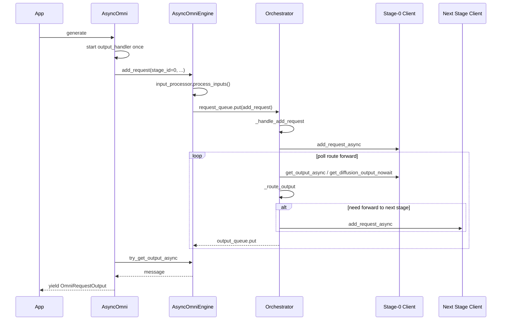

# AsyncOmni Architecture (Qwen3-Omni Example)

## 1. System Architecture

```text
• ┌───────────────────────────────────────────────────────────────────────────────────────┐
  │                                       API Layer                                       │
  │  ┌────────────────────────────────────────┐  ┌─────────────────────────────────────┐  │
  │  │ AsyncOmni (EngineClient)               │  │ Omni                                │  │
  │  │ • generate() / abort() / shutdown()    │  │ • generate()                        │  │
  │  │ • _final_output_handler()              │  │                                     │  │
  │  └────────────────────────────────────────┘  └─────────────────────────────────────┘  │
  ├───────────────────────────────────────────────────────────────────────────────────────┤
  │                                  Engine Layer (Proxy)                                 │
  │  ┌─────────────────────────────────────────────────────────────────────────────────┐  │
  │  │ AsyncOmniEngine                                                                 │  │
  │  │ • _bootstrap_orchestrator() & _initialize_stages()                              │  │
  │  │ • add_request() / add_request_async() -> input_processor.process_inputs()       │  │
  │  │ • try_get_output() / try_get_output_async()                                     │  │
  │  └─────────────────────────────────────────────────────────────────────────────────┘  │
  │              request_queue (janus.Queue)      output_queue (janus.Queue)              │
  ├───────────────────────┼───────────────────────────────────┼───────────────────────────┤
  │                                  Orchestration Layer                                  │
  │  ┌─────────────────────────────────────────────────────────────────────────────────┐  │
  │  │ Orchestrator [background thread]                                                │  │
  │  │ • _request_handler()                                                            │  │
  │  │     -  stage_client.add_request_async() & _prewarm_async_chunk_stages()         │  │
  │  │ • _orchestration_output_handler()                                               │  │
  │  │     -  _process_stage_outputs() -> output_processors[i].process_outputs()       │  │
  │  │     -  _route_output() & _forward_to_next_stage()                               │  │
  │  └─────────────────────────────────────────────────────────────────────────────────┘  │
  ├────────────────┼───────────────────────────┼───────────────────────────┼──────────────┤
  │                                  Communication Layer                                  │
  │  ┌─────────────────────────┐ ┌─────────────────────────┐ ┌─────────────────────────┐  │
  │  │ StageLLMCoreClient      │ │ StageLLMCoreClient      │ │ StageDiffusionCoreClient│  │
  │  │ • ZMQ ROUTER / PULL     │ │ • ZMQ ROUTER / PULL     │ │ • ZMQ ROUTER / PULL     │  │
  │  │ • Msgpack codec         │ │ • Msgpack codec         │ │ • Msgpack codec         │  │
  │  └───────────┬─────────────┘ └───────────┬─────────────┘ └───────────┬─────────────┘  │
  │               ▼ ZMQ IPC               ▼ ZMQ IPC               ▼ ZMQ IPC               │
  ├───────────────────────────────────────────────────────────────────────────────────────┤
  │                                    Execution Layer                                    │
  │  ┌─────────────────────────┐ ┌─────────────────────────┐ ┌─────────────────────────┐  │
  │  │ StageLLMCoreProc        │ │ StageLLMCoreProc        │ │ StageDiffusionCoreProc  │  │
  │  │ [background process]    │ │ [background process]    │ │ [background process]    │  │
  │  └─────────────────────────┘ └─────────────────────────┘ └─────────────────────────┘  │
  └───────────────────────────────────────────────────────────────────────────────────────┘
```

## 2. Execution Flow (Arrow Steps, one generate request)

```text
[1] App
    -> AsyncOmni.generate(prompt, request_id)

[2] AsyncOmni
    -> _final_output_handler()   (started on first request)
    -> AsyncOmniEngine.add_request(stage_id=0, ...)

[3] AsyncOmniEngine.add_request
    -> (if stage-0 is llm and input is not EngineCoreRequest)
       InputProcessor.process_inputs()
       OutputProcessor[0].add_request()
    -> request_queue.put(add_request_msg)

[4] Orchestrator._request_handler
    -> _handle_add_request(msg)
    -> stage_clients[0].add_request_async(...)

[5] Orchestrator._orchestration_loop (loop)
    -> poll stage output
       - llm stage: await get_output_async()
       - diffusion stage: get_diffusion_output_nowait()
    -> (llm stage) output_processors[i].process_outputs(...)
    -> _route_output(...)
    -> if finished and not final_stage and non-async-chunk:
         _forward_to_next_stage(...)
         -> next_stage.add_request_async(...)
    -> output_queue.put(output)

[6] AsyncOmni._final_output_loop (background coroutine)
    -> AsyncOmniEngine.try_get_output_async()
    -> route by request_id to ClientRequestState.queue

[7] AsyncOmni._process_orchestrator_results
    -> read from ClientRequestState.queue
    -> _process_single_result(...)
    -> yield OmniRequestOutput

[8] Exit condition
    -> receive result["finished"] == True
    -> generate() ends
```

## 3. Runtime Sequence (one generate request)



## 4. Comparison

Previous topology (reference):

```text
┌────────────────────────────────────────────────────────────────────────────┐
│ Main Process                                                               │
│  ┌──────────────────────┐   ┌────────────────────────────────────────────┐ │
│  │ generate()           │   │ final_output_handler()                     │ │
│  └──────────────────────┘   └────────────────────────────────────────────┘ │
└──────────┬─────────────────────────┬─────────────────────────┬─────────────┘
  mp.Queue (in_q/out_q)    mp.Queue (in_q/out_q)    mp.Queue (in_q/out_q)
           ▼▲                        ▼▲                        ▼▲
┌───────────────────────┐  ┌───────────────────────┐  ┌──────────────────────┐
│ Worker Proc-0         │  │ Worker Proc-1         │  │ Worker Proc-2        │
│ (Thinker LLM)         │  │ (Talker LLM)          │  │ (Vocoder)            │
│  ┌────────────────┐   │  │  ┌────────────────┐   │  │  ┌────────────────┐  │
│  │_stage_worker   │   │  │  │_stage_worker   │   │  │  │_stage_worker   │  │
│  │_async()        │   │  │  │_async()        │   │  │  │_async()        │  │
│  └────────────────┘   │  │  └────────────────┘   │  │  └────────────────┘  │
│  ┌────────────────┐   │  │  ┌────────────────┐   │  │  ┌────────────────┐  │
│  │output_handler()│   │  │  │output_handler()│   │  │  │output_handler()│  │
│  └────────────────┘   │  │  └────────────────┘   │  │  └────────────────┘  │
└──────────┬────────────┘  └──────────┬────────────┘  └──────────┬───────────┘
       ZMQ ▼ ▲ ZMQ               ZMQ ▼ ▲ ZMQ               ZMQ ▼ ▲ ZMQ
┌──────────────────────┐   ┌──────────────────────┐   ┌──────────────────────┐
│ EngineCore Proc-0    │   │ EngineCore Proc-1    │   │ EngineCore Proc-2    │
│ (Thinker)            │   │ (Talker)             │   │ (Vocoder)            │
└──────────────────────┘   └──────────────────────┘   └──────────────────────┘
```

Current topology:

```text
┌────────────────────────────────────────────────────────────────────────────┐
│ Main Process                                                               │
│  ┌──────────────────────────────────────────────────────────────────────┐  │
│  │ Main Thread                                                          │  │
│  │  ┌──────────────────────┐   ┌─────────────────────────────────────┐  │  │
│  │  │ generate()           │   │ final_output_handler()              │  │  │
│  │  └──────────────────────┘   └─────────────────────────────────────┘  │  │
│  └──────────────────────────────────────────────────────────────────────┘  │
│         janus.Queue (request_queue) ▼  ▲ janus.Queue (output_queue)        │
│  ┌──────────────────────────────────────────────────────────────────────┐  │
│  │ Orchestrator Thread                                                  │  │
│  │  ┌──────────────────────┐  ┌──────────────────────────────────────┐  │  │
│  │  │ _request_handler()   │  │ _orchestration_output_handler()      │  │  │
│  │  └──────────────────────┘  └──────────────────────────────────────┘  │  │
│  │  ┌────────────────────────────────────────────────────────────────┐  │  │
│  │  │ _orchestration_loop(): poll/process/route outputs for all stages│  │  │
│  │  └────────────────────────────────────────────────────────────────┘  │  │
│  └───────┬─────────────────────────┬─────────────────────────┬──────────┘  │
└──────────┬─────────────────────────┬─────────────────────────┬─────────────┘
       ZMQ ▼ ▲ ZMQ               ZMQ ▼ ▲ ZMQ               ZMQ ▼ ▲ ZMQ  
  ┌──────────────────────┐  ┌──────────────────────┐  ┌──────────────────────┐
  │ EngineCore Proc-0    │  │ EngineCore Proc-1    │  │ EngineCore Proc-2    │
  │ (Thinker)            │  │ (Talker)             │  │ (Vocoder)            │
  └──────────────────────┘  └──────────────────────┘  └──────────────────────┘
```


## 5. Extending: Adding a New Stage Type

The Communication + Execution layers are backend-agnostic. Each backend (`llm`,
`diffusion`) is one triad of classes, and adding a new stage type means adding a
new triad. Suppose you want an `encode` stage; you write three classes:

| Role | Layer | What it does |
|------|-------|--------------|
| `StageEncodeCoreClient` | Communication (head side) | Encodes requests onto the wire, decodes outputs; implements the `StageCoreClientBase` contract. |
| `StageEncodeCoreProc` | Execution (subprocess) | Runs your engine's busy loop in a child process; decodes requests, runs them, encodes outputs. |
| `StageEncodeCoreProcManager` | Head side | Spawns/monitors the `StageEncodeCoreProc` subprocess and forwards the omni kwargs (coord address, stage id, replica id). |

The two processes talk over ZMQ. The frames are msgspec wire structs you declare
next to the existing ones in `stage_core_types.py`, all subclassing the field-free
markers so the orchestrator can treat every stage uniformly:

```python
# vllm_omni/engine/stage/stage_core_types.py
class StageEncodeCoreRequest(StageCoreRequest):
    request_id: str
    prompt: Any                    # Any: model-specific payload, handled by the omni msgpack hooks
    sampling_params: dict[str, Any]

class StageEncodeCoreOutput(StageCoreOutput):
    request_id: str
    finished: bool = True
    embedding: Any = None          # your stage's result, carried opaquely

class StageEncodeCoreOutputs(StageCoreOutputs):
    outputs: list[StageEncodeCoreOutput] = []
```

### 5.1 Client — implement the shared contract

Subclass `StageCoreClientBase` (directly, or mix in a vLLM transport base like the
LLM client does with `AsyncMPClient`). `StageCoreClientBase.__init__` fills in the
shared metadata (`stage_id`, `replica_id`, `stage_type`, …); you only implement the
seven abstract methods.

The manager exposes the subprocess ZMQ endpoints as `.addresses` (inputs/outputs);
the client opens its own sockets against them (mirroring the diffusion client's
`from_addresses` construction):

```python
# vllm_omni/engine/stage/stage_encode_core_client.py
class StageEncodeCoreClient(StageCoreClientBase):
    def __init__(self, metadata, request_address, response_address, *, proc_manager=None):
        super().__init__(metadata=metadata)                    # sets stage_id/replica_id/...
        self._proc = proc_manager                              # owns the subprocess
        self._input = zmq_ctx.socket(zmq.PUSH); self._input.connect(request_address)
        self._output = zmq_ctx.socket(zmq.PULL); self._output.connect(response_address)
        self._encoder, self._decoder = OmniMsgpackEncoder(), OmniMsgpackDecoder()

    async def add_request_async(self, request: StageEncodeCoreRequest) -> None:
        await self._input.send(self._encoder.encode(request))

    async def get_outputs_async(self) -> StageEncodeCoreOutputs:
        frame = await self._output.recv()
        return self._decoder.decode(frame, StageEncodeCoreOutputs)

    def get_outputs_nowait(self) -> StageEncodeCoreOutputs | None:
        ...                                                    # non-blocking poll, or None

    async def abort_requests_async(self, request_ids: list[str]) -> None: ...
    async def collective_rpc_async(self, method, timeout=None, args=(), kwargs=None): ...
    def shutdown(self, timeout: float | None = None) -> None: self._proc.shutdown(timeout)
    def _engine_dead_reason(self) -> str | None:               # None == healthy
        return "encode proc died" if self._proc.finished_procs() else None
```

### 5.2 Proc — the subprocess busy loop

Give it a static entry point the manager can spawn. It decodes requests, runs your
engine, and sends back the wire outputs:

```python
# vllm_omni/engine/stage/stage_encode_core_proc.py
class StageEncodeCoreProc:
    @staticmethod
    def run_encode_core(*args, addresses, config, omni_coord_address=None,
                        omni_stage_id=None, omni_replica_id=0, **kwargs) -> None:
        set_death_signal(signal.SIGTERM)                       # die with the parent
        input_socket = zmq_ctx.socket(zmq.PULL); input_socket.bind(addresses.inputs[0])
        output_socket = zmq_ctx.socket(zmq.PUSH); output_socket.bind(addresses.outputs[0])
        engine = MyEncoder(config)
        # optional: register with the coordinator for heartbeats
        coord = create_stage_coord_client(omni_coord_address, ...) if omni_coord_address else None
        while True:
            req = decoder.decode(input_socket.recv(), StageEncodeCoreRequest)
            result = engine.encode(req.prompt, req.sampling_params)
            out = StageEncodeCoreOutputs(outputs=[
                StageEncodeCoreOutput(request_id=req.request_id, embedding=result)])
            output_socket.send(encoder.encode(out))
```

### 5.3 Manager — spawn and monitor the subprocess

Spawn `run_encode_core` in a child process and forward the omni kwargs. If your
backend is an `EngineCoreProc`, subclass vLLM's `CoreEngineProcManager` (like the
LLM manager); otherwise own a plain `mp.Process` (like the diffusion manager):

```python
# vllm_omni/engine/stage/stage_encode_core_proc_manager.py
class StageEncodeCoreProcManager:
    def __init__(self, *, config, omni_coord_address=None,
                 omni_stage_id=None, omni_replica_id=0, **kwargs):
        # the subprocess binds these; the client connects to them (see .addresses)
        self.addresses = EngineZmqAddresses(
            inputs=[get_open_zmq_ipc_path()], outputs=[get_open_zmq_ipc_path()])
        self.proc = get_mp_context().Process(
            target=StageEncodeCoreProc.run_encode_core,
            kwargs={"config": config,
                    "addresses": self.addresses,
                    "omni_coord_address": omni_coord_address,
                    "omni_stage_id": omni_stage_id,
                    "omni_replica_id": omni_replica_id},
        )
        self.proc.start()

    def shutdown(self, timeout=None): shutdown([self.proc], timeout=timeout)
    def finished_procs(self): ...      # {} while alive; used by the client's health check
    def monitor_engine_liveness(self): ...
```

A factory then wires the two together — build the manager, hand its
`addresses.inputs[0]` / `addresses.outputs[0]` to the client (this is what
`create_diffusion_client` does):

```python
proc_manager = StageEncodeCoreProcManager(config=config, omni_stage_id=stage_id, ...)
client = StageEncodeCoreClient(metadata,
                               proc_manager.addresses.inputs[0],
                               proc_manager.addresses.outputs[0],
                               proc_manager=proc_manager)
```

### 5.4 Wiring

Register the stage type in the pool/startup path (`StageReplicaPool`,
`stage_engine_startup.py`) so a stage config with `stage_type="encode"` constructs
your `StageEncodeCoreProcManager` + `StageEncodeCoreClient`. The orchestrator,
routing, and output handling are unchanged — they only see the marker types
(`StageCoreRequest` / `StageCoreOutputs`), so no orchestration code needs to know
`encode` exists.

## 6. Test scripts

```bash
# enter offline inference folder.
cd examples/offline_inference/qwen2_5_omni
python end2end.py --output-dir output_audio --query-type use_mixed_modalities

cd ../qwen3_omni
python end2end.py --output-dir output_audio --query-type text --async-chunk --enable-stats

cd ../bagel
python end2end.py --prompts "A cute cat"

cd ../text_to_image
python text_to_image.py --prompt "a cup of coffee on the table" --output output.png
```
