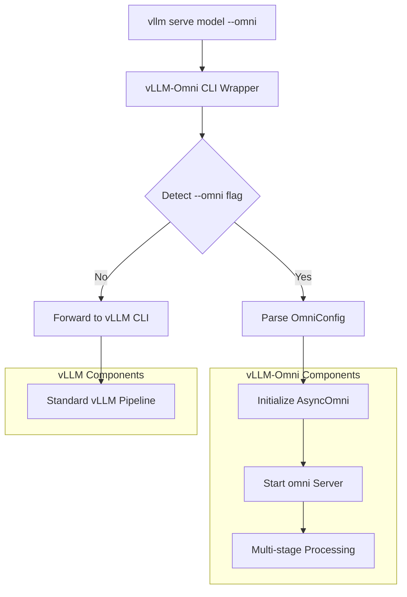

# Architecture Design Principles

## Overview

vLLM-Omni is a multi-modality extension for vLLM that supports non-autoregressive structures and non-textual outputs. This document outlines the key software abstractions, APIs, and dependencies for the system, designed to maximize reuse of vLLM's proven architecture.

## Architecture Principles

1. **vLLM V1 Compatibility**: Built on vLLM's Engine V1 architecture with AsyncLLM and EngineCore patterns
2. **Stage-based Processing**: Models are divided into multiple stages, each processed by different Engine Cores
3. **Multiple Engine Core Support**: Each stage can use either AR Engine Core (reusing vLLM) or Diffusion Engine Core (new DiT support), or other new Cores
4. **Worker Process Pattern**: Follows vLLM's multiprocess worker architecture for scalability
5. **Extensibility**: Easy integration of new modalities, model architectures, and output formats

## Key Data Flow

API Server --> OmniLLM/AsyncOmni (New, including multi engines) --> LLMEngine/AsyncLLM --> Engine Core
 --> Scheduler (New one for DiT) --> Executor (New one for diffusers) --> Worker (New one for DiT)
 --> ModelRunner (New one for AR hiddenstate, New one for DiT) --> RequestState --> OutputProcessor (New one for final multimodal output)

## Core Components (Ordered by Data Flow)

### 1. Installation
```bash
pip install vllm
pip install vllm-omni
```

### 2. Online inference launch (Entry Point)

Keep consistency with the vllm main branch
```bash
vllm serve Qwen/Qwen2.5-Omni-7B --omni --port 8000
```

#### Design Architecture


#### omni Serve Command Implementation
File: vllm_omni/entrypoints/cli/main.py
```python
import sys
import argparse
from typing import List, Optional
from vllm_omni.entrypoints.omni import OmniServeCommand

def main():
    """Main CLI entry point that intercepts vLLM commands"""
    # Check if --omni flag is present
    if "--omni" in sys.argv:
        # Remove --omni flag and process with vLLM-Omni
        omni_args = [arg for arg in sys.argv[1:] if arg != "--omni"]
        omni_serve = OmniServeCommand()
        omni_serve.run(omni_args)
    else:
        # Forward to original vLLM CLI
        from vllm.entrypoints.cli.main import main as vllm_main
        vllm_main()

if __name__ == "__main__":
    main()
```

#### vLLM Plugin Integration
File: vllm_omni/pyproject.toml
```python
[project.scripts]
# Override vLLM's CLI entry point
vllm = "vllm_omni.cli:main"

# Add entry point for vLLM integration
[project.entry-points."vllm.plugins"]
omni = "vllm_omni.plugin:OmniPlugin"
```

### 3. Offline inference launch (Entry Point)
Design an upper level class to incorporate multi Engines, each engine has a engine call.
```python
from vllm.entrypoints.llm import LLM
from vllm.v1.engine.llm_engine import LLMEngine

class OmniLLM(LLM):
    """Extended LLM supporting multiple engines and stage-based processing"""

    def __init__(self, stage_configs: List[StageConfig]):
        super().__init__()
        self.stage_configs = stage_configs
        self.engine_list = []  # List of AsyncLLM instances for each stage
        self.output_processor = MultimodalOutputProcessor()
        self._initialize_stage_engines()

    def _initialize_stage_engines(self) -> None:
        """Initialize LLMEngine instances for each stage"""
        for stage_config in self.stage_configs:
            stage_llm = LLMEngine.from_vllm_config(
                    vllm_config=stage_config.vllm_config,
                    executor_class=self.executor_class,
                    log_stats=self.log_stats
                )
            self.engine_list.append(stage_llm)

    def generate(
        self,
        stage_args_list: List[stage_args],
        use_tqdm: Union[bool, Callable[..., tqdm]] = True,
        lora_request: Optional[Union[list[LoRARequest], LoRARequest]] = None,
        priority: Optional[list[int]] = None,
    ) -> list[RequestOutput]:
        """Main generation interface - orchestrates multi-stage processing"""

        # Process through each stage sequentially
        for i, stage_config in enumerate(self.stage_configs):
            stage_engine = self.engine_list[i]

            # Prepare input for this stage
            stage_args = stage_args_list[i]
            prompt_str, engine_request, tokenization_kwargs = self._process_stage_inputs(stage_config, **stage_args)

            # Add inputs to Engine
            stage_engine.add_request(request_id, prompt_str, tokenization_kwargs)
            # Run Engine
            stage_output = stage_engine.step()

            # Update stage input and output of each stage for later usage
            self._update_stage_io(stage_output, stage_config)


        # Process final output
        final_output = self.output_processor.process_output(
            self.stage_configs[-1].stage_output
        )
        return final_output

    def _process_stage_inputs(stage_config, **stage_args) -> Any:
        """Prepare input for specific stage"""
        if stage_config.engine_type == "AR":
            return self._process_ar_inputs(**stage_args)
        elif stage_config.engine_type == "DiT":
            return self._process_dit_inputs(**stage_args)
        else:
            raise NotImplementedError

    def _process_dit_inputs(**stage_args)-> Any:
        image_latent = self.vae.encode(**stage_args)

        return image_latent
```

### 4. Stage config for setting of different model stages
```python
@dataclass
class StageConfig:
    """Configuration for a processing stage"""
    stage_id: int
    engine_type: str  # "AR" or "DiT"
    model_path: str
    input_modalities: List[str]
    output_modalities: List[str]
    vllm_config: Optional[VllmConfig] = None  # For engine config of corresponding stage
    executor_class: type[Executor]  # For execute class config of corresponding stage
    dit_config: Optional[DiTConfig] = None  # For diffusion stages
    cache_config: Optional[DiTCacheConfig] = None
```
For AR stage, the setting is:
```python
from vllm.v1.core.sched.scheduler import Scheduler
from vllm.v1.executor.multiproc_executor import MultiprocExecutor
ar_stage_config = StageConfig()
ar_stage_config.vllm_config.scheduler_config.scheduler_cls = Scheduler # original vllm scheduler for AR
ar_stage_config.executor_class = MultiprocExecutor # original vllm executor for AR
```
For DiT stage, the setting is:
```python
from vllm.v1.executor.multiproc_executor import MultiprocExecutor
dit_stage_config = StageConfig()
dit_stage_config.vllm_config.scheduler_config.scheduler_cls = DiffusionScheduler # New scheduler for DiT

# For diffusion models without using diffusers
dit_stage_config.executor_class = MultiprocExecutor

# For diffusion models using diffusers
dit_stage_config.executor_class = DiffusersPipelineExecutor
```

### 5. Online inference main class

Similar to OmniLLM in offline inference, add some asynchronous processing, referring to AsyncLLM
```python
from vllm.v1.engine.async_llm import AsyncLLM


class AsyncOmni(AsyncLLM):
    """Extended AsyncLLM supporting multiple engines and stage-based processing"""

    def __init__(self, stage_configs: List[StageConfig]):
        super().__init__()
```

### 6. Engine Core
No need to change. The specific executor, scheduler and output type can be transferred into it with new configs.
```python
# class: EngineCore
# EngineCore.step (simplified)
class EngineCore:
    def step(self):
        scheduler_output = scheduler.schedule()
        model_output = executor.execute_model(scheduler_output)
        engine_outputs = scheduler.update_from_output(
            scheduler_output, model_output
        )
        return engine_outputs
```

### 7. Scheduler
Create a new Diffusion Scheduler for DiT, which is inherited from original vllm AR scheduler. At first, no complicated strategy.
Just process the request first in first out. Then create a class of DiT Cache Manager for optimization in the future.
```python
from vllm.v1.core.sched.scheduler import Scheduler
class DiffusionScheduler(Scheduler):

    def __init__(
        self,
        vllm_config: VllmConfig,
        kv_cache_config: KVCacheConfig,
        dit_cache_config: DiTCacheConfig,
        structured_output_manager: StructuredOutputManager,
        mm_registry: MultiModalRegistry = MULTIMODAL_REGISTRY,
        include_finished_set: bool = False,
        log_stats: bool = False,
    ) -> None:

    self.dit_cache_manager = DiTCacheManager(dit_cache_config)
```
For DiT Cache Manager (Can refer to xDiT):
```python
class DiTCacheManager:
    """Manages DiT-specific caching"""

    def __init__(self, config: DiTCacheConfig):
        self.cache_tensors: Dict[str, torch.Tensor] = {}
        self.cache_groups: List[DiTCacheTensor] = config.dit_cache_tensors

    def allocate_cache(self, request_id: str, size: int) -> torch.Tensor
    def get_cache(self, request_id: str) -> Optional[torch.Tensor]
    def release_cache(self, request_id: str) -> None
    def clear_expired_cache(self) -> None
```

### 8. Executor for DiT without diffusers

No need to change. Just import original AR executor.

### 9. Diffusers Pipeline Executor (no worker)

A single-process executor that directly runs the Diffusers pipeline without spawning workers or using RPC. Interfaces remain identical to `Executor` so the EngineCore loop is unchanged.

#### Function map（Pipeline Executor）

##### 1) Inherited and overridden
```python
from concurrent.futures import Future
from typing import Optional, Union, Callable, Any
import torch
import torch.nn as nn
from vllm.v1.executor.abstract import Executor
from vllm.v1.kv_cache_interface import KVCacheConfig, KVCacheSpec
from vllm.v1.outputs import ModelRunnerOutput
from vllm.tasks import SupportedTask
from diffusers import DiffusionPipeline

class DiffusersPipelineExecutor(Executor):
    supports_pp: bool = False  # Single-process, no TP/PP/DP

    def _init_executor(self) -> None:
        # Called by ExecutorBase.__init__
        self._failure_callback: Optional[Callable[[], None]] = None
        self._device = self._resolve_device()
        self._dtype = self._resolve_dtype()
        self._pipeline = self._build_pipeline(device=self._device, dtype=self._dtype)
        self._profiler = None
        self._is_failed = False
        self.is_sleeping = False
        self.sleeping_tags: set[str] = set()

    # major functions to build/run diffusers pipeline
    def _build_pipeline(self, device:torch.device, dtype:torch.dtype)->DiffusionPipeline:
        model_name = "Qwen/Qwen-Image"

        self.pipe = DiffusionPipeline.from_pretrained(model_name, torch_dtype=dtype)
        self.pipe = pipe.to(device)

    def _run_pipeline(self, scheduler_output) -> ModelRunnerOutput: ...
        positive_magic = {
            "en": ", Ultra HD, 4K, cinematic composition.", # for english prompt
            "zh": ", 超清，4K，电影级构图." # for chinese prompt
        }

        # Generate image
        prompt_embeds = self._get_and_process_prompt_embeds(scheduler_output, positive_magic)
        negative_prompt_embeds = self.pipe.embed_prompt(" ")

        width, height = aspect_ratios["16:9"]

        image = pipe(
            prompt_embeds=prompt_embeds,
            negative_prompt_embeds=negative_prompt_embeds,
            width=width,
            height=height,
            num_inference_steps=50,
            true_cfg_scale=4.0,
            generator=torch.Generator(device="cuda").manual_seed(42)
        ).images[0]

        output = self.wrap_image_as_ModelRunnerOutput(image)
        return output

    # ---- Internal helpers (implementation-specific, not public API) ----
    def _resolve_device(self): ...
    def _resolve_dtype(self): ...
    def _get_model(self) -> nn.Module: ...
    def _get_and_process_prompt_embeds(self, scheduler_output, positive_magic):
        ...
        #append the positive_magic to prompt and embed them to prompt embed tensors

    # Functions related to workers should either raise NotImplementedError
    # or return empty defaults in this no-worker executor.

    def collective_rpc(self, method, timeout=None, args=(), kwargs=None) -> list[Any]:
        # No workers in pipeline executor
        raise NotImplementedError("No workers in DiffusersPipelineExecutor")

    def initialize_from_config(self, kv_cache_configs: list[KVCacheConfig]) -> None:
        return  # no-op (pipeline already built in _init_executor)

    def register_failure_callback(self, callback):
        self._failure_callback = callback

    def determine_available_memory(self) -> list[int]:  # bytes
        # Single device; return [available_bytes]. If CPU-only, return [0].
        return [self._determine_available_bytes(self._device)]

```

### 10. Worker

#### Inheritance strategy
Prefer reusing the mature GPU Worker end-to-end. Worker class is selected by configuration (vllm_config). Do not add a new executor-specific worker binding. If customization is needed, override only `init_device` to construct the `DiffusionModelRunner`; all other behaviors (device init details, profiling, sleep/wake, PP/TP comms, execute path) remain from `vllm/v1/worker/gpu_worker.py::Worker`.


Inherited and overridden
```python
# Optional: only if you need to plug a custom DiffusionModelRunner.
from vllm.v1.worker.gpu_worker import Worker as GPUWorker
from vllm.v1.worker.diffusion_model_runner import DiffusionModelRunner

class Worker(GPUWorker):
    def init_device(self) -> None:
        #those related to device check and init
        ...

        self.model_runner = DiffusionModelRunner(self.vllm_config, ...)
```

### 11. Model Runner

### Function map (Model Runner)
#### 1) Inherited and overridden
Those parts relied to the KV Cache will be omitted if we do not register the model to the vllm config. The engine core will view it as do not require KV Cache, and handle it properly

Reuse `vllm/v1/outputs.py::ModelRunnerOutput`：
- DiffusionModelRunner: Use the `pooler_output=[Tensor,...]` to return multi modal tensors
- ARModelRunner: Use the `pooler_output=[Tensor,...]` to return hidden states.
```python
from typing import Optional, Union
import torch
from vllm.v1.worker.gpu_model_runner import GPUModelRunner
from vllm.v1.outputs import ModelRunnerOutput


class DiffusionModelRunner(GPUModelRunner):
    @torch.inference_mode()
    def execute_model(
        self,
        scheduler_output: "SchedulerOutput",
        intermediate_tensors: Optional[IntermediateTensors] = None,
    ) -> Union[ModelRunnerOutput, IntermediateTensors]:
        ...
        return ModelRunnerOutput(
            req_ids=[...],
            req_id_to_index={...},
            sampled_token_ids=[],
            spec_token_ids=None,
            logprobs=None,
            prompt_logprobs_dict={},
            pooler_output=[Tensor,...],         # Return Hidden states
            kv_connector_output=None,
            num_nans_in_logits=None,
        )# return multi modal tensors via pooler_output=[Tensor,...]


class ARModelRunner(GPUModelRunner):
    @torch.inference_mode()
    def execute_model(
        self,
        scheduler_output: "SchedulerOutput",
        intermediate_tensors: Optional[IntermediateTensors] = None,
    ) -> Union[ModelRunnerOutput, IntermediateTensors]:
        ...
        return ModelRunnerOutput(
            req_ids=[...],
            req_id_to_index={...},
            sampled_token_ids=[],
            spec_token_ids=None,
            logprobs=None,
            prompt_logprobs_dict={},
            pooler_output=[Tensor,...],         # Return Hidden states
            kv_connector_output=None,
            num_nans_in_logits=None,
        )# return hidden states via pooler_output=[Tensor,...]
```

### 12. RequestState Role and Usage
```bash
# RequestState serves as the per-request state tracker in OutputProcessor:
# - Maintains request-specific state (tokens, logprobs, detokenizer, etc.)
# - Converts EngineCoreOutput → RequestOutput/PoolingRequestOutput
# - Manages request lifecycle from registration to completion
AsyncLLM.add_request()
↓
OutputProcessor.add_request()
↓
RequestState.from_new_request() → create request state

AsyncLLM.__init__() / AsyncLLM.generate() / AsyncLLM.encode() →  create a background loop that continuously pulls output from EngineCore
↓
OutputProcessor.process_outputs() → update state and process outputs
↓
RequestState.make_request_output() → convert to the final output, formatted as RequestOutput or PoolingRequestOutput
↓
RequestOutputCollector.put() → push to the queue (AsyncLLM)
```

Need to add implementation for an existing method
```python
class RequestState:
    def __init__(self, request_id: str, parent_req: Optional[ParentRequest],
                 request_index: int, lora_name: Optional[str],
                 output_kind: RequestOutputKind, prompt: Optional[str],
                 prompt_token_ids: list[int], logprobs_processor: Optional[LogprobsProcessor],
                 detokenizer: Optional[IncrementalDetokenizer],
                 max_tokens_param: Optional[int], arrival_time: float,
                 queue: Optional[RequestOutputCollector], log_stats: bool):

    def _new_pooling_output(self, pooling_output: torch.Tensor) -> PoolingOutput:
        """Create PoolingOutput for multimodal/pooling requests"""
        return PoolingOutput(data=pooling_output)
```


### 13. OutputProcessor

For hidden state output, original OutputProcessor already support.

We only need to add new one for final multimodal output.
```python
class MultimodalOutputProcessor(OutputProcessor):
    """Handles multimodal output processing"""

    def __init__(self):
        self.output_handlers: Dict[str, OutputProcessor] = {}

    def process_outputs(self, engine_core_outputs: list[EngineCoreOutput], ...):
        for engine_core_output in engine_core_outputs:
            # Option 1: Use output_type field (if EngineCoreOutput is extended)
            if engine_core_output.output_type == "image":
                self._process_image_output(engine_core_output)
            elif engine_core_output.output_type == "text+image":
                self._process_text_image_output(engine_core_output)
            elif engine_core_output.output_type == "latents":
                self._process_latents_output(engine_core_output)
            elif engine_core_output.output_type == "text":
                self._process_text_output(engine_core_output)
            else:
                # Fallback: use existing pooling_output logic
                if engine_core_output.pooling_output is not None:
                    self._process_pooling_output(engine_core_output)
                else:
                    self._process_text_output(engine_core_output)
```
