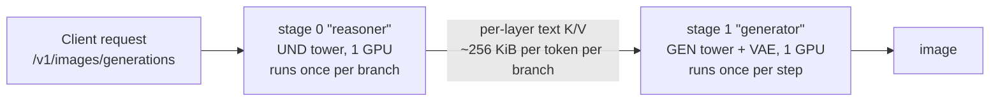

# Cosmos3 Tower Disaggregation (experimental)

!!! warning "Experimental topology"
    The tower split is opt-in, text-to-image only, and has no published
    per-stage performance numbers yet. The co-located
    [`cosmos3_super_t2i.yaml`](https://github.com/vllm-project/vllm-omni/blob/main/vllm_omni/deploy/cosmos3_super_t2i.yaml)
    layout remains the validated way to serve Cosmos3 T2I; see the
    [Cosmos3-Super recipe](https://github.com/vllm-project/vllm-omni/blob/main/recipes/cosmos3/Cosmos3-Super.md).

Cosmos3 is a Mixture-of-Transformers (MoT) model with two towers over one
checkpoint: an autoregressive **UND** tower that encodes the prompt, and a
diffusion **GEN** tower (plus the VAE) that denoises the image. The two towers do
very different amounts of work per request — UND runs **once** (twice with
classifier-free guidance, once per prompt branch), GEN runs **once per denoising
step**, 50 times at the default.

Tower disaggregation puts each tower in its own stage on its own GPU. The
reasoner stage encodes the prompt and ships the UND key/value tensors to the
generator stage, which replays them instead of holding 31.2 B parameters of UND
weights it would use once.



## When to use it

Reach for the split when:

- **Neither card can hold both towers.** Co-located Cosmos3-Super needs 120.91
  GiB of bf16 weights resident; each tower alone is 58.1 GiB, so the split fits
  two smaller cards without any weight sharding.
- **NCCL is unhealthy or unavailable.** This layout has no intra-stage
  collectives at all — every parallel degree is 1 and HSDP is off. The only
  cross-GPU traffic is the K/V handoff, which travels through the stage
  connector rather than NCCL.
- **You want the towers to pipeline across requests.** While the generator
  denoises request *n*, the reasoner can encode request *n+1*.

Prefer the co-located layout when:

- **One H200 is available.** Both towers fit on a single 141 GB card and that
  layout is collective-free too, with no handoff to pay for.
- **You need T2V, I2V, V2V, audio, or action modalities.** The reasoner rejects
  anything that is not text-to-image with
  `Cosmos3 disagg currently splits the towers for text-to-image only`.
- **Single-request latency is what you are optimizing.** The split does not make
  one request faster; the towers were already sequential within it. It also
  serializes the two CFG branches inside the generator stage, so a guided
  request costs about two denoise passes unless you scale that stage out.

## Launch

The topology is selected by the `pipeline:` key in the deploy YAML and by
nothing else. It is unreachable unless you name a deploy config that selects it,
so registering it cannot affect existing co-located deployments.

```bash
CUDA_VISIBLE_DEVICES=0,1 vllm serve nvidia/Cosmos3-Super-Text2Image --omni \
  --host 0.0.0.0 --port 8000 \
  --deploy-config cosmos3_super_t2i_disagg.yaml \
  --init-timeout 1800
```

A bare filename resolves against the bundled `vllm_omni/deploy/` directory; pass
an absolute path to use your own copy. Requests are the ordinary image-generation
requests — the split is invisible to the client:

```bash
curl -sS -X POST http://localhost:8000/v1/images/generations \
  -H "Content-Type: application/json" \
  -d '{"model": "nvidia/Cosmos3-Super-Text2Image",
       "prompt": "A robot arm cleaning a plate in a bright kitchen",
       "size": "1024x1024"}'
```

Both stage workers are launched with the same visible device set, and `devices`
in the YAML are **logical indexes into that set**, not physical GPU ids. That is
why stage 0 says `devices: "0"` and stage 1 says `devices: "1"`: two different
cards out of the shared pair.

## Constraints

| Constraint | Why | What happens if you break it |
| --- | --- | --- |
| `tensor_parallel_size` must be equal on both stages | UND K/V is TP-sharded: the reasoner emits `[B, S, num_kv_heads // tp_size, head_dim]` and the generator's cross-attention expects the shape *its own* TP size implies | The generator raises at install time, naming both stages' TP sizes |
| Both stages must load the same checkpoint | Layer count, KV-head count and head dim all have to line up | Same install-time error |
| Both stages must resolve generation parameters identically | The generator finds its replayed K/V by fingerprinting the token ids it tokenizes itself; `max_sequence_length`, `use_system_prompt` and the geometry all feed that tokenization | Replay-table miss: a `RuntimeError` naming the missing fingerprint, so a failed request rather than a wrong image |
| Set `guardrails` the same on both stages | Only the generator decodes pixels, so it is the only stage that can run the image check | Guardrails on stage 1 alone lets a blocked prompt through the reasoner and catches it only on the decoded image |

The shipped YAML satisfies all four. Other parallel degrees — `cfg_parallel_size`,
`ulysses_degree`, `ring_degree`, HSDP — are stage-local and free to differ; they
are the knobs to reach for when scaling the generator stage out.

A per-stage `default_sampling_params` block is not how you break the third
constraint today: every current request path replaces a diffusion stage's startup
defaults with one request-level params object cloned to all diffusion stages, so a
value set on one tower and not the other is silently dropped rather than honored.
The generator's fingerprint check is there for the routes that do reach it — a
per-stage `sampling_constraints` in the pipeline's stage specs, and anything a
future config path adds.

## The handoff is not small

K/V is grouped-query and bf16 (8 KV heads × 128 head dim × 2 bytes), so one token
costs 4 KiB per layer for K and V together, and about **256 KiB per token per
branch** across all 64 layers. The payload is trimmed to the real prompt length,
so a 256-token formatted prompt is roughly 64 MiB per branch and 128 MiB once
guidance turns on the unconditional branch too.

That crosses the stage edge once per request, against a generator stage that then
runs `num_inference_steps` forwards — but it scales linearly with prompt length,
and `max_sequence_length` (4096 by default) puts the worst case in the GiB range.
The reasoner logs the size of every payload and warns past 512 MiB
(`COSMOS3_UND_PAYLOAD_WARN_MIB`). If you see that warning, lower
`max_sequence_length` rather than ignoring it.

## Scaling the generator stage

The generator stage is where essentially all the FLOPs are, so it is the one to
widen first. Keep
`cfg_parallel_size × ulysses_degree == hsdp_shard_size == len(devices)` for that
stage:

| Generator GPUs | Settings |
| --- | --- |
| 2 | `cfg_parallel_size: 2`, `use_hsdp: true`, `hsdp_shard_size: 2` |
| 4 | additionally `ulysses_degree: 2`, `hsdp_shard_size: 4` |

`ulysses_degree` must divide the latent sequence length: 1024×1024 gives a GEN
sequence of 32 × 32 = 1024 tokens. Widen that stage's `devices` list to match,
and leave `tensor_parallel_size` alone on both stages.

## How the replay works

The seam is a single call. `Cosmos3VFMTransformer.forward` invokes the UND tower
exactly once per branch, and on the generator stage that tower is replaced by a
stub holding the reasoner's K/V, keyed by a fingerprint of the tokenized prompt.
Everything else — prompt formatting, tokenization, GEN mRoPE construction,
scheduler setup, VAE decode — is the inherited co-located code running unchanged
on each stage.

Two consequences worth knowing:

- **Only K/V crosses the wire.** GEN rotary frequencies are computed locally on
  the generator stage from the latent geometry that stage actually allocated,
  rather than being shipped from a stage that would have to predict it.
- **Both stages tokenize the prompt.** That is what makes the fingerprints line
  up, and it is also why the prompt-text guardrail check, when enabled, runs
  twice per request.

The split saves device memory, not startup I/O: both stages still stream the
whole checkpoint and filter the other tower's tensors out after reading them.
Expect roughly double the aggregate startup read I/O of the co-located layout.

## Related

- [Pipeline and deploy configurations](../configuration/stage_configs.md) — how
  `pipeline:`, stages, and `devices` are resolved
- [Disaggregated Inference](../design/feature/disaggregated_inference.md) — the
  generic, connector-based stage-split design contract
- [Parallelism overview](../user_guide/diffusion/parallelism/overview.md) — CFG,
  Ulysses, and HSDP degrees referenced above
- [Cosmos3-Super recipe](https://github.com/vllm-project/vllm-omni/blob/main/recipes/cosmos3/Cosmos3-Super.md)
  — the validated co-located deployments and request formats
