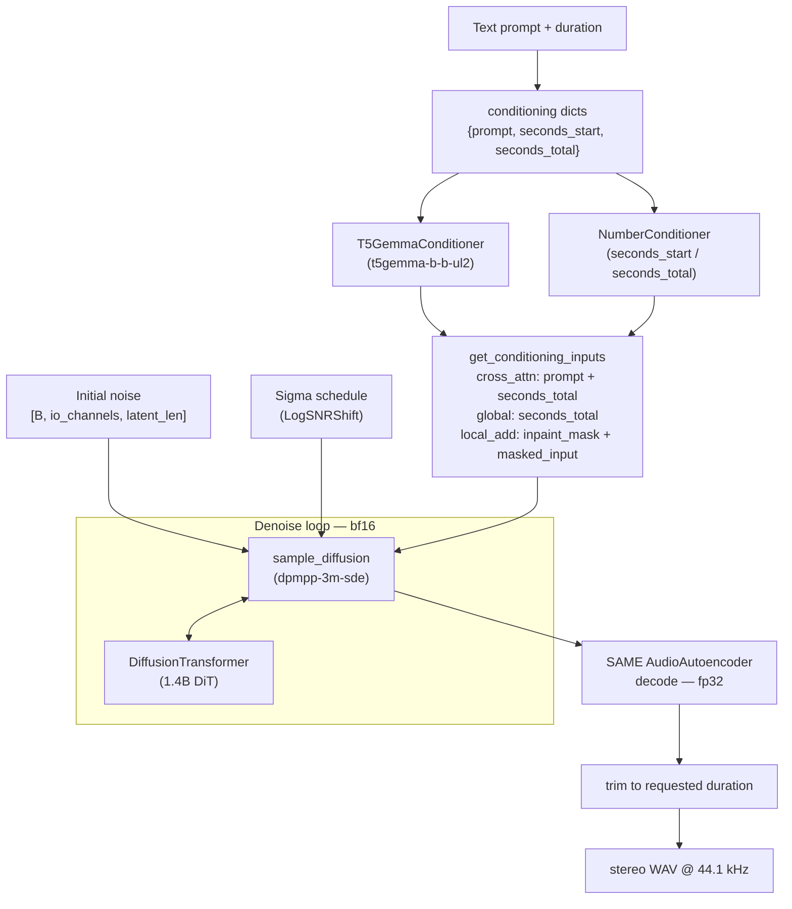

# Stable Audio 3 (medium) — offline inference

> Status: **text-to-audio working** — issue [#3787](https://github.com/vllm-project/vllm-omni/issues/3787).
> The DiT + SAME autoencoder are ported from
> [Stability-AI/stable-audio-3](https://github.com/Stability-AI/stable-audio-3) (MIT)
> under `vllm_omni/diffusion/models/stable_audio_3/`. audio-to-audio editing and
> inpainting are not wired up yet.

## Model

[`stabilityai/stable-audio-3-medium`](https://huggingface.co/stabilityai/stable-audio-3-medium) — 1.4B-parameter DiT, stereo 44.1 kHz, up to **380 s** of audio per generation.

Small variants are CPU-targeted and **not** the primary serving target:

- [`stabilityai/stable-audio-3-small-music`](https://huggingface.co/stabilityai/stable-audio-3-small-music) — 433M params, up to 120 s
- [`stabilityai/stable-audio-3-small-sfx`](https://huggingface.co/stabilityai/stable-audio-3-small-sfx) — 433M params, up to 120 s

Stable Audio 3 **Large** (2.7B) is API-only and out of scope.

## Architecture

`StableAudio3Pipeline.forward` (text → audio) routes conditioning into the DiT,
denoises in bf16, then decodes with the fp32 SAME autoencoder:



## Download

`stabilityai/stable-audio-3-medium` is **gated** — accept the license on its
[model page](https://huggingface.co/stabilityai/stable-audio-3-medium) and
`hf auth login` first. The HF repo does not ship the `model_index.json` /
`transformer/config.json` that vLLM-Omni's engine uses for model discovery, so
download via the helper script, which fetches the weights and writes both files:

```bash
python download_stable_audio_3.py --output-dir ./stable-audio-3-medium
```

## Run

Point the shared `text_to_audio.py` driver at the prepared local directory:

```bash
python ../text_to_audio/text_to_audio.py \
    --model ./stable-audio-3-medium \
    --prompt "An ambient drone evolving slowly with shimmering overtones" \
    --audio-length 120.0 \
    --num-inference-steps 100 \
    --guidance-scale 7.0 \
    --output sa3_drone.wav
```

### SA3-specific flags

`text_to_audio.py` already supports the relevant flags; SA3 just unlocks longer durations:

| Flag | SA Open 1.0 max | SA3 Medium max | Notes |
|------|----------------|-----------------|-------|
| `--audio-length` | ~47 s | **380 s** | Per Stability AI release |
| `--num-inference-steps` | 100 (default) | 100 | Same default works |
| `--guidance-scale` | 7.0 | 7.0 | CFG, same default |
| `--enable-cpu-offload` | yes | yes | Recommended for long clips |
| `--enable-layerwise-offload` | yes | yes | Pin DiT, offload SAME chunks |
| `--use-hsdp` | yes | **yes** | Shard the 1.4B DiT across GPUs (FSDP2) |
| `--tensor-parallel-size` | yes | not yet | TP not implemented for SA3 (audio peers ship without it) |
| `--ulysses-degree` | yes | not yet | SP not implemented for SA3 |

### SAME autoencoder variant

SA3 ships three SAME variants (Small Music / Small SFX / Medium). Selecting one is done via the model checkpoint — the pipeline reads `same_variant` from `od_config.model_config` if you need to override the default `medium`.

## Hardware

| Variant | Peak VRAM | Notes |
|---------|-----------|-------|
| `stable-audio-3-medium` | ~6.5 GB | Single commodity GPU (RTX 3090 / 4070 / A100) |
| `stable-audio-3-small-music` | CPU-targeted | Quality lower; use only when no GPU |
| `stable-audio-3-small-sfx` | CPU-targeted | Quality lower; use only when no GPU |

Medium requires **Flash Attention 2** at runtime.

## Implementation notes

- Reference implementation: [Stability-AI/stable-audio-3](https://github.com/Stability-AI/stable-audio-3) (MIT)
- Tech report: [arxiv.org/abs/2605.17991](https://arxiv.org/abs/2605.17991)
- Initial scope (per #3787): **text-to-audio only**. Audio-to-audio editing and inpainting/continuation are deferred.
- LoRA: SA3 supports stackable, runtime-adjustable LoRA adapters. A serving-side knob may land in a follow-up PR.
