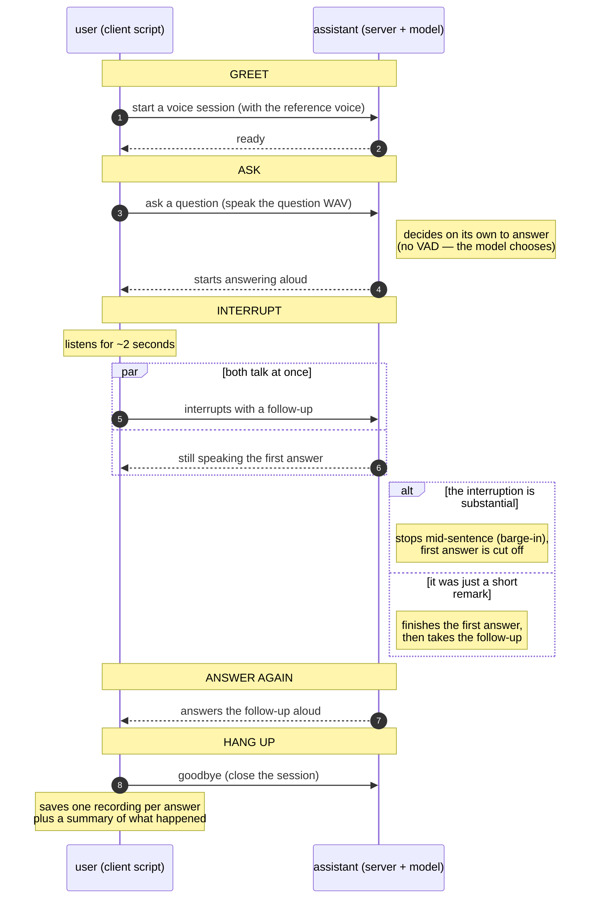

# `barge_in_client.py` — what happens, at a glance

The demo plays one everyday conversation pattern against the full-duplex
server: ask something, get talked-over mid-answer, and see the assistant
cope. High-level flow below — for the exact wire events, read the
docstring in `barge_in_client.py`.

Outcome: the output directory shows which branch ran — a cut-off first
answer is saved as `response_1_cancelled.wav`, a completed one as
`response_1_completed.wav`, and `summary.json` records status, text, and
duration per answer.

Companion: the runtime architecture lives in
[`docs/design/fullduplex.md`](../../docs/design/fullduplex.md); the client
API is `vllm_omni.clients.duplex.DuplexClient`, documented with the wire
protocol in
[`docs/serving/realtime_duplex_api.md`](../../docs/serving/realtime_duplex_api.md).
