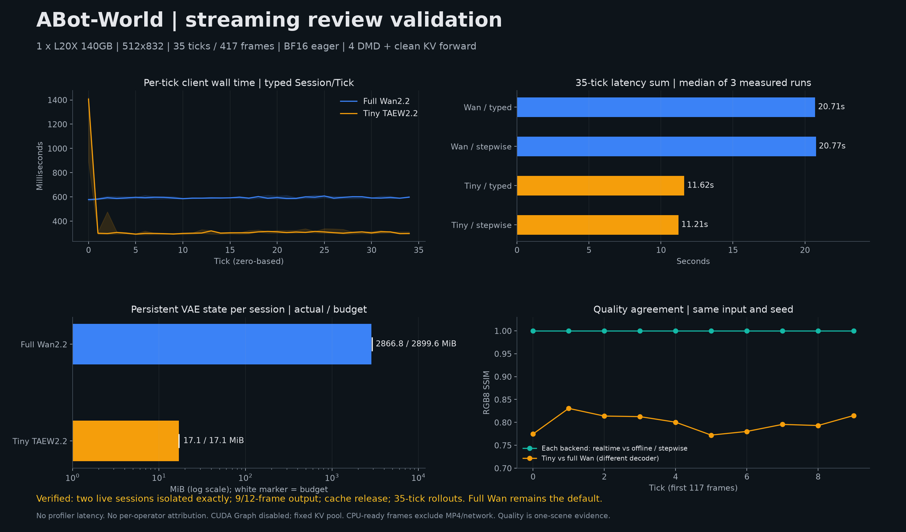

# ABot-World

> Experimental: offline image-conditioned generation and in-process realtime interactive generation

## Summary

- Vendor: ACVLab (Amap CV Lab)
- Model: `acvlab/ABot-World-0-5B-LF`
- Task: image-conditioned interactive world generation
- Modes: offline generation, experimental typed Session/Tick, and stepwise chunk output
- Maintainer: Community

The ABot checkpoint and pipeline integration are Apache-2.0 licensed. The
optional TAEW2.2 decoder adapter includes the MIT notice from its upstream
implementation; obtain its weights separately from the official release.

> [!IMPORTANT]
> ABot-World currently requires `enforce_eager=True`. Current experiments show
> that disabling eager execution can reduce accuracy or generation quality; the
> root cause is still under investigation.

## Offline generation

Create `AsyncOmni` with the checkpoint path and
`model_class_name="ABotWorldCausalPipeline"`. Submit an image-conditioned
diffusion request with `height=512`, `width=832`, `num_frames=9`,
`num_inference_steps=4`, `max_sequence_length=512`, and
`extra_args={"flow_shift": 5.0}`. The official ABot checkpoint uses its native
single-directory layout and does not need a Diffusers `model_index.json`.

The bundled Wan2.2 VAE compresses space by 16 and the DiT applies a 2x2
spatial patch, so 512x832 produces 16x26 = 416 tokens per latent frame. The
FlashAttention paged-KV kernel requires this page size to be a multiple of 16.
480x832 (390 tokens) and 448x832 (364 tokens) are therefore rejected before
model execution.

Offline whole-clip frame counts must be `9 + 12k`, up to 117 frames. This
whole-clip safeguard is not a ten-tick limit on typed sessions or stepwise
rollouts. Both streaming paths decode 9 frames in the opening chunk and 12
in each subsequent chunk.

## Stepwise generation and decoder selection

The default `model_config={"abot_vae": "wan"}` uses the complete Wan2.2
decoder. Select `"taew2_2"` explicitly to use `taew2_2.pth` in the checkpoint
directory. Both retain the original Wan image encoder and the same normalized
48-channel, 16x spatial, 4x temporal latent contract. The tiny decoder is an
approximation, not a quality-equivalent replacement or a quantized Wan VAE.

```bash
python examples/offline_inference/diffusion/abot_world_realtime.py \
  --model /path/to/ABot-World-0-5B-LF --image /path/to/image.jpg \
  --vae wan --ticks 35 --output abot-35ticks.mp4
```

This uses `step_execution=True`, `diffusion_streaming_output=True`, and one
`generate()` call for the complete rollout. It prepares the first image and
prompt once. Optional `--actions actions.json` supplies one three-frame action
list per tick, for example `[[["w"],[],[]],[[],["j"],[]]]` for two ticks.
Actions must all be known at request start; this is not a mid-rollout control
transport. Typed sessions below accept incremental events instead.

Both decoders own their temporal feature cache per session, following the
shared AR-Diffusion streaming decoder contract used by LingBot-World. Reset,
close, and fail-closed cleanup release that cache along with the session's KV.
The full decoder's persistent feature budget is separate from paged attention
KV; admission reserves both. Temporary decoder activations and model weights
are not included in the per-session persistent-state figure.

## Realtime in-process generation

Each JSONL line describes the prompt and/or three latent-frame camera
actions (W/A/S/D/I/J/K/L) applied at the next chunk boundary:

```json
{"event_id":1,"prompt":"A road through a forest","frames":[["j"],[],[]]}
{"event_id":2,"frames":[["w"],["w"],["w"]]}
{"event_id":3,"prompt":"The road enters a snowy valley","frames":[[],[],[]]}
```

Use `ARDiffusionSessionManager` with `ARDiffusionOmniTickConsumer`,
`ARDiffusionWorkerLifecycle`, and `ABotCameraControlReducer`. Configure
`ARDiffusionEngine`, one replica, `max_num_seqs=1`, `output_type="pt"`, and the same
512x832 four-step sampling contract as offline generation. The current control
plane is an internal Python API; no public server transport is exposed yet.
`output_type="latent"` intentionally skips video decode and therefore cannot
be used as evidence of two resident VAE decoding sessions.

## Reproduce review evidence

Run from the repository root with the checkpoint, tokenizer, input image, and
optional tiny decoder weights already present locally. Reserve one GPU through
your cluster scheduler first. The benchmark does not select or reserve a GPU.

```bash
export ABOT_MODEL=/path/to/ABot-World-0-5B-LF
export ABOT_IMAGE=/path/to/image.jpg
export ABOT_RESULTS=/path/to/new-evidence-directory
export PYTHONPATH="$PWD"
for vae in wan taew2_2; do
  for phase in dual typed stepwise offline; do
    python -m benchmarks.diffusion.abot_review_evidence \
      --model "$ABOT_MODEL" --image "$ABOT_IMAGE" --vae "$vae" \
      --phase "$phase" --ticks 35 --repeats 3 \
      --output "$ABOT_RESULTS/$vae-$phase"
  done
done
python -m benchmarks.diffusion.abot_compare_quality "$ABOT_RESULTS"
```

- `dual`: interleave two live RGB-decoding sessions with different camera
  controls; compare each of their three chunks exactly against a solo run.
  Snapshots verify cache budgets, isolation, and independent release.
- `typed`: 35 consecutive Session/Tick events, with incremental controls and
  CPU-ready RGB output, using `max_num_seqs=1`.
- `stepwise`: 35 chunks from one `generate()` call, with the opening input
  prepared once and stateful decoding throughout.
- `offline`: the matched 117-frame whole-clip control. Quality compares its
  ten chunks with the first ten chunks from both streaming paths. It is not a
  claim of 35-tick offline quality equivalence or official-upstream parity.

The three latency phases run one warmup rollout and three measured rollouts.
JSON records retain every tick, configuration, source hashes, memory snapshots,
and failures. CPU video validation, disk IO, and memory RPCs are outside timing.
Client wall time includes submission, inference, decode and CPU return, but
excludes MP4 encoding and public network transport. No profiler is enabled.
The CPU-only quality pass requires `ffmpeg`; it retains raw metric logs and
reports float PSNR plus lossless RGB8 PSNR/SSIM. Tiny-versus-Wan quality is
reported separately from streaming-versus-offline consistency.

CUDA Graph capture is disabled by construction (`enforce_eager=True` and
`warmup_cudagraph=False`), not benchmarked as an enabled optimization. Real KV
pool storage addresses and sizes must remain unchanged. Allocating pages from
that fixed pool is not a bucket-growth event; a normal clean-KV forward is not
a CUDA Graph capture. No stall is attributed to either without such evidence.

### Measured validation (2026-09-19)

One scheduler-reserved **NVIDIA L20X 140GB**, TP=1, BF16 eager, 512x832,
seed 42, four DMD steps plus one clean-KV forward per tick. Environment:
Python 3.12, PyTorch 2.13.0 / CUDA 13, vLLM 0.27.1, Diffusers 0.38.0,
Transformers 5.14.1. These are not A100 or H200 measurements. Both streaming
modes completed 35 ticks / 417 frames per rollout with finite RGB output.

Each value below is the median across three measured runs, excluding the
separate warmup. Steady statistics exclude the first chunk. The first-chunk
figure is CPU-ready chunk latency, not a network-delivered single-frame TTFT.

| Decoder / API | First chunk (ms) | Steady median (ms/tick) | Steady p95 (ms/tick) | Sum of 35 tick intervals (s) |
| --- | ---: | ---: | ---: | ---: |
| Full Wan / typed | 578.6 | 590.3 | 605.5 | 20.712 |
| Full Wan / stepwise | 595.9 | 587.8 | 611.3 | 20.765 |
| TAEW2.2 / typed | 1407.2 | 304.7 | 330.4 | 11.618 |
| TAEW2.2 / stepwise | 1001.8 | 299.5 | 323.1 | 11.212 |

The tiny path still uses the full Wan encoder for the input image, moving it
onto the GPU for encoding and back to CPU afterward. It improves steady decode
cost but does not improve first-chunk latency in this experiment. No separate
DiT/VAE operator times were measured, so these totals must not be used as an
operator attribution or an asynchronous-overlap claim.

Persistent **full Wan** decoder state measured **3,006,062,592 bytes/session**
(2.800 GiB), within the **3,040,460,800-byte** reservation (2.832 GiB).
Most cached features are FP32 even with BF16 weights; budgeting only BF16
underestimates residency. The total model-owned reservation, including image,
prompt and action conditions, is 3,131,236,352 bytes/session, separate from KV.
Tiny decoder state measured and reserved **17,891,328 bytes/session**.

Both backends retained two live decoding sessions. All six interleaved chunks
(A0/B0/A1/B1/A2/B2, with different camera controls) were bit-identical to their
corresponding solo controls. Each cache stayed bounded, closing A preserved B,
and closing both left no decoder state. Full-Wan peak PyTorch allocated memory
was 46.078 GiB; tiny peak was 40.150 GiB with this configuration. These include
the configured fixed KV pool (`gpu_memory_fraction=0.15`) and are not minimum
GPU-memory requirements or total driver memory usage.

For the control-free first 117 frames (**10 ticks**, `9 + 9 * 12`), all 40
same-backend chunk comparisons (two backends, typed versus offline and
stepwise) were bit-exact: SSIM=1, PSNR=infinity. The offline reference uses the
same per-frame decoder, isolating chunking and paged-KV changes rather than
whole-clip convolution kernel selection. Separately, tiny versus full Wan had
mean per-chunk float PSNR **30.13 dB** and RGB8 SSIM **0.7988**. This is a
single-scene consistency check, not a general image-quality certification.

All KV pool storage identities and sizes remained fixed at the snapshots;
CUDA Graph was disabled. One full-Wan stepwise run had an **855.6 ms** interval
at zero-based tick **22**; it is retained in the data, not labeled as a capture
or bucket-growth stall without supporting evidence.

Raw warmup and measured intervals: [per-tick CSV](ABot-World-evidence/per-tick.csv).
Quality by chunk: [quality CSV](ABot-World-evidence/quality.csv).
Aggregated latency and residency: [summary JSON](ABot-World-evidence/summary.json).



CPU regression checks (matching vLLM installation and pytest dependencies;
no checkpoint or GPU allocation needed):

```bash
pytest -o addopts= tests/diffusion/models/abot_world \
  tests/diffusion/ar_diffusion/test_streaming_decode.py \
  tests/diffusion/ar_diffusion/test_capability_runner.py -q
pytest -o addopts= tests/diffusion/models/abot_world tests/diffusion/ar_diffusion \
  -m 'core_model and cpu' --run-level=core_model -q
```

The focused original-directory run passed 79 tests. The submission-only source
snapshot passed 197 tests with 8 skipped. The new CPU cases are already covered
by the existing Buildkite `tests/diffusion -m 'core_model and cpu'` sweep.

## Current limitations

- Only the `ABot-World-0-5B-LF` causal student checkpoint is supported.
- The realtime control plane is internal; there is no public server transport yet.
- AR-Diffusion stages require one replica.
- Typed mode emits one AR block per tick; stepwise mode emits multiple blocks
  from one request. `max_num_seqs` must be one in both modes. Multiple resident
  sessions are interleaved, not executed concurrently.
- SP/USP, pipeline/CFG parallelism, HSDP, VAE parallelism, quantization, Cache-DiT, and TeaCache are not supported.
- No AMD GPU, Ascend NPU, or Intel GPU support is claimed.
- DiT, clean-context KV commit, and VAE decode are serial; no asynchronous
  decode speedup is claimed.
- Reference images (5-view surround) are not yet integrated.

## References

- Checkpoint: <https://huggingface.co/acvlab/ABot-World-0-5B-LF>
- Official implementation: <https://github.com/amap-cvlab/ABot-World>
- Shared stepwise binding: <https://github.com/vllm-project/vllm-omni/pull/6844>
- Shared stateful decoder: <https://github.com/vllm-project/vllm-omni/pull/6533>
- Realtime design: [`docs/design/feature/realtime_ar_diffusion.md`](../../docs/design/feature/realtime_ar_diffusion.md)
