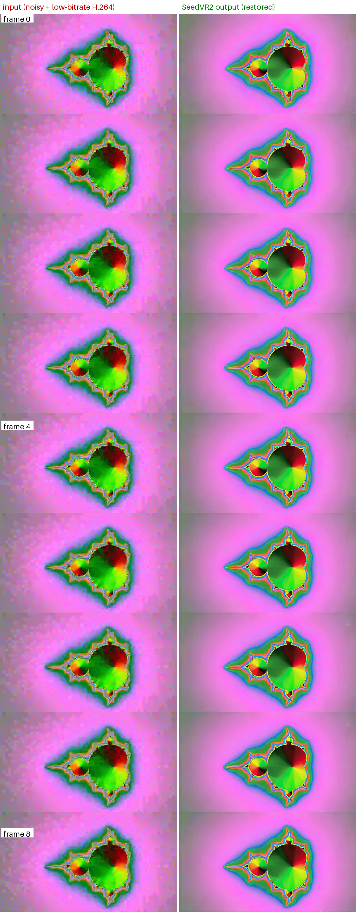

# SeedVR2 video restoration — Ascend NPU (Atlas A2)

## Summary

- Vendor: ByteDance
- Model: SeedVR2 3B
- Task: restore an uploaded video at its original size
- Mode: native offline/HTTP pipeline, one Euler step
- Hardware: Ascend 910B (Atlas A2), 64 GiB HBM per device
- Maintainer: InferMatrix

## When to use this recipe

Run short, constant-frame-rate videos with the native SeedVR2 pipeline on
Ascend hardware. The whole-clip path and the long-video route work unchanged;
the model guide covers the full contract. For NVIDIA GPUs use the
[RTX 5090 recipe](./SeedVR2-RTX-5090.md) instead.

## Supported model contract

See [the model guide](../../docs/models/seedvr2.md#model-directory) for the
checkpoint files, hashes, and the required `model_index.json`. Serving,
sampling, colour correction, and admission behave exactly as on CUDA: the
pipeline requires `--dtype float16 --enforce-eager`, rejects quantization and
cache backends, and needs no NPU-specific flags.

## Hardware

One 910B device (64 GiB HBM) fits the complete FP16 model and its activations
for small clips. A padded five-frame 848×480 output pixel budget is admitted by
default, so longer clips at smaller resolutions work on a single card; see
[request admission](../../docs/models/seedvr2.md#request-admission) for the
env-var overrides. Sequence parallelism above degree 1 is unvalidated on NPU.

## Software environment

Validated with the `quay.io/atlas-ci/vllm-ascend:v0.31.0` container
(vLLM 0.31.0, vllm-ascend 0.19.1rc2, CANN 9.1.0, torch 2.10 / torch_npu,
diffusers 0.40.0, Python 3.12) on an Atlas A2 server. Create the container with
`--privileged` plus the usual Ascend device and driver mounts, and install the
checkout with `pip install -e . --no-deps` (the repo tree is not a git checkout
on the target, so export `SETUPTOOLS_SCM_PRETEND_VERSION`).

## Command

```bash
ASCEND_RT_VISIBLE_DEVICES=0 vllm serve "$MODEL_DIR" --omni \
  --model-class-name SeedVR2Pipeline --dtype float16 --enforce-eager \
  --num-gpus 1 --host 127.0.0.1 --port 8098
```

## Validated result

A nine-frame 512×288 24 FPS clip — a Mandelbrot animation degraded with heavy
gaussian noise and low-bitrate H.264, plus an AAC tone — restored at the
original size through `POST /v1/videos/sync` (seed 7723, one Euler step): the
output keeps the codec, geometry, frame count, frame rate, and audio of the
source, and the injected grain is visibly removed. Frames 0, 4, and 8 —
degraded input on the left, restored output on the right:



## Verification

```bash
curl --fail-with-body http://127.0.0.1:8098/v1/videos/sync \
  -F 'prompt= ' -F 'input_references=@input.mp4;type=video/mp4' \
  -F 'size=224x128' -F 'num_inference_steps=1' \
  -F 'guidance_scale=1' -F 'seed=7723' --output restored.mp4
```

Expect HTTP 200 and a decodable 224×128 video with the source frame count,
frame rate, and audio. The offline e2e
(`tests/diffusion/models/seedvr2/test_seedvr2_e2e.py`, with
`VLLM_TEST_SEEDVR2_MODEL_DIR` pointing at the checkpoint directory) passes all
four colour modes on one NPU, and the NPU smoke tests in
`tests/diffusion/models/seedvr2/test_seedvr2_npu.py` validate the DiT and VAE
modules without a checkpoint.

## References

- [Canonical SeedVR](https://github.com/ByteDance-Seed/SeedVR)
- [Model guide](../../docs/models/seedvr2.md)
- [RTX 5090 recipe](./SeedVR2-RTX-5090.md)
