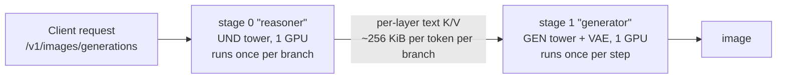

# Cosmos3 — Tower Disaggregation (experimental)

> One stage per Mixture-of-Transformers tower, for text-to-image on two smaller cards
>
> **Experimental.** The tower split is opt-in, text-to-image only, and has no
> published per-stage throughput numbers yet — only the memory and correctness
> checks in [What has been measured](#what-has-been-measured). The co-located
> [`vllm_omni/deploy/cosmos3_super_t2i.yaml`](../../vllm_omni/deploy/cosmos3_super_t2i.yaml)
> layout remains the validated way to serve Cosmos3 T2I; see
> [`Cosmos3-Super.md`](./Cosmos3-Super.md).

Cosmos3 is a Mixture-of-Transformers (MoT) model with two towers over one
checkpoint: an autoregressive **UND** tower that encodes the prompt, and a
diffusion **GEN** tower (plus the VAE) that denoises the image. The two towers do
very different amounts of work per request — UND runs **once** (twice with
classifier-free guidance, once per prompt branch), GEN runs **once per denoising
step**, 50 times at the default.

Tower disaggregation puts each tower in its own stage on its own GPU. The
reasoner stage encodes the prompt and ships the UND key/value tensors to the
generator stage, which replays them instead of holding 31.2 B parameters of UND
weights it would use once.



## When to use this recipe

Reach for the split when:

- **Neither card can hold both towers.** Co-located Cosmos3-Super needs 120.91
  GiB of bf16 weights resident; each tower alone is 58.1 GiB, so the split fits
  two smaller cards without any weight sharding. Each stage builds only the tower
  it owns, so peak startup memory is one tower's worth, not both.
- **NCCL is unhealthy or unavailable.** In the shipped layout there are no
  intra-stage collectives at all — every parallel degree is 1 and HSDP is off.
  The only cross-GPU traffic is the K/V handoff, which travels through the stage
  connector rather than NCCL.
- **You want the towers to pipeline across requests.** While the generator
  denoises request *n*, the reasoner can encode request *n+1*.

Prefer the co-located layout when:

- **One H200 is available.** Both towers fit on a single 141 GB card and that
  layout is collective-free too, with no handoff to pay for.
- **You need T2V, I2V, V2V, audio, or action modalities.** The reasoner rejects
  anything that is not text-to-image with
  `Cosmos3 disagg currently splits the towers for text-to-image only`.
- **Single-request latency is what you are optimizing.** The split does not make
  one request faster; the towers were already sequential within it. It also
  serializes the two CFG branches inside the generator stage, so a guided
  request costs about two denoise passes unless you scale that stage out.

## Prerequisites

- 2+ GPUs, each able to hold one 58.1 GiB tower.
- The `vllm-omni` package (or the `vllm/vllm-omni:cosmos3` container), which
  provides the `vllm serve … --omni` entrypoint.
- A Cosmos3-Super checkpoint. Both stages read the *same* checkpoint; no
  separately prepared per-tower checkpoint is needed.

## Serve command

The topology is selected by the `pipeline:` key in the deploy YAML and by
nothing else. It is unreachable unless you name a deploy config that selects it,
so registering it cannot affect existing co-located deployments.

```bash
CUDA_VISIBLE_DEVICES=0,1 vllm serve nvidia/Cosmos3-Super-Text2Image --omni \
  --host 0.0.0.0 --port 8000 \
  --deploy-config cosmos3_super_t2i_disagg.yaml \
  --init-timeout 1800
```

A bare filename resolves against the bundled
[`vllm_omni/deploy/`](../../vllm_omni/deploy/) directory; pass an absolute path
to use your own copy. Requests are the ordinary image-generation requests — the
split is invisible to the client:

```bash
curl -sS -X POST http://localhost:8000/v1/images/generations \
  -H "Content-Type: application/json" \
  -d '{"model": "nvidia/Cosmos3-Super-Text2Image",
       "prompt": "A robot arm cleaning a plate in a bright kitchen",
       "size": "1024x1024"}'
```

Both stage workers are launched with the same visible device set, and `devices`
in the YAML are **logical indexes into that set**, not physical GPU ids. That is
why stage 0 says `devices: "0"` and stage 1 says `devices: "1"`: two different
cards out of the shared pair.

## Constraints

| Constraint | Why | What happens if you break it |
| --- | --- | --- |
| Both stages must load the same checkpoint | Layer count, KV-head count and head dim all have to line up between the tower that produces the K/V and the cross-attention that consumes it | The generator raises at install time, naming the fields that disagree |
| Both stages must run the same vLLM-Omni version | The payload declares the schema identifier `cosmos3.text_conditioning/v1`; a future layout change bumps it | The generator refuses the payload by name on the first request |
| Both stages must resolve generation parameters identically | The generator finds its replayed K/V by fingerprinting the token ids it tokenizes itself; `max_sequence_length`, `use_system_prompt` and the geometry all feed that tokenization | Replay-table miss: a `RuntimeError` naming the missing fingerprint, so a failed request rather than a wrong image |
| Set `guardrails` the same on both stages | Only the generator decodes pixels, so it is the only stage that can run the image check | Guardrails on stage 1 alone lets a blocked prompt through the reasoner and catches it only on the decoded image |

The shipped YAML satisfies all four. **Every parallel degree is stage-local**,
`tensor_parallel_size` included: UND K/V is born sharded across the reasoner's TP
ranks, but the reasoner all-gathers the KV-head dimension before the payload
leaves the tower and each generator rank slices back out the head range its own
cross-attention owns. The two stages are therefore free to differ in
`tensor_parallel_size`, `cfg_parallel_size`, `ulysses_degree`, `ring_degree` and
HSDP; the latter are the knobs to reach for when scaling the generator stage out.

A per-stage `default_sampling_params` block is not how you break the third
constraint today: every current request path replaces a diffusion stage's startup
defaults with one request-level params object cloned to all diffusion stages, so a
value set on one tower and not the other is silently dropped rather than honored.
The generator's fingerprint check is there for the routes that do reach it — a
per-stage `sampling_constraints` in the pipeline's stage specs, and anything a
future config path adds.

## The handoff is not small

K/V is grouped-query and bf16 (8 KV heads × 128 head dim × 2 bytes), so one token
costs 4 KiB per layer for K and V together, and about **256 KiB per token per
branch** across all 64 layers. The payload is trimmed to the real prompt length,
so a 256-token formatted prompt is roughly 64 MiB per branch and 128 MiB once
guidance turns on the unconditional branch too. Those figures do not depend on
either stage's TP size — the wire always carries the full 8-head set.

That crosses the stage edge once per request, against a generator stage that then
runs `num_inference_steps` forwards — but it scales linearly with prompt length,
and `max_sequence_length` (4096 by default) puts the worst case in the GiB range.
The reasoner logs the size of every payload and warns past 512 MiB
(`COSMOS3_UND_PAYLOAD_WARN_MIB`). If you see that warning, lower
`max_sequence_length` rather than ignoring it.

## Scaling the generator stage

The generator stage is where essentially all the FLOPs are, so it is the one to
widen first. Keep
`cfg_parallel_size × ulysses_degree == hsdp_shard_size == len(devices)` for that
stage:

| Generator GPUs | Settings |
| --- | --- |
| 2 | `cfg_parallel_size: 2`, `use_hsdp: true`, `hsdp_shard_size: 2` |
| 4 | additionally `ulysses_degree: 2`, `hsdp_shard_size: 4` |

`ulysses_degree` must divide the latent sequence length: 1024×1024 gives a GEN
sequence of 32 × 32 = 1024 tokens. Widen that stage's `devices` list to match.

## How the replay works

The seam is a single call. `Cosmos3VFMTransformer.forward` invokes the UND tower
exactly once per branch, and on the generator stage that tower is never built at
all: `language_model` is a stub holding the reasoner's K/V, keyed by a fingerprint
of the tokenized prompt. Everything else — prompt formatting, tokenization, GEN
mRoPE construction, scheduler setup, VAE decode — is the inherited co-located code
running unchanged on each stage.

What crosses the edge is a single typed contract,
`Cosmos3TextConditioning`, tagged with the schema identifier
`cosmos3.text_conditioning/v1`. It declares the branch keys, the tensor layout
(`num_layers` / `num_kv_heads` / `head_dim`), the reasoner's TP size, and the
geometry and tokenization settings the reasoner resolved. Two checks run on it:
every declared field is validated against the tensors it carries when the contract
is built — along with the properties the wire format does not declare, namely batch
size and dtype across the whole payload and UND token count within each branch —
and the *layout* fields (`num_layers` / `num_kv_heads` / `head_dim`) are
re-checked against the generator's own cross-attention when it is installed. The
geometry and tokenization settings are not re-checked — they are what the reasoner
fingerprinted, so a stage that resolved them differently is caught by the replay
miss instead, and the reasoner's values are printed in that error. `reasoner_tp_size`
must be declared like every other metadata field, but its *value* constrains
nothing — the payload is unsharded, so the two TP sizes need not match; it is
carried to be named in the error when the layout fields do disagree.

Three consequences worth knowing:

- **Only K/V crosses the wire.** GEN rotary frequencies are computed locally on
  the generator stage from the latent geometry that stage actually allocated,
  rather than being shipped from a stage that would have to predict it.
- **Both stages tokenize the prompt.** That is what makes the fingerprints line
  up, and it is also why the prompt-text guardrail check, when enabled, runs
  twice per request.
- **Each stage owns one tower.** The unowned tower is never constructed, so its
  parameters are never allocated on the card — the split does not construct both
  and prune one.

The split saves device memory, not startup I/O: both stages still stream the
whole checkpoint and filter the other tower's tensors out after reading them.
Expect roughly double the aggregate startup read I/O of the co-located layout.

## What has been measured

On 2×H200 (141 GB), Cosmos3-Super-Text2Image at 1024×1024, 50 steps, guidance
7.0, `flow_shift` 3.0, a fixed seed, guardrails off:

| Layout | Peak device memory | Image |
| --- | --- | --- |
| co-located, TP 1 | 121.56 GiB on one card | baseline |
| **disaggregated, TP 1** | **63.43 GiB / 62.04 GiB per stage** | byte-identical to baseline |
| co-located, TP 2 | 63.78 GiB per rank | baseline' |
| **disaggregated, TP 2** | **34.52 GiB / 33.13 GiB per rank** | byte-identical to baseline' |

The tower split is numerically transparent: the images match bit for bit at both
TP sizes. Changing TP *does* change pixels slightly — reduction order in the
sharded matmuls — but by the same amount in both layouts, so that delta is TP's,
not the split's. At TP 2 the generator's ranks report `heads [0, 4) of 8` and
`heads [4, 8) of 8`, and the payload is the same size as at TP 1, confirming the
wire is TP-independent. A run with `tensor_parallel_size: 2` on the reasoner and
`1` on the generator also produces a correct image, which is the asymmetry the
Constraints section promises. Each stage keeps roughly half the checkpoint's
tensors (about 720 of 1425) and discards the rest after reading.

If your checkpoint lives on network storage, raise the startup timeouts —
`--init-timeout 3600 --stage-init-timeout 1800`. Two stages loading the same
27-shard checkpoint over NFS can exceed the default 600 s orchestrator budget,
which surfaces as `Orchestrator did not become ready within 600s` rather than as
anything model-specific.

## References

- Topology and payload keys:
  [`vllm_omni/diffusion/models/cosmos3_pipeline_config.py`](../../vllm_omni/diffusion/models/cosmos3_pipeline_config.py)
- Tower pipelines and the replay stub:
  [`vllm_omni/diffusion/models/cosmos3/pipeline_cosmos3_disagg.py`](../../vllm_omni/diffusion/models/cosmos3/pipeline_cosmos3_disagg.py)
- Deploy layout:
  [`vllm_omni/deploy/cosmos3_super_t2i_disagg.yaml`](../../vllm_omni/deploy/cosmos3_super_t2i_disagg.yaml)
- Co-located deployments and request formats:
  [`Cosmos3-Super.md`](./Cosmos3-Super.md)
- [Pipeline and deploy configurations](../../docs/configuration/stage_configs.md)
  — how `pipeline:`, stages, and `devices` are resolved
- [Disaggregated Inference](../../docs/design/feature/disaggregated_inference.md)
  — the generic, connector-based stage-split design contract
- [Parallelism overview](../../docs/user_guide/diffusion/parallelism/overview.md)
  — CFG, Ulysses, and HSDP degrees referenced above
