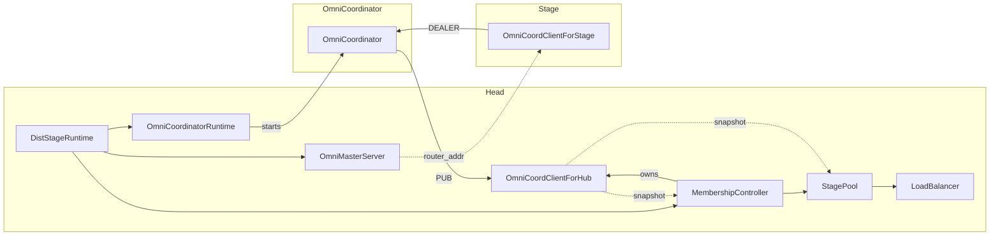
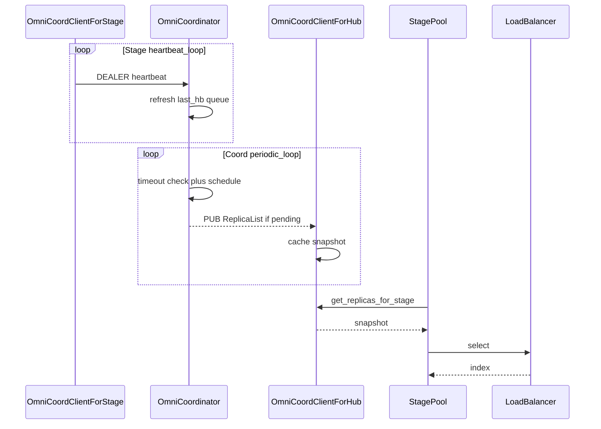
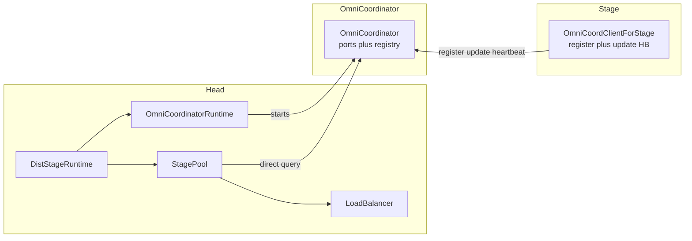
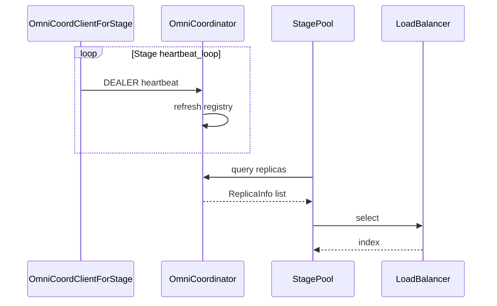

# [Analysis] OmniCoordinator package system analysis

> Simplified Chinese (canonical for CN reviewers): [`omni_coordinator_analysis.zh.md`](omni_coordinator_analysis.zh.md)  
> Per-function audit (zh): [`omni_coordinator_code_audit.zh.md`](omni_coordinator_code_audit.zh.md)  
> Talk notes (internal, zh): [`omni_coordinator_talk.zh.md`](omni_coordinator_talk.zh.md)  
> Level: **analysis** (current state + risks); not final design.  
> **PR2 Decision B:** `OmniCoordClientForStage` owns `register`＋`update`／`heartbeat`; delete `OmniCoordClientForHub`／`MembershipController`.

**Scope:** all 7 files under `vllm_omni/distributed/omni_coordinator/`  
**Code base:** `main` @ `c27623c2`

---

## 1. Architecture and sequencing

**When it starts:** only under `DistStageRuntime` (`--stage-id` + master). Ordinary in-process multi-stage does **not** start the Coordinator.

### 1.1 Current structure

`DistStageRuntime` → `OmniCoordinatorRuntime` → `OmniCoordinator` (Runtime on Head; Coord in a child process).



| Component | Role |
|-----------|------|
| `OmniCoordinatorRuntime` | Start/stop Coord; expose router／pub only |
| `OmniCoordinator` | In-memory registry + ROUTER／PUB |
| `OmniMasterServer` | Allocates handshake／I／O addresses on register; echoes router_addr |
| `OmniCoordClientForHub` | SUB cache; owned by Mem; Mem／Pool read snapshot |
| `StagePool` + `LoadBalancer` | Replica pick (LB ownership: §3 P2) |
| `OmniCoordClientForStage` | update／heartbeat → Coord |

### 1.2 Startup sequence (current)

Order: **Head starts Master + Coord first, then launches／waits for replicas; register is the rendezvous-address RPC.**

`router_addr`／`pub_addr` from `OmniCoordinatorRuntime` **are** the ROUTER／PUB endpoints bound by `OmniCoordinator`.

| Address | Who binds | Who uses |
|---------|-----------|----------|
| `router_addr` | Coord ROUTER | Master forwards to Stage; Stage DEALER (update／heartbeat) |
| `pub_addr` | Coord PUB | Head: Mem → Hub SUB |

Master register reply (`stage_engine_startup.py:645-652`):

| Field | Purpose |
|-------|---------|
| `handshake_address` | Engine-core ↔ Head HELLO／READY (Head binds ROUTER; engine connects) |
| `input_address`／`output_address` | Request／response data-plane ZMQ |
| `replica_id` | Confirmed or auto-assigned replica id |
| `coordinator_router_address` | Echo of Coord ROUTER for `OmniCoordClientForStage` |

handshake／input／output do **not** go through Coord; Coord only owns membership.

| Path | Who registers | After |
|------|---------------|-------|
| Head-local replica | Head launch helper | Head **binds** handshake from the same allocation, then spawns engine |
| Headless | Headless process | **Connects** to Head-owned sockets; uses router to reach Coord |

```mermaid
sequenceDiagram
  participant Head as DistStageRuntime
  participant RT as OmniCoordinatorRuntime
  participant OC as OmniCoordinator
  participant Master as OmniMasterServer
  participant Stage as Stage
  participant SC as OmniCoordClientForStage
  participant Mem as MembershipController
  participant Hub as OmniCoordClientForHub

  Note over Head,Master: Infrastructure
  Head->>RT: new
  RT->>OC: start
  OC-->>RT: ready
  RT-->>Head: router_addr pub_addr
  Head->>Master: start with router_addr

  Note over Head,Stage: Launch and register
  Head->>Stage: init local or wait headless
  Stage->>Master: register
  Master-->>Stage: handshake input output replica_id router_addr
  Note over Head,Stage: Head bind HS/IO; Stage or engine connect
  Stage->>SC: new with router_addr
  SC->>OC: DEALER update

  Note over Head,Hub: Membership
  Head->>Mem: new with pub_addr
  Mem->>Hub: SUB pub_addr
  OC-->>Hub: PUB ReplicaList
```

### 1.3 Runtime sequence (current)

Three decoupled paths — **not** “every heartbeat immediately PUBs”:

| Path | Actor | Behavior |
|------|-------|----------|
| Heartbeat | `OmniCoordClientForStage` | DEALER `heartbeat`; Coord updates memory; broadcast only when queue changes or ERROR→UP |
| Periodic flush | `OmniCoordinator` | Timeout check + coalesced PUB; Hub caches |
| Pick | `StagePool` + `LoadBalancer` | Read Hub snapshot → `select` (no direct causal link to a single heartbeat) |



**Dynamic headless (current):** After the service is up, additional headless replicas can attach — Master `on_register` → Orchestrator → `MembershipController` attach → `StagePool`. Manual dynamic attach exists; **no** autoscaler／`scale to N` API.

---

## 2. P0: Is OmniCoordinator a single point of failure?

**Yes.** One Coord child process per head; in-memory registry only; no HA／failover. After Coord dies, the membership／LB hot path has no standby; distributed `StagePool.pick` fails or spins empty. The HTTP serve process may not crash immediately; Master handshake can still run independently. This outranks structural merge work.

**Mitigation ladder (not HA):**

| Measure | Effect |
|---------|--------|
| Process watchdog restarts Coord | Process can self-heal; registry still empty — Stages must re-register／update reliably (needs R1／R2) |
| Persist／cold-start snapshot | Shortens the empty window; still a single live Coord |
| Merge Master (PR2) | Clears ownership; **can still be** a SPOF |
| True HA (multi-Coord／leader election, etc.) | Separate effort; **out of scope** for this refactor |

> Merge ≠ fix SPOF. Watchdog ≠ HA.

---

## 3. Graded issues

For this refactor effort: **two P1 rows** — reliability and Master merge are peer priority; merge is the main refactor deliverable.

| Priority | Category | Summary |
|----------|----------|---------|
| **P0** | Availability／architecture | Coord **SPOF** (in-memory registry, no HA) |
| **P1** | **Reliability** | Register／heartbeat／PUB／close can silently fail or desync |
| **P1** | **Refactor: merge Master into Coord** | Remove dual owners for handshake vs membership (see §6 PR2) — **mainline of this task** |
| **P2** | Package structure／ownership | Module boundaries (e.g. LB placement), dead APIs, dual paths, custom LB |

### P1 (reliability)

| # | Issue | Impact | Direction |
|---|-------|--------|-----------|
| R1 | Stage registration drops on `zmq.Again` | Never enters registry | Reliable registration delivery |
| R2 | Heartbeat for unknown `input_addr` ignored | Lost first update → permanent absence | Upsert or registration ack |
| R3 | PUB／send `NOBLOCK` best-effort | Stale Hub／Pool view | Document SLA; consider ack／snapshot on critical path |
| R4 | Runtime `terminate`／`kill` vs close semantics | Unpredictable shutdown; child skips `coordinator.close()` | Graceful + idempotent close |
| R5 | `_parse_replica_event` does not force `queue_length` to `int` | Diverges from dataclass／LB assumptions | Force int／default 0 |

### P1 (refactor: merge Master)

| # | Issue | Impact | Direction |
|---|-------|--------|-----------|
| M1 | `OmniMasterServer` parallel to `OmniCoordinator` | Split entrypoints; address echo vs registry | Fold into Coord; Stage uses `ClientForStage` for register／update (one client＋one Coord owner) |
| M2 | Hub＋`MembershipController` indirection | Fragmented Head ownership | Pool reads Coord directly (with the merge) |

> P0 = “only one Coord”; P1 reliability = “path not reliable enough”; P1 refactor = “Master／Coord dual ownership must collapse” (refactor mainline).

### P2 — Package structure

| File | Relation to Coord core service |
|------|--------------------------------|
| `omni_coordinator.py`／`runtime.py` | **Core:** registry process |
| `omni_coord_client_for_stage.py` | **Required client:** ROUTER |
| `omni_coord_client_for_hub.py` | **Required client:** PUB subscribe |
| `messages.py` | **Required contract:** wire／domain types |
| `load_balancer.py` | **No ownership link:** pure pick helper; no Coord ZMQ; used by Head `StagePool` |
| `__init__.py` | Re-exports everything → blurrier boundary |

On `LoadBalancer`:

- Inputs `list[ReplicaInfo]` + `Task`, outputs index — routing helper
- Real owner is **Head／`StagePool.pick`**, not the Coord process
- Living under `distributed/omni_coordinator/` implies it is part of membership; it only shares `ReplicaInfo`
- **Suggestion:** move closer to ownership, or explicitly mark Head／Pool-owned; short-term keep as structural debt

Other structure items:

| # | Issue | Notes |
|---|-------|-------|
| S1 | LB package ownership | See above |
| S2 | Dead public APIs | `add_new_replica`／`update_replica_info`／`remove_replica`; stage `update_info` tests-only |
| S3 | LLM／Diffusion dual registration | Public factory vs private `_on_heartbeat` |
| S4 | fork／spawn TODO | `runtime.py:66-67` |
| S5 | Custom LB policy | Only three built-in enums today; custom injection in §6 PR2 |

Per-function verdicts: [`omni_coordinator_code_audit.zh.md`](omni_coordinator_code_audit.zh.md).

---

## 4. Package file inventory

| File | Lines | Role | Structure note |
|------|------:|------|----------------|
| `omni_coordinator.py` | 369 | registry + ROUTER/PUB | Core |
| `runtime.py` | 159 | Child-process wrapper | Core |
| `omni_coord_client_for_stage.py` | 259 | Stage DEALER | Core client |
| `omni_coord_client_for_hub.py` | 164 | Hub SUB cache | Core client |
| `messages.py` | 61 | wire types | Core contract |
| `load_balancer.py` | 131 | Pick policy | P2: consider move |
| `__init__.py` | 37 | re-exports | Currently exports LB too |

Severity order: **P0 SPOF → two P1s (reliability＋Master merge) → P2 boundary／dead code／custom LB**.

---

## 5. Close semantics matrix

| API | Second close | Production shutdown |
|-----|--------------|---------------------|
| `OmniCoordinatorRuntime.close` | idempotent | `terminate`／`kill` child |
| `OmniCoordinator.close` | raise | **Not called in production** |
| `OmniCoordClientForStage.close` | raise | finally + often suppressed |
| `OmniCoordClientForHub.close` | raise | MembershipController.shutdown |

---

## 6. Proposed PR split (two PRs)

| PR | Theme | Maps to |
|----|-------|---------|
| **PR1** | Coord reliability + small cleanup | P0 docs／expectations + **P1 reliability** + P2 dead APIs／LB ownership (**no** custom LB, **no** Master merge) |
| **PR2** | **Merge Master into Coord** + user-custom LB | **P1 refactor (mainline)** + P2 custom LB |

**Refactor mainline is PR2 (Master merge).** Prefer landing PR1 first to lock SPOF／registration tests and cut PR2 regression risk; PR2 does not remove the SPOF.

---

### PR1 — Reliability and structure cleanup

**Goal:** Predictable distributed membership; no silent register／heartbeat loss; clearer package boundaries.

| Block | Content |
|-------|---------|
| **P0** | Docs／tests lock SPOF expectations after Coord kill |
| **P1 R1–R5** | Reliable registration; heartbeat upsert／ack; PUB／SLA; graceful Runtime close; force `queue_length` int |
| **P2** | Remove／narrow dead public APIs; unify LLM／Diffusion registration; clarify or move LB — **built-in policies only** |

**Out of scope:** Merging `OmniMasterServer`; deleting Hub／MembershipController; custom LB (→ PR2).

**Acceptance (draft):**

- Clear pick failure／empty behavior + tests after Coord kill  
- First `update` not permanently lost on `Again`  
- Built-in `random`／`round-robin`／`least-queue-length` still work  
- Production path + tests green after dead-API cleanup  

**Focus files (draft):**  
`omni_coordinator.py`, `runtime.py`, `omni_coord_client_for_stage.py`, `omni_coord_client_for_hub.py`, `messages.py`, `load_balancer.py`, `stage_pool.py`, `membership_controller.py`, `stage_runtime.py`, related tests.

---

### PR2 — Merge OmniMasterServer into OmniCoordinator + custom LB

**Target shape:** No parallel standalone `OmniMasterServer`. `OmniCoordinator` owns both **handshake／I／O address allocation** and **membership registry**; on the Stage side, **`OmniCoordClientForStage` (rename optional) owns `register`＋`update`／`heartbeat`**; on the Head side, **delete Hub／MembershipController** and let `StagePool` query Coord directly; users may inject a custom `LoadBalancer`.

| Block | Content |
|-------|---------|
| Merge | Fold `OmniMasterServer` into `OmniCoordinator` |
| Stage client | Extend `OmniCoordClientForStage`: `register` (HS／IO allocation)＋existing `update`／`heartbeat`; Coord address known at startup (Head／env／CLI — no Master reply echoing router) |
| Simplify Head | **Delete** `OmniCoordClientForHub`, `MembershipController` (no PUB／SUB hop); `StagePool` reads Coord directly |
| Startup | `DistStageRuntime`／headless talk only to Coord |
| **Custom LB** | `--omni-lb-policy=mypkg:MyBalancer` dotted path (below); `StagePool.pick` still only calls `LoadBalancer.select` |

**Out of scope:** Full HA (still a single in-memory registry). **Depends on:** PR1 landing first. Current state: §1.1.

#### Delete／merge map (keep existing class names; Stage client may rename later)

| Today | After PR2 |
|-------|-----------|
| `OmniMasterServer` | **Merged into** `OmniCoordinator` |
| `OmniCoordinator` | **Keep:** registry＋heartbeat; also register (server side) |
| `OmniCoordinatorRuntime` | **Keep** |
| `OmniCoordClientForHub` | **Delete** (Pool no longer uses SUB cache) |
| `MembershipController` | **Delete** |
| `StagePool` | **Keep**; query Coord directly |
| `LoadBalancer` | **Keep**; add custom-policy injection |
| `OmniCoordClientForStage` | **Keep and extend**: `register`＋`update`／`heartbeat` (rename optional) |

#### Target static structure



> **Decision B:** Stage talks to Coord **only via** `OmniCoordClientForStage` (or one renamed client): `register` first for handshake／input／output／replica_id, then the same connection for `update`／`heartbeat`.  
> **`OmniCoordClientForHub` is deleted in the target** — no PUB→SUB→Hub cache; `StagePool` queries Coord directly.

#### Target startup sequence

```mermaid
sequenceDiagram
  participant Head as DistStageRuntime
  participant RT as OmniCoordinatorRuntime
  participant OC as OmniCoordinator
  participant Stage as Stage
  participant SC as OmniCoordClientForStage
  participant Pool as StagePool

  Note over Head,OC: Start Coord only (includes former Master duties)
  Head->>RT: new
  RT->>OC: start
  OC-->>RT: ready
  RT-->>Head: coord addresses

  Note over Head,Stage: Stage already knows Coord addr; register via ClientForStage
  Head->>Stage: init local or wait headless
  Stage->>SC: new with coord addr
  SC->>OC: register
  OC-->>SC: handshake input output replica_id
  SC-->>Stage: addresses
  Note over Head,Stage: Head bind HS/IO; engine connect

  Note over Stage,Pool: Same client continues membership; no Hub
  SC->>OC: DEALER update
  Head->>Pool: ready
  Pool->>OC: direct query
```

#### Target runtime sequence

| Path | Actor | Behavior |
|------|-------|----------|
| Heartbeat | `OmniCoordClientForStage` | DEALER heartbeat → Coord |
| Registry | `OmniCoordinator` | Refresh liveness／queue |
| Pick | `StagePool` + `LoadBalancer` | **Direct Coord** snapshot → `select` (custom allowed; **no Hub**) |



#### Custom LoadBalancer (dotted path)

Upstream vLLM core has **no** Omni-style cross-stage-replica `LoadBalancer`; cross-engine routing lives in the production-stack router. For Omni custom policies, **use a dotted import path** (same spirit as production-stack `callbacks: module.Class`).

| Method | Example | Guidance |
|--------|---------|----------|
| Dotted import path | `--omni-lb-policy=mypkg:MyBalancer` | **Primary** |
| Built-in enum name | `--omni-lb-policy=random` (also `round-robin`／`least-queue-length`) | Keep for compatibility |
| Inject factory via constructor | `AsyncOmniEngine(..., load_balancer_factory=MyBalancer)` | Optional: libraries／tests |

**Primary behavior (draft):**

| Step | Approach |
|------|----------|
| Interface | Subclass `LoadBalancer`; implement `select(task, replicas) -> int` |
| CLI／config | `--omni-lb-policy=mypkg.sub:MyBalancer` (`module:Class` or `module.Class`) |
| Resolve | `_build_load_balancer_factory`: built-in enum → current path; else `importlib` load class, require `LoadBalancer` subclass, use as factory |
| Wire-up | Unchanged: `load_balancer_factory` → `StagePool.attach_load_balancer` |

User example:

```python
# mypkg/lb.py
from vllm_omni.distributed.omni_coordinator import LoadBalancer, Task, ReplicaInfo

class MyBalancer(LoadBalancer):
    def select(self, task: Task, replicas: list[ReplicaInfo]) -> int:
        return 0
```

```bash
# mypkg on PYTHONPATH or pip-installed
vllm serve ... --omni-lb-policy=mypkg.lb:MyBalancer
```

Do not require `entry_points`／`LoadBalancerRegistry` as the primary path (named aliases can come later). Matches production-stack dotted callbacks: install the user package into the environment and point the flag at it.

**Acceptance (draft):**

- Headless／local path completes handshake and HELLO／READY via `OmniCoordClientForStage.register`  
- Pick ≥ PR1 baseline; `--omni-lb-policy=mypkg:MyBalancer` loads and selects  
- Production path no longer depends on standalone Master／`OmniCoordClientForHub`／MembershipController  

**Focus files (draft):**  
`stage_engine_startup.py`, `omni_coordinator.py`, `runtime.py`, `stage_runtime.py`, `membership_controller.py`, `omni_coord_client_for_hub.py`, `stage_pool.py`, `load_balancer.py`, `_build_load_balancer_factory` (`stage_runtime.py`／CLI validation), headless startup.

---

## Related links

- Per-function I／O／dead code (zh): [`omni_coordinator_code_audit.zh.md`](omni_coordinator_code_audit.zh.md)
- Writing rules: [`00_refactor_work_rules.md`](00_refactor_work_rules.md)
