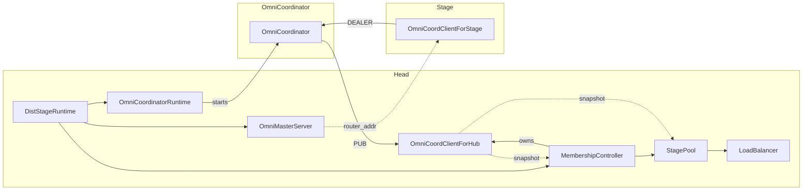
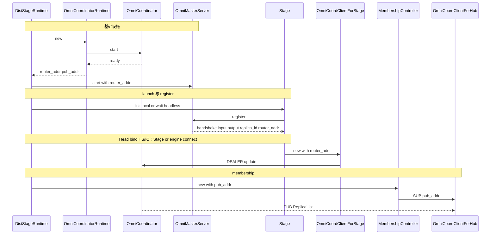
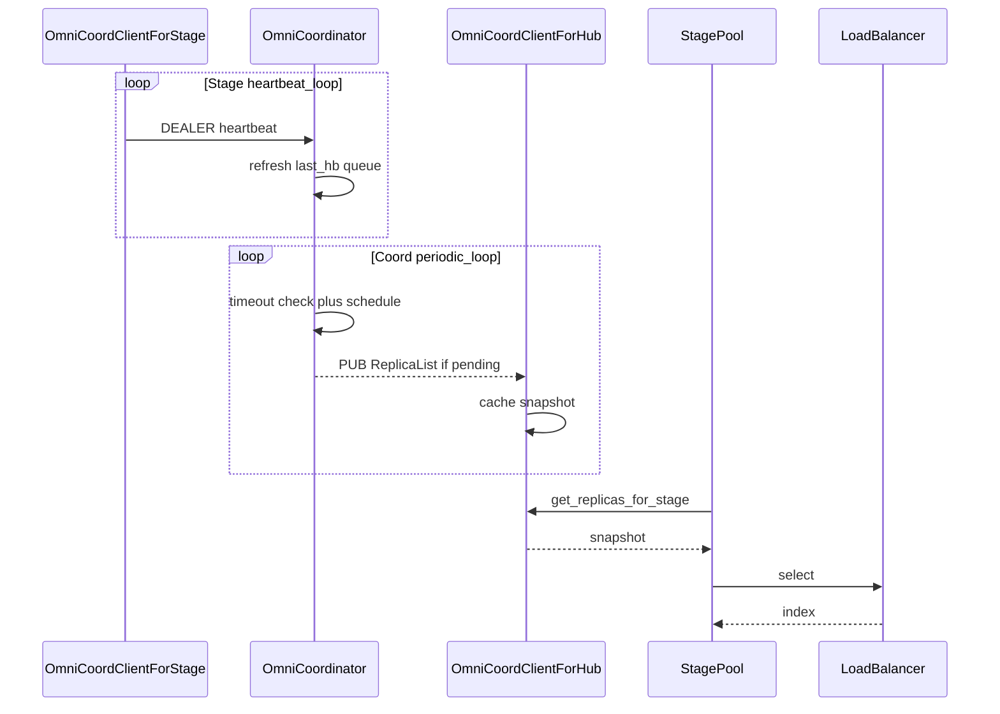
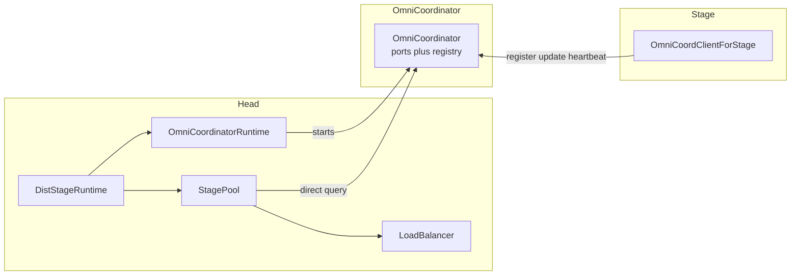
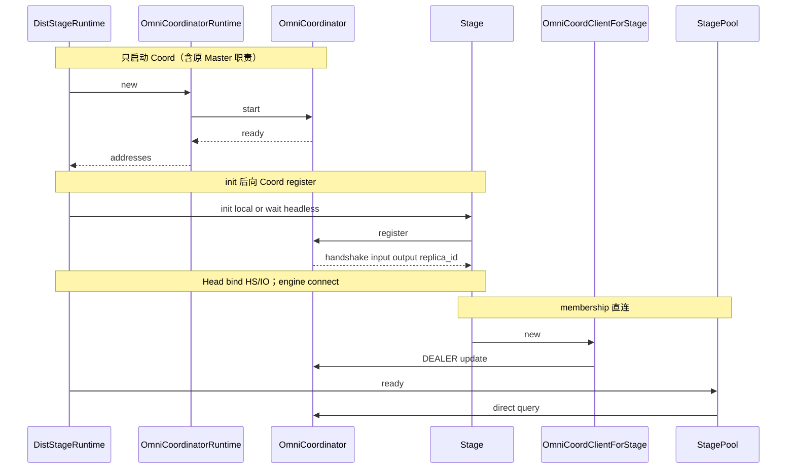
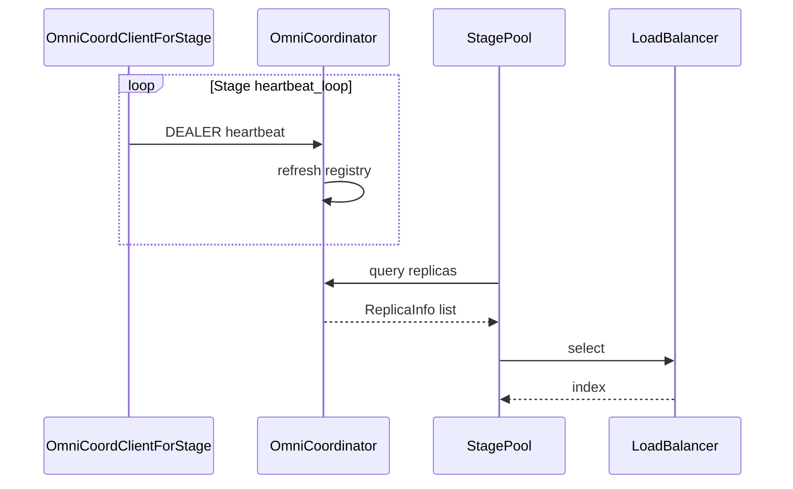

# [Analysis] OmniCoordinator 套件系统分析

> 简体中文。英文对照：[`omni_coordinator_analysis.md`](omni_coordinator_analysis.md)  
> 逐函数审计：[`omni_coordinator_code_audit.zh.md`](omni_coordinator_code_audit.zh.md)  
> 层级：**analysis**（现状与风险）；不是最终 design。

**审查范围：** `vllm_omni/distributed/omni_coordinator/` 全部 7 个文件  
**代码基准：** `main` @ `c27623c2`

---

## 1. 架构与时序

**何时启动：** 仅 `DistStageRuntime`（`--stage-id` + master）。普通 in-process multi-stage **不会**启动 Coordinator。

### 1.1 现状结构

`DistStageRuntime` → `OmniCoordinatorRuntime` → `OmniCoordinator`（Runtime 在 Head；Coord 在独立进程）。



| 组件 | 职责 |
|------|------|
| `OmniCoordinatorRuntime` | 启停 Coord；只暴露 router／pub 地址 |
| `OmniCoordinator` | 内存 registry + ROUTER／PUB |
| `OmniMasterServer` | 注册时分配握手／I／O 地址，并回传 router_addr |
| `OmniCoordClientForHub` | SUB 缓存；由 Mem 持有；Mem／Pool 读 snapshot |
| `StagePool` + `LoadBalancer` | 选副本（LB 归属见 §3 P2） |
| `OmniCoordClientForStage` | update／heartbeat → Coord |

### 1.2 建立时序（现状）

顺序是：**Head 先启动 Master 与 Coord，再 launch／等待 replica；register 用于获取汇合地址。**

`OmniCoordinatorRuntime` 返回的 `router_addr`／`pub_addr` **即** `OmniCoordinator` 绑定的 ROUTER／PUB。

| 地址 | 谁 bind | 谁使用 |
|------|---------|--------|
| `router_addr` | Coord ROUTER | Master 转发给 Stage；Stage DEALER（update／heartbeat） |
| `pub_addr` | Coord PUB | Head：Mem → Hub SUB |

Master register 回复（`stage_engine_startup.py:645-652`）：

| 字段 | 用途 |
|------|------|
| `handshake_address` | Engine-core 与 Head 做 HELLO／READY（Head bind ROUTER，engine connect） |
| `input_address`／`output_address` | 请求／响应数据面 ZMQ |
| `replica_id` | 确认或自动分配的副本编号 |
| `coordinator_router_address` | 回传 Coord ROUTER，供 Stage 创建 `OmniCoordClientForStage` |

handshake／input／output **不经过** Coord；Coord 只维护 membership。

| 路径 | 谁发起 register | 之后 |
|------|-----------------|------|
| Head 本地 replica | Head launch helper | Head 按同一份分配 **bind** handshake，再 spawn engine |
| Headless | Headless 进程自行 register | **connect** 到 Head 侧 socket，并用 router 连 Coord |



### 1.3 使用时序（现状）

三条路径解耦，**不是**「每次 heartbeat 立即 PUB」：

| 路径 | 执行方 | 行为 |
|------|--------|------|
| 心跳 | `OmniCoordClientForStage` | DEALER `heartbeat`；Coord 更新内存；queue 变化或 ERROR→UP 时才 schedule 广播 |
| 周期刷新 | `OmniCoordinator` | 超时检查 + 合并后的 PUB；Hub 缓存 |
| 选路 | `StagePool` + `LoadBalancer` | 读 Hub snapshot → `select`（与单次 heartbeat 无直接因果） |



**动态 headless（现状）：** 服务已拉起后可再挂 headless——Master `on_register` → Orchestrator → `MembershipController` attach → `StagePool`。有手动动态挂上；**无** autoscaler／`scale to N` API。

---

## 2. P0：OmniCoordinator 是否单点故障？

**是。** 每个 head 仅一个 Coord 子进程；registry 仅在内存；无 HA／failover。Coord 宕机后，membership／负载均衡热路径没有备援，distributed 下 `StagePool.pick` 会失败或空转。HTTP serve 进程未必立即退出；Master 握手仍可独立进行。

**缓解阶梯（不是 HA）：**

| 手段 | 效果 |
|------|------|
| 进程 watchdog 重拉 Coord | 进程可自愈；registry 仍空，需 Stage 可靠重注册／update（依赖 R1／R2） |
| 持久化／冷启动快照 | 缩短空窗；仍是单活 Coord |
| 合并 Master（PR2） | 清 ownership；**仍然可以是**单点 |
| 真 HA（多 Coord／选主等） | 另案；本 refactor **不做** |

> 合并 ≠ 解决单点。Watchdog ≠ HA。

---

## 3. 问题分级

本 refactor 任务下：**P1 分两行**——可靠性与「合并 Master」同级；后者是重构主交付。

| 优先级 | 类别 | 说明 |
|--------|------|------|
| **P0** | 可用性／架构 | Coord **单点**（内存 registry、无 HA） |
| **P1** | **可靠性** | 注册／心跳／PUB／关闭可能静默失败或状态不一致 |
| **P1** | **重构：合并 Master 与 Coord** | 消除「握手」与「membership」双 owner（见 §6 PR2）——**本任务主线** |
| **P2** | 套件结构／ownership | 模块边界（如 LB 是否应在本套件）、死 API、双路径、自定义 LB |

### P1（可靠性）

| # | 问题 | 后果 | 建议方向 |
|---|------|------|----------|
| R1 | Stage registration 遇 `zmq.Again` 静默丢弃 | 永不进入 registry | 注册必须可靠送达 |
| R2 | 对未知 `input_addr` 的 heartbeat 直接忽略 | 首次 update 丢失则永久缺席 | upsert 或 registration ack |
| R3 | PUB／send `NOBLOCK` best-effort | Hub／Pool 视图陈旧 | 明确 SLA；关键路径考虑 ack／snapshot |
| R4 | Runtime `terminate`／`kill` 与 close 语义不一致 | 关闭行为难预期；子进程不走 `coordinator.close()` | 优雅关闭 + idempotent close |
| R5 | `_parse_replica_event` 未强制 `queue_length` 为 `int` | 与 dataclass／LB 假设不一致 | 强制 int／缺省 0 |

### P1（重构：合并 Master）

| # | 问题 | 后果 | 建议方向 |
|---|------|------|----------|
| M1 | `OmniMasterServer` 与 `OmniCoordinator` 并列 | 两套入口、地址回传与 registry 分裂 | 并入 Coord；Stage register／update 同一 owner |
| M2 | Hub＋`MembershipController` 间接层 | Head 侧 ownership 碎 | Pool 直读 Coord（随合并落地） |

> P0 =「只有一个 Coord」；P1 可靠性 =「路径不够可靠」；P1 重构 =「Master／Coord 双 owner 必须收束」（refactor 主线）。

### P2 — 套件结构

现状套件内容：

| 文件 | 与 Coord 主体服务关系 |
|------|----------------------|
| `omni_coordinator.py`／`runtime.py` | **核心**：registry 服务进程 |
| `omni_coord_client_for_stage.py` | **必要 client**：对接 ROUTER |
| `omni_coord_client_for_hub.py` | **必要 client**：订阅 PUB |
| `messages.py` | **必要契约**：wire／domain types |
| `load_balancer.py` | **无主属关系**：纯选路策略；不连接 Coord ZMQ；由 Head 侧 `StagePool` 使用 |
| `__init__.py` | 一并 re-export，边界更模糊 |

关于 `LoadBalancer`：

- 输入为 `list[ReplicaInfo]` + `Task`，输出为 index——routing helper
- 实际所有者是 **Head／`StagePool.pick`**，不是 Coord 子进程
- 放在 `distributed/omni_coordinator/` 易被误解为 membership 服务的一部分
- **建议：** 迁到更贴近 ownership 的位置，或明确标注为 Head／Pool 侧组件；短期可保留，但计为结构债

其他结构项：

| # | 问题 | 说明 |
|---|------|------|
| S1 | LB 套件归属 | 见上 |
| S2 | 死公共 API | `add_new_replica`／`update_replica_info`／`remove_replica`；stage `update_info` 仅测试使用 |
| S3 | LLM／Diffusion 注册双路径 | 公开 factory vs 手写 private `_on_heartbeat` |
| S4 | fork／spawn 进程模型 TODO | `runtime.py:66-67` |
| S5 | LB 自定义策略 | 目前仅内置三种枚举策略；自定义注入见 §6 PR2 |

逐函数判定见 [`omni_coordinator_code_audit.zh.md`](omni_coordinator_code_audit.zh.md)。

---

## 4. 套件文件一览

| 文件 | 行数 | 角色 | 结构备注 |
|------|------:|------|----------|
| `omni_coordinator.py` | 369 | registry + ROUTER/PUB | 核心 |
| `runtime.py` | 159 | 子进程 wrapper | 核心 |
| `omni_coord_client_for_stage.py` | 259 | Stage DEALER | 核心 client |
| `omni_coord_client_for_hub.py` | 164 | Hub SUB 缓存 | 核心 client |
| `messages.py` | 61 | wire types | 核心契约 |
| `load_balancer.py` | 131 | 选路策略 | P2：宜考虑迁出 |
| `__init__.py` | 37 | re-exports | 当前一并 export LB |

痛点层次：**P0 单点 → 两个 P1（可靠性＋合并 Master）→ P2 边界／死码／自定义 LB**。

---

## 5. Close 语义矩阵

| API | 二次 close | 生产 shutdown |
|-----|------------|---------------|
| `OmniCoordinatorRuntime.close` | idempotent | `terminate`／`kill` 子进程 |
| `OmniCoordinator.close` | raise | **生产路径不调用** |
| `OmniCoordClientForStage.close` | raise | finally + 常 suppress |
| `OmniCoordClientForHub.close` | raise | MembershipController.shutdown |

---

## 6. 建议拆分的两个 PR

| PR | 主题 | 对应优先级 |
|----|------|------------|
| **PR1** | Coord 可靠性与小结构清理 | P0 文档／预期 + **P1 可靠性** + P2 死码／LB 归属（**不含**自定义策略、**不含**合并 Master） |
| **PR2** | **将 Master 并入 Coord** + 用户自定义 LB | **P1 重构（主线）** + P2 自定义 LB |

**Refactor 主线是 PR2（合并 Master）。** PR1 仍建议先合，用测试锁住 SPOF／注册行为，降低 PR2 回归风险；PR2 不消除单点本身。

---

### PR1 — 可靠性与结构整理

**目标：** distributed membership 路径行为可预期；注册／心跳不静默丢失；套件边界清晰。

| 块 | 内容 |
|----|------|
| **P0** | 文档与测试锁定 SPOF 预期：Coord 被杀后 Hub／`StagePool.pick` 行为 |
| **P1 R1–R5** | 注册可靠送达；未知 addr heartbeat upsert／ack；PUB／SLA；Runtime 优雅关闭与 close 语义统一；`queue_length` 强制 `int` |
| **P2** | 删除／收窄死公共 API；统一 LLM／Diffusion 注册路径；明确或迁移 LB 归属——**仍仅内置三种策略** |

**不做：** 合并 `OmniMasterServer`；删除 Hub／MembershipController；用户自定义 LB（→ PR2）。

**验收（草案）：**

- Coord 被杀后 pick 失败／空转有明确行为与测试  
- 首次 `update` 不因 `Again` 永久缺席  
- 内置 `random`／`round-robin`／`least-queue-length` 仍可用  
- 死 API 清理后生产路径与测试通过  

**涉及文件（草案）：**  
`omni_coordinator.py`、`runtime.py`、`omni_coord_client_for_stage.py`、`omni_coord_client_for_hub.py`、`messages.py`、`load_balancer.py`、`stage_pool.py`、`membership_controller.py`、`stage_runtime.py`、相关 tests。

---

### PR2 — 将 OmniMasterServer 并入 OmniCoordinator，并支持自定义 LB

**目标形态：** 不再并行独立的 `OmniMasterServer`。由 `OmniCoordinator` 同时负责：**分配 handshake／I／O 地址**与 **membership registry**；`StagePool` 直读 Coord；支持用户注入自定义 `LoadBalancer`。

| 块 | 内容 |
|----|------|
| 合并 | `OmniMasterServer` 职责并入 `OmniCoordinator` |
| 简化 Head | 删除 `OmniCoordClientForHub`、`MembershipController`；`StagePool` 直读 Coord |
| Startup | `DistStageRuntime`／headless 只对接 Coord |
| **自定义 LB** | `--omni-lb-policy=mypkg:MyBalancer` dotted path（见下）；`StagePool.pick` 仍只调 `LoadBalancer.select` |

**不做：** 完整 HA（合并后仍可以是单点内存 registry）。**依赖：** PR1 先合并。现状对照见 §1.1。

#### 删除／合并对照（沿用现有类名）

| 现状 | PR2 之后 |
|------|----------|
| `OmniMasterServer` | **并入** `OmniCoordinator` |
| `OmniCoordinator` | **保留**：registry＋heartbeat；兼做 register |
| `OmniCoordinatorRuntime` | **保留** |
| `OmniCoordClientForHub` | **删除** |
| `MembershipController` | **删除** |
| `StagePool` | **保留**；改为直读 Coord |
| `LoadBalancer` | **保留**；增加自定义策略注入 |
| `OmniCoordClientForStage` | **保留** |

#### 目标静态结构



#### 目标建立时序



#### 目标使用时序

| 路径 | 执行方 | 行为 |
|------|--------|------|
| 心跳 | `OmniCoordClientForStage` | DEALER heartbeat → Coord |
| 注册表 | `OmniCoordinator` | 更新存活与 queue |
| 选路 | `StagePool` + `LoadBalancer` | 直读 snapshot → `select`（可自定义） |



#### 自定义 LoadBalancer（dotted path）

上游 vLLM core **没有** Omni 这种跨 stage replica 的 `LoadBalancer`；跨 engine 分流在 production-stack router。Omni 侧自定义策略 **定案用 dotted path**（对齐 production-stack `callbacks: module.Class`）。

| 方式 | 例子 | 建议 |
|------|------|------|
| 字符串指向可 import 路径 | `--omni-lb-policy=mypkg:MyBalancer` | **主路径** |
| 内置枚举名 | `--omni-lb-policy=random`（及 `round-robin`／`least-queue-length`） | 保留兼容 |
| 入口参数注入 factory | `AsyncOmniEngine(..., load_balancer_factory=MyBalancer)` | 可选：库／测试 |

**主路径行为（草案）：**

| 步骤 | 做法 |
|------|------|
| 接口 | 用户子类化 `LoadBalancer`，实现 `select(task, replicas) -> int` |
| CLI／配置 | `--omni-lb-policy=mypkg.sub:MyBalancer`（`module:Class` 或 `module.Class`） |
| 解析 | `_build_load_balancer_factory`：若值为内置枚举则走现逻辑；否则 `importlib` 加载类，校验为 `LoadBalancer` 子类后作 factory |
| 注入点 | 不变：`load_balancer_factory` → `StagePool.attach_load_balancer` |

用户示例：

```python
# mypkg/lb.py
from vllm_omni.distributed.omni_coordinator import LoadBalancer, Task, ReplicaInfo

class MyBalancer(LoadBalancer):
    def select(self, task: Task, replicas: list[ReplicaInfo]) -> int:
        return 0
```

```bash
# 保证 mypkg 在 PYTHONPATH／已 pip install
vllm serve ... --omni-lb-policy=mypkg.lb:MyBalancer
```

不做强制 `entry_points`／`LoadBalancerRegistry` 作为主路径（可后续再加命名别名）；与 production-stack 的 dotted callback 一致，部署时把用户包装进环境即可。

**验收（草案）：**

- Headless／本地 register 仍能完成握手与 HELLO／READY  
- pick 不低于 PR1 基线；`--omni-lb-policy=mypkg:MyBalancer` 可加载并选中  
- 生产路径不再依赖独立 `OmniMasterServer`／Hub／`MembershipController`  

**涉及文件（草案）：**  
`stage_engine_startup.py`、`omni_coordinator.py`、`runtime.py`、`stage_runtime.py`、`membership_controller.py`、`omni_coord_client_for_hub.py`、`stage_pool.py`、`load_balancer.py`、`_build_load_balancer_factory`（`stage_runtime.py`／CLI 校验）、headless startup。

---

## 相关链接

- 逐函数 I／O／废码：[`omni_coordinator_code_audit.zh.md`](omni_coordinator_code_audit.zh.md)
- 写作规则：[`00_refactor_work_rules.md`](00_refactor_work_rules.md)
